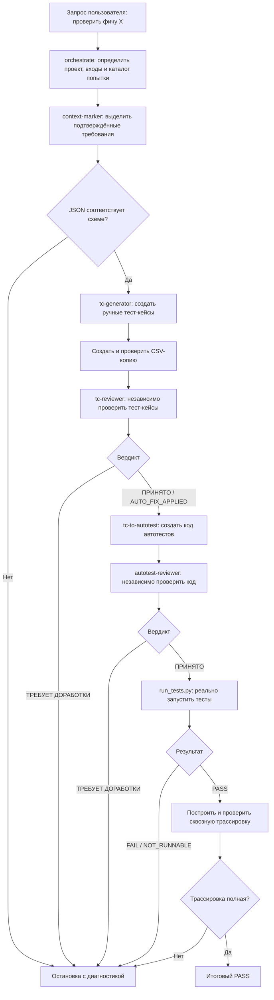

# Как работает полный тестовый пайплайн

Этот документ подробно описывает, что должно происходить после запроса к LLM в
CLI:

> Пройди полный тестовый прогон на фичу X.

## Главная идея

Такой запрос должен запускать не один тест и не один скилл, а управляемую цепочку:



Пайплайн разделяет четыре разных уровня проверки:

1. Понимание исходных требований.
2. Формальная корректность JSON.
3. Смысловая проверка тестов другой LLM.
4. Фактическое выполнение кода и трассировка результата.

Один уровень не подменяет другой.

## Это не монолитная CLI-программа

В репозитории нет единственной команды наподобие:

```bash
test-skills run feature-x
```

Пакет состоит из компонентов двух типов:

- `SKILL.md` — инструкции для LLM;
- Python-инструменты — детерминированные валидаторы, экспортёр, средство запуска и проверка трассировки.

Именно LLM-агент или внешний контроллер управляет процессом:

```text
прочитать SKILL.md
→ сформировать запрос к модели
→ получить JSON
→ сохранить JSON
→ запустить валидатор
→ проверить код завершения
→ перейти к следующему этапу
```

Если CLI поддерживает скиллы, `orchestrate` можно зарегистрировать как управляющий
скилл.

Если CLI не знает формата `SKILL.md`, внешний контроллер должен сам передавать
модели:

1. инструкцию конкретного скилла;
2. его справочный контракт;
3. JSON Schema;
4. входной артефакт;
5. путь, куда нужно записать результат.

Обычный CLI одной языковой модели сам по себе не догадается запустить локальные
Python-инструменты. Он должен иметь:

- доступ к файлам;
- возможность читать проект;
- возможность создавать артефакты;
- возможность запускать команды;
- подключённый `orchestrate/SKILL.md` либо внешний контроллер.

## Что происходит сразу после запроса

Предположим, CLI уже настроен и текущий каталог — целевой проект.

### 1. Оркестратор распознаёт намерение

Запрос на полный тестовый прогон соответствует описанию скилла
`skills/orchestrate/SKILL.md`.

Оркестратор читает:

- `skills/orchestrate/SKILL.md`;
- `skills/orchestrate/references/orchestration-contract.md`;
- `contracts/pipeline.json`.

Именно `pipeline.json` задаёт канонические этапы, входы, выходы и переходы.

### 2. Определяется проект

Оркестратору нужны:

- корень пакета скиллов;
- корень целевого проекта;
- фича или ограниченная область проверки;
- требования и разрешённые файлы исходного кода;
- каталог артефактов;
- изолированное место для создаваемых автотестов.

Если в проекте есть `.skillsrc`, из него читаются:

- язык;
- фреймворк;
- средство сборки;
- расположение исходного кода;
- расположение тестов;
- тестовый фреймворк;
- API-клиент;
- пути к требованиям, OpenAPI и архитектуре.

Пример:

```yaml
version: "2.0"

project:
  name: "orders-service"
  language: "java"
  framework: "spring-boot"
  build_tool: "maven"

paths:
  source: "src/main/java"
  tests: "src/test/java"
  docs: "docs"

test:
  framework: "junit5"
  api_client: "rest-assured"
```

`.skillsrc` не даёт разрешения изменять проект. Он только описывает структуру.

Если `.skillsrc` отсутствует, агент может без изменений изучить проект:

```bash
python <skill-pack>/tools/scan_project.py \
  --project <project> \
  --target <feature>
```

### 3. Проверяется достаточность информации

Само название «фича X» может быть недостаточным. LLM должна понять, где находятся
её источники:

- задача или спецификация;
- OpenAPI;
- документация;
- исходный код;
- конкретный diff;
- существующие тесты;
- описание ожидаемого поведения.

Пример хорошо ограниченной области:

```text
Фича: создание заказа.

Разрешённые источники:
- docs/requirements/order-creation.md
- docs/api/openapi.yaml#/paths/~1orders
- src/orders/controller.py
- src/orders/service.py
```

Если агент знает только, что существует `POST /orders`, но нигде не указан
результат, он не должен самостоятельно решать, что ответ равен `201 CREATED`.

В этом случае он сохраняет известный маршрут, отмечает отсутствие наблюдаемого
результата и либо останавливает цепочку, либо запрашивает недостающие сведения.

## Где сохраняются результаты

Для каждого логического запуска создаётся отдельный каталог:

```text
<project>/docs/to_do/test-pipeline/<feature>/<attempt>/
```

Пример:

```text
docs/to_do/test-pipeline/order-creation/attempt-01/
  01-context-marker-output.json
  01-context-marker-validation.json

  02-tc-generator-output.json
  02-tc-generator-output.csv
  02-tc-generator-validation.json

  03-tc-reviewer-output.json
  03-tc-reviewer-validation.json

  04-tc-to-autotest-output.json
  generated/
    test_order_creation.py

  05-autotest-reviewer-output.json
  05-autotest-reviewer-validation.json

  06-run-result.json
  07-trace-document.json
  08-orchestrator-output.json
```

Если попытка неудачная, её артефакты не перезаписываются. После исправления
причины создаётся `attempt-02/`. Так всегда можно увидеть вход, результат, точку
ошибки и отличие следующей попытки.

# Этап 1. context-marker

## Назначение

Первый скилл не пишет тест-кейсы. Он превращает разрозненные требования и сведения
из исходного кода в нормализованный контекст.

Вход:

```text
документация + OpenAPI + разрешённый исходный код + diff
```

Выход:

```text
context-marker-output.json
```

## Требования и наблюдения

LLM разделяет найденную информацию на две категории.

Требования — это утверждения о поведении продукта:

```text
Пользователь с ролью sales_manager создаёт заказ.
При корректном запросе API возвращает HTTP 201 и code=CREATED.
```

Им назначаются канонические ID:

```text
REQ-0001
REQ-0002
```

Наблюдения по исходному коду — технические факты, которые сами по себе не
являются бизнес-требованиями:

```text
Маршрут: POST /api/v1/orders
Контроллер: OrderController.createOrder
Поле: quantity
```

Из наличия маршрута нельзя автоматически вывести успешный статус, правила
авторизации или ограничения поля.

## Наблюдаемый результат

Для тестируемого требования должны быть понятны:

- действие или условие;
- результат, который можно проверить извне.

Примеры наблюдаемого результата:

- HTTP-статус;
- код ошибки;
- конкретное поле ответа;
- изменение состояния;
- опубликованное событие;
- отсутствие поля;
- созданная запись.

Плохое требование:

```text
POST /orders
```

Хорошее требование:

```text
При корректном POST /orders API возвращает HTTP 201
и поле status со значением CREATED.
```

## Происхождение фактов

Каждое требование получает `provenance` — точные ссылки на источники:

```json
{
  "id": "REQ-0001",
  "text": "При корректном создании заказа API возвращает HTTP 201 CREATED.",
  "provenance": [
    "/requirements/4/text",
    "docs/api/openapi.yaml#/paths/~1orders/post/responses/201"
  ]
}
```

Это доказывает, что тест появился из конкретного требования, а не из догадки LLM.

## Проверка схемы

После создания JSON запускается:

```bash
python <skill-pack>/tools/validate_artifact.py \
  <skill-pack>/schemas/context-marker-output.schema.json \
  <run>/01-context-marker-output.json
```

Если JSON структурно некорректен, процесс останавливается.

Схема проверяет форму документа, но не истинность его смысла. Она проверяет
обязательные поля, типы, версию и допустимую структуру. Соответствие реальному
продукту проверяется происхождением и последующими этапами.

# Этап 2. tc-generator

## Назначение

Скилл получает нормализованные требования и создаёт ручные тест-кейсы.

Вход:

```text
context-marker-output.json
```

Выходы:

```text
tc-generator-output.json
tc-generator-output.csv
```

## Сохранение требований

Массив требований копируется без перестановки и переписывания текста, ID или
`provenance`. Генератор не должен «улучшать» требования.

## Атомарные тест-кейсы

Одно конкретное поведение должно проверяться отдельным тест-кейсом.

Из требования:

```text
quantity принимает значения от 1 до 100 включительно.
Значения вне диапазона возвращают 422 QUANTITY_OUT_OF_RANGE.
```

получаются отдельные тест-кейсы:

```text
TC-0001: quantity=1 принимается
TC-0002: quantity=100 принимается
TC-0003: quantity=0 отклоняется
TC-0004: quantity=101 отклоняется
```

Упрощённая структура:

```json
{
  "id": "TC-0001",
  "requirement_ids": ["REQ-0001"],
  "title": "quantity 1 is accepted",
  "priority": "HIGH",
  "categories": ["positive", "boundary"],
  "preconditions": ["Authenticated as sales_manager."],
  "test_data": {"quantity": 1},
  "steps": [
    {
      "order": 1,
      "action": "POST /api/v1/orders",
      "expected_result": "HTTP 201 CREATED"
    }
  ],
  "expected_outcome": "HTTP 201 with code CREATED."
}
```

## Покрытие

Помимо прямой связи `TC-0001 → REQ-0001` строится обратная:

```text
REQ-0001 → TC-0001, TC-0002, TC-0003, TC-0004
```

Это позволяет обнаружить требование без тестов, тест без требования, неизвестный
ID, дублирующую связь или расхождение прямого и обратного покрытия.

## Запрет на выдумывание

Генератор не должен добавлять неподтверждённые:

- роли;
- поля запроса;
- проверки журналов и аудита;
- платежи;
- проверки базы данных;
- повторные запросы;
- уведомления;
- правила авторизации;
- статусы и коды ответа.

Если ожидаемый результат отсутствует, его нельзя придумывать.

## JSON и CSV

JSON является каноническим источником истины. После его успешной проверки
создаётся CSV:

```bash
python <skill-pack>/skills/tc-generator/scripts/export_test_cases_csv.py \
  --input <run>/02-tc-generator-output.json \
  --output <run>/02-tc-generator-output.csv
```

Затем выполняется обратная сверка:

```bash
python <skill-pack>/skills/tc-generator/scripts/export_test_cases_csv.py \
  --input <run>/02-tc-generator-output.json \
  --output <run>/02-tc-generator-output.csv \
  --verify-only
```

Экспортёр читает CSV обратно и сравнивает число и порядок тест-кейсов и каждое
поле. CSV содержит столбцы:

```text
test_case_id
requirement_links
title
priority
categories
preconditions
test_data
ordered_steps
expected_outcome
```

Массивы и объекты сохраняются в ячейках как компактный JSON. CSV предназначен
для просмотра человеком и последующего импорта в Jira Zephyr. Последующие этапы
всегда читают JSON, а не CSV.

# Этап 3. tc-reviewer

## Зачем нужен отдельный проверяющий

Генератор может неправильно понять требование, пропустить или добавить сценарий,
использовать неподтверждённую роль, написать расплывчатый результат или создать
формально валидный, но бессмысленный JSON.

Поэтому результат проверяется в независимом контексте LLM. В идеале проверяющий
не получает внутренних рассуждений генератора и читает только результат,
контракт и схему.

## Что проверяется

Для каждого тест-кейса проверяются:

1. Существование всех `REQ-*` и согласованность прямого и обратного покрытия.
2. Соответствие маршрута, метода и операции требованию.
3. Подтверждённость роли и разрешений.
4. Точность тестовых данных и различие отсутствующего поля, `null` и пустого значения.
5. Наличие конкретного наблюдаемого ожидаемого результата.
6. Исполнимость цепочки «подготовка → действие → результат».
7. Отсутствие заглушек `TBD`, `TODO`, `unknown` и `not specified`.

Например, нельзя принимать ожидание JSON, если указанное действие возвращает
обычный текст.

## Вердикты

### ПРИНЯТО

Все тест-кейсы корректны. Дальше используются исходные тест-кейсы.

### AUTO_FIX_APPLIED

Найдены только однозначные механические дефекты, например `sesion → session`,
когда правильная форма уже подтверждена входом. Дальше источником истины становятся
`corrected_test_cases`.

### ТРЕБУЕТ ДОРАБОТКИ

Есть хотя бы один смысловой или блокирующий дефект: отсутствующий результат,
неподтверждённая роль, противоречие, неизвестное требование или невозможная
тестовая среда. Автоматические исправления запрещены, пайплайн останавливается.

# Этап 4. tc-to-autotest

## Назначение

После принятия ручных тест-кейсов создаётся код автотестов. Скилл обязан изучить
целевой проект, а не выбрать любимый фреймворк модели.

Он читает только разрешённый контекст:

- `.skillsrc`;
- манифест сборки;
- конфигурацию тестов;
- ближайший существующий тест той же функции;
- существующие фикстуры;
- существующий клиент;
- существующий механизм аутентификации;
- структуру тестовых каталогов.

Если проект использует `MockMvc`, нельзя без причины перейти на RestAssured. Если
проект использует синхронный `TestClient`, нельзя выдумать `httpx.AsyncClient`.
Ближайший существующий тест проекта имеет больший приоритет, чем общий пример.

## Граница изменений

Скиллу запрещено менять:

- рабочий исходный код;
- существующие тесты;
- манифесты сборки;
- зависимости;
- lock-файлы;
- настройки приложения;
- разрешения и роли.

Он создаёт только новые тестовые файлы в изолированном рабочем пространстве. Если
тест невозможно написать без новой зависимости, этап останавливается.

## Секреты

Запрещено переносить в тесты bearer-, session- и API-токены, cookie, пароли,
закрытые ключи и реальные учётные данные. Можно использовать только существующий
безопасный механизм проекта: фикстуру, переменную окружения или помощник
аутентификации времени выполнения.

## Машинный результат

Помимо фактических файлов создаётся `tc-to-autotest-output.json` с тремя блоками.

`automation_matrix` связывает тест-кейс с файлами и методами:

```json
{
  "test_case_id": "TC-0001",
  "generated_file_ids": ["FILE-0001"],
  "generated_method_ids": ["METHOD-0001"]
}
```

`generated_test_files` описывает файл и SHA-256 его фактических байтов:

```json
{
  "id": "FILE-0001",
  "path": "tests/generated/test_order_creation.py",
  "language": "python",
  "framework": "pytest",
  "content_digest": "sha256:..."
}
```

`generated_test_methods` описывает метод:

```json
{
  "id": "METHOD-0001",
  "file_id": "FILE-0001",
  "name": "test_tc_0001_quantity_lower_boundary",
  "test_case_ids": ["TC-0001"],
  "requirement_ids": ["REQ-0001"]
}
```

SHA-256 связывает JSON с точными байтами файла. Если файл позже изменится,
дайджест перестанет совпадать.

Этот этап не компилирует и не запускает тесты и не имеет права заявлять, что они
прошли.

# Этап 5. autotest-reviewer

Проверяющий не доверяет самоотчёту генератора. Он получает принятые ручные
тест-кейсы, матрицу автоматизации, списки файлов и методов и фактический исходный
код.

Сначала проверяются:

- границы путей;
- существование файлов;
- SHA-256;
- уникальность ID;
- связи файлов, методов и тест-кейсов;
- отсутствие бесхозных файлов.

Затем для каждого `TC-*` независимо восстанавливается цепочка:

```text
предусловия
→ роль
→ подготовка данных
→ действие
→ точные входные данные
→ проверки ожидаемого результата
```

Основные классы дефектов:

- `MISSING_TEST_CASE` — ручной тест-кейс не реализован;
- `EXTRA_EXECUTABLE_TEST` — есть лишний исполнимый тест;
- `ACTION_MISMATCH` — реализовано другое действие;
- `TEST_DATA_MISMATCH` — данные не соответствуют тест-кейсу;
- `ASSERTION_MISSING` — ожидаемый результат не проверяется;
- `RUNTIME_SETUP_MISSING` — роль, разрешение или фикстура не создаются;
- `HARNESS_ORACLE_MISMATCH` — среда не может создать ожидаемое значение;
- `SECRET_PERSISTED` — в артефакт записан секрет.

Проверяющий не исправляет сгенерированный исходный код. Смысловой дефект
возвращается в новую попытку `tc-to-autotest`.

# Этап 6. Реальный запуск

Теперь впервые запускается исполнимый код:

```bash
python <skill-pack>/tools/run_tests.py \
  --project <isolated-project> \
  --automation-artifact <run>/04-tc-to-autotest-output.json
```

## Защита перед запуском

`run_tests.py` повторно проверяет схему артефакта, существование файлов, границы
путей, SHA-256, уникальность файлов и методов, связи матрицы и соответствие языка
средству запуска.

Для Java дополнительно проверяется, что файл находится под `src/test/java` и что
полное имя Java-класса уникально.

## Python

Когда передан `--automation-artifact`, средство запуска по умолчанию выбирает
только объявленные сгенерированные файлы:

```text
pytest <generated-file-1> <generated-file-2> ...
```

Вывод `pytest` связывается с `METHOD-*`:

```text
METHOD-0001 → passed
METHOD-0002 → failed
METHOD-0003 → skipped
```

## Java

Для Maven выполняется `mvn test`, а для Gradle — `gradle test` либо проектная
обёртка `mvnw`/`gradlew`.

Java-маршрут сейчас запускает тестовую задачу проекта целиком. Поэтому число
вроде `1471 tests` может включать старые модульные, интеграционные и существующие
автотесты, а не только новые тест-кейсы. Выполнение новых методов доказывается
отдельно по свежим JUnit XML-отчётам и привязке к `METHOD-*`.

## Вердикты

`PASS` означает код завершения 0, отсутствие ошибок привязки, наличие `run_id` и
непустых доказательств выполнения.

`FAIL` означает ошибку компиляции, коллекции, теста, привязки метода или
противоречие отчёта артефакту.

`NOT_RUNNABLE` означает, что отсутствует Python, pytest, JDK, Maven/Gradle,
не определён язык, средство запуска не реализовано или артефакт несовместим.
Это честная невозможность проверки, а не успех.

Формально полная цепочка поддерживается для Python/pytest и Java/JUnit 5. Для Go,
TypeScript и Kotlin без отдельной реализации средство запуска возвращает
`NOT_RUNNABLE`.

# Этап 7. Сквозная трассировка

После успешного запуска строится документ:

```text
REQ → TC → FILE → METHOD → RUN
```

Команда:

```bash
python <skill-pack>/tools/build_trace_document.py \
  --requirements <run>/01-context-marker-output.json \
  --test-cases <run>/02-tc-generator-output.json \
  --automation-artifact <run>/04-tc-to-autotest-output.json \
  --run-result <run>/06-run-result.json \
  --output <run>/07-trace-document.json
```

Одна линия трассировки выглядит так:

```text
REQ-0001
  → TC-0001
  → FILE-0001
  → METHOD-0001
  → RUN-a37f...
  → passed
```

Затем выполняется:

```bash
python <skill-pack>/tools/trace_check.py \
  <run>/07-trace-document.json \
  --require-execution
```

Проверка ищет требования без тест-кейсов, тест-кейсы без файлов, файлы без
методов, методы без выполнения, неизвестные и повторяющиеся ID и `PASS` без
доказательства.

Даже при коде завершения тестовой команды 0 итоговый пайплайн не получает `PASS`,
если метод нельзя связать с исходным требованием.

# Этап 8. Итоговый артефакт

После успешной трассировки создаётся `orchestrator-output.json`:

```json
{
  "schema_version": "2.1.0",
  "stage": "orchestrate",
  "artifacts": {
    "run_tests_verdict": {},
    "execution_evidence": [],
    "trace_audit": {}
  },
  "warnings": []
}
```

В него нельзя вручную вписать `PASS`. Он собирается только из результата средства
запуска, доказательств по методам и результата трассировки.

Последняя перекрёстная проверка:

```bash
python <skill-pack>/tools/trace_check.py \
  <run>/07-trace-document.json \
  --orchestrator-artifact <run>/08-orchestrator-output.json \
  --require-execution
```

Итоговый `PASS` возможен, только если все JSON прошли схемы, ручные тест-кейсы и
код автотестов приняты, реальные тесты прошли, все методы имеют доказательства и
вся цепочка связана с требованиями.

# Кто за что отвечает

| Компонент | Ответственность |
|---|---|
| Проект и требования | Источник фактов |
| LLM `context-marker` | Понимание и нормализация требований |
| JSON Schema | Форма и типы артефакта |
| LLM `tc-generator` | Создание ручных тест-кейсов |
| CSV-экспортёр | Копия JSON без потерь для человека и Zephyr |
| LLM `tc-reviewer` | Независимая смысловая проверка тест-кейсов |
| LLM `tc-to-autotest` | Генерация проектно-нативного кода |
| LLM `autotest-reviewer` | Независимая проверка кода |
| `run_tests.py` | Фактическое выполнение |
| `trace_check.py` | Доказательство полного покрытия |
| `orchestrate` | Последовательность, остановки и выбор канонической ветки |

# Что должен показывать CLI

Хороший контроллер показывает после каждого этапа примерно такой отчёт:

```text
[1/8] Context Marker
Статус: PASS
Требований: 12
Предупреждений: 1
Артефакт: .../01-context-marker-output.json

[2/8] Test-case Generator
Статус: PASS
Тест-кейсов: 27
JSON: .../02-tc-generator-output.json
CSV: .../02-tc-generator-output.csv
JSON↔CSV: эквивалентны

[3/8] Test-case Reviewer
Вердикт: ПРИНЯТО
Проверено тест-кейсов: 27
Блокирующих находок: 0

[4/8] Test to Autotest
Создано файлов: 3
Создано методов: 27

[5/8] Autotest Reviewer
Вердикт: ПРИНЯТО
Пропущенных тестов: 0
Лишних тестов: 0

[6/8] Runner
Вердикт: PASS
Выполнено сгенерированных методов: 27
Passed: 27
Failed: 0

[7/8] Trace
REQ: 12
TC: 27
FILE: 3
METHOD: 27
Непокрытых связей: 0

[8/8] Final
Вердикт: PASS
```

При ошибке контроллер должен показать точную причину и безопасный следующий шаг:

```text
ОСТАНОВКА: tc-reviewer

TC-0014:
BLOCKING / EXPECTED_RESULT_MISSING

Причина:
Требование указывает POST /orders, но не задаёт
наблюдаемый успешный статус или тело ответа.

Следующий безопасный шаг:
Добавить подтверждённый ожидаемый результат в требования
и создать attempt-02.
```

# Поведение при ошибках

## Ошибка структуры JSON

Валидатор возвращает ненулевой код, и следующий скилл не запускается.

## Неполное требование

`tc-reviewer` возвращает `ТРЕБУЕТ ДОРАБОТКИ`. Нельзя просить генератор выбрать
«что-нибудь разумное».

## Неправильный автотест

`autotest-reviewer` возвращает `ТРЕБУЕТ ДОРАБОТКИ`. Создаётся новая попытка
генерации кода. Проект не меняется под тест.

## Тест упал

Нужно различить ошибку сгенерированного теста, реальный дефект продукта, ошибку
подготовки среды, неправильный вход и инфраструктурный сбой. Сам `FAIL` не
разрешает автоматически переписывать продукт.

## Среда недоступна

Возвращается `NOT_RUNNABLE`. Исправляется окружение, а результат не подменяется на
`PASS`.

## Трассировка неполная

Даже при зелёных тестах итоговый статус остаётся `FAIL`, пока отсутствует связь
`REQ → TC → METHOD → execution evidence`.

# Рекомендуемый запрос для полной цепочки

Минимальная фраза сработает только в уже настроенном CLI:

```text
Пройди полный тестовый пайплайн на фиче X.
```

Надёжнее передавать такой запрос:

```text
Используй скилл orchestrate из
D:\AI-Projects\test-skills\skills\orchestrate\SKILL.md
и каноническую маршрутизацию из
D:\AI-Projects\test-skills\contracts\pipeline.json.

Корень пакета:
D:\AI-Projects\test-skills

Корень проекта:
D:\AI-Projects\my-project

Фича:
Создание и подтверждение заказа.

Разрешённые источники:
- docs/requirements/orders.md
- docs/api/openapi.yaml
- src/orders/
- tests/orders/

Каталог артефактов:
D:\AI-Projects\my-project\docs\to_do\test-pipeline\orders\attempt-01

Создавай автотесты только в изолированной копии проекта.
Не изменяй рабочий код, существующие тесты, конфигурацию,
зависимости и lock-файлы.

Пройди:
context-marker
→ tc-generator
→ JSON/CSV
→ tc-reviewer
→ tc-to-autotest
→ autotest-reviewer
→ run-tests
→ trace-check.

После каждого этапа покажи:
- статус;
- количество сущностей;
- путь артефакта;
- найденные проблемы;
- решение о продолжении или остановке.

Остановись на первом:
- нарушении схемы;
- вердикте ТРЕБУЕТ ДОРАБОТКИ;
- FAIL;
- NOT_RUNNABLE;
- нарушении трассировки.
```

# Зависимость от конкретной LLM

Пакет не привязан к Codex или одной модели. Но «формат переносим» не означает,
что любая модель даст одинаковое качество.

Для выполнения нужны:

- достаточное понимание исходного кода;
- способность строго следовать JSON Schema;
- доступ к файлам и CLI;
- способность не выдумывать отсутствующее;
- достаточное контекстное окно.

Схемы и инструменты уменьшают вариативность, но не превращают слабую модель в
сильного разработчика.

Рекомендуемый режим:

- генератор работает в отдельном контексте;
- проверяющий работает в свежем независимом контексте;
- запуск и трассировка выполняются детерминированными Python-инструментами;
- итоговое принятие выполняет оркестратор по сохранённым фактам.

# Что не должно происходить

Во время полного пайплайна нельзя:

- подгонять продукт под тест-кейс;
- менять существующие тесты;
- менять зависимости ради генерации;
- выдумывать отсутствующий HTTP-статус;
- добавлять неподтверждённую роль;
- сохранять реальные пароли и токены;
- считать валидный JSON доказательством правильного смысла;
- считать слова LLM «тест прошёл» доказательством запуска;
- объявлять `PASS`, если отсутствует выполнение;
- перезаписывать неудачную попытку;
- использовать CSV как независимый источник истины.

Полный пайплайн должен доказать путь:

```text
подтверждённое требование
→ корректный ручной тест-кейс
→ корректный автотест
→ фактическое выполнение
→ прослеживаемый результат
```
