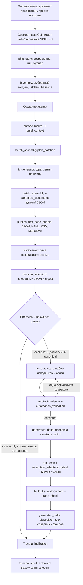
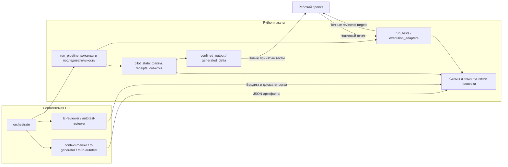
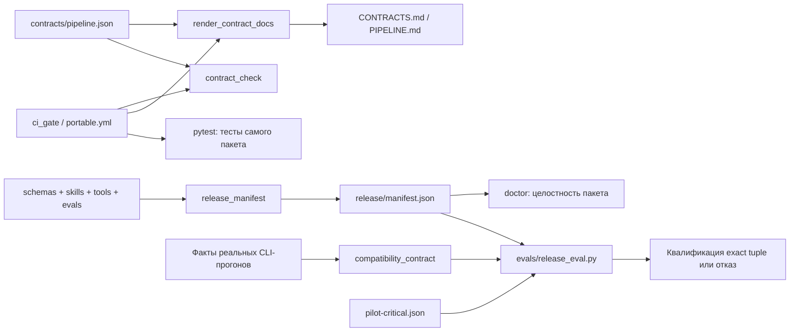
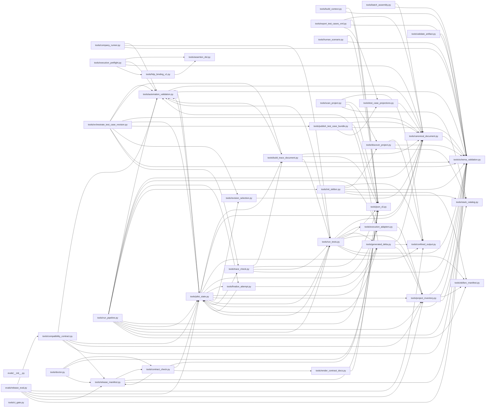

# Переносимый тестовый пайплайн: справочник файлов и взаимодействий

Срез кода: `d9e1ad91c0b45a0b67c68c5cad53c29e52cb1ac2` из `IxFire-X/test-skills`,
с последующим добавлением этого справочника. Дата: 2026-09-09.
Справочник описывает **все 181 файл текущего состава**,
включая служебные файлы, тестовые примеры, схемы, презентацию и сам справочник.
История Git, `.git`, временные каталоги и результаты внешних экспериментов в этот
состав не входят.

Документ предназначен для человека, который будет использовать или сопровождать
пакет. Он объясняет обязанности и связи; точные правила по-прежнему задают
`contracts/pipeline.json`, JSON Schema и исполняемый код. Это справочник устройства,
а не свидетельство квалификации какой-либо модели или среды.

## Как читать справочник

- **[Поток работы](#поток-работы)** — от требования до результата.
- **[Границы модулей](#границы-модулей)** — кто вызывает модель, пишет файлы и запускает тесты.
- **[Каталог файлов](#каталог-файлов)** — отдельная карточка каждого файла с назначением,
  причиной существования и техническими связями.
- **[Полная карта импортов](#полная-карта-импортов)** — все Python-модули `tools/` и `evals/`.
- **[Что менять для конкретной задачи](#что-менять-для-конкретной-задачи)** — маршрут сопровождения.
- **[Как поддерживать документ](#как-поддерживать-документ)** — правила обновления.

В карточках «импортирует» означает статическую зависимость Python, в том числе
импорт внутри функции или условной ветки. Это не утверждение, что модуль обязательно
исполняется на каждом запуске. Упоминание схемы в исходнике также не доказывает,
что соответствующий артефакт возникает в каждой ветке.

## Термины

| Термин | Что он означает здесь |
|---|---|
| Пакет / skill-pack | Копируемые инструкции, схемы и локальные Python-инструменты |
| Host / совместимая CLI | Внешняя программа, которая предоставляет модель, инструменты и отдельные контексты ролей |
| Controller | Действия CLI по инструкции `orchestrate` вместе с детерминированными границами в Python; отдельного LLM-сервиса в пакете нет |
| Run | Работа по одному запросу и профилю, связанная с конкретным проектом и затем модулем |
| Attempt | Одна сохраняемая попытка внутри run; завершённая попытка не переписывается |
| Canonical document | JSON с требованиями, кейсами, шагами и проверками; источник смысла для автоматизации |
| Envelope | Внешняя JSON-оболочка результата стадии: версия, стадия, артефакты и предупреждения |
| Digest | SHA-256, связывающий решение с точными байтами конкретного входа или выхода |
| Receipt | Запись о проверенном действии или публикации, которую следующий этап читает обратно |
| Baseline | Зафиксированные входы проекта и параметры среды до создания attempt |
| Generated delta | Полный набор новых файлов автотестов с содержимым, идентичностью и связями с ревью |
| Materialization | Контролируемая запись принятого набора файлов в активный test root проекта |
| Disposition | Решение для каждого созданного файла: сохранить, очистить или оставить из-за неопределённости/конфликта |
| Trace | Связи «требование → кейс → шаг → ожидание → assertion → код → факт исполнения» |
| Fresh reviewer | Отдельный контекст ревью, чья независимость подтверждается host evidence; другое имя модели само по себе её не доказывает |
| Qualification tuple | Точная комбинация пакета, CLI, моделей и ролей, ОС, runtime, сборки, адаптера и снимка проекта |

Версии обозначают разные сущности: контракт пайплайна — `4.0`, пакет —
`0.5.0-pilot`, canonical JSON — `1.0.0`, оболочки стадий — `5.0.0`.
Суффиксы `v1`, `v3`, `v4`, `v5` в именах профилей и функций нельзя автоматически
трактовать как наличие нескольких независимых пайплайнов.

## Поток работы



Цикл коррекции автоматизации ограничен: исходная версия и максимум одна полная
исправленная версия. Для canonical ветки действует другой протокол: одна reviewer
session и один authoritative verdict; при `AUTO_FIX_APPLIED` сам reviewer возвращает
полный successor revision 2. Это не свободный цикл повторной генерации.

`cases-only-v1` завершает работу с документацией и явным `NOT_APPLICABLE` для
исполнения; такой результат не равен принятому полному автоматизированному прогону.
`local-pilot-v1` допускает исполнение только после разрешения, принятого статического
ревью и полной materialization. Ошибка ревью или записи файлов закрывается своим
результатом; стрелки схемы не означают безусловный переход к запуску.

## Границы модулей

### Модель, Python и проект



В Python нет клиента конкретной модели. Инструменты проверяют, записывают,
сопоставляют и исполняют закрытые операции. Вызовы LLM и независимость контекстов
обеспечивает CLI. Пакет не создаёт sandbox, не устанавливает JDK/зависимости и не
исправляет приложение ради зелёного теста. Обычные project-native plugins и hooks
относятся к доверенному исполнению проекта.

### Четыре похожих файла о проекте

| Файл | Отдельная обязанность |
|---|---|
| `stack_catalog.py` | Общие признаки сборочных систем и правила обхода |
| `discover_project.py` | Найти модули и дать детерминированное предложение конфигурации |
| `scan_project.py` | Сформировать технический контекст выбранного target и связанных исходников |
| `project_inventory.py` | Зафиксировать разрешённые file IDs, исключения, baseline и точные порции контекста |

Они решают разные задачи. Найденный путь не становится разрешённым входом модели
до отбора и проверки inventory; обнаруженная сборка не доказывает готовность её запуска.

### Проверка, запись и завершение

| Модуль | Что решает | Чего его результат сам по себе не доказывает |
|---|---|---|
| `schema_validation.py` | JSON корректен и соответствует локальной схеме | Семантическая правильность и фактическая публикация |
| `canonical_document.py` | Связность и правила тестового документа | Что приложение удовлетворяет требованиям |
| `automation_validation.py` | Связи кода, assertions, ревью и допустимых revisions | Реальное исполнение исходников |
| `confined_output.py` | Безопасная запись/чтение в разрешённой файловой границе | Допустимость перехода жизненного цикла |
| `pilot_state.py` | Сохраняемые факты, readback, журнал и допустимые переходы | Качество текста без соответствующего ревью |
| `generated_delta.py` | Владение созданными файлами, materialization и disposition | PASS автотестов |
| `run_tests.py` | Связанный результат точных тестов и процесса | Полная приёмка до finalization |
| `finalize_attempt.py` | Проверка закрытия всех обязательств и итоговый результат | Квалификация других проектов и моделей |

`pilot_state.py` — самый большой модуль, потому что в нём сосредоточена проверка
долговременного состояния. Его API можно читать группами: создание run/attempt;
model requests и ответы; canonical/reviewer evidence; execution inputs и receipts;
восстановление после прерывания; closure/terminal artifacts; observations для release
eval и retained rerun. Общая точка нужна, чтобы другой CLI-процесс мог восстановить
тот же результат из файлов, а вызывающий код не мог заменить доказательство флагом.
Наличие общей точки не означает, что весь файл следует передавать модели при каждом
запросе: контекст выбирается по выполняемой операции.

### Жизненный цикл результатов и файлов


`COMPLETE` и `PASS` описывают разные оси; `COMPLETE + FAIL` допустим. `UNKNOWN`
сохраняет созданные файлы и не разрешает автоматический повтор исполнения.
При `FAIL`/`NOT_RUNNABLE` можно очищать лишь неизменённые файлы, принадлежащие
данной попытке; связанные копии и отчёты остаются в evidence. `RETAINED` до
finalization — факт сохранения файла, а не окончательное `accepted=true`.

Нативные результаты связываются с точными `(file_id, symbol_id)` и digest исходников.
Код завершения процесса без подходящего отчёта не становится доказательством PASS.
Retained rerun создаёт отдельное доказательство повторного запуска сохранённых тестов
и не переписывает terminal результат исходной попытки.

### Проверки выпуска



Проверки выпуска не входят автоматически в обычную генерацию кейсов. `doctor` и CI
проверяют реализацию; release eval проверяет фактические прогоны по политике
`adaptive-1-3-5-v1`. Сохранённое состояние пакета — `implemented_unverified`,
`ready_tuple=null`. Удаление неиспользуемого кода это состояние не повышает.

## Корпоративная среда и границы поддержки

Для работы в компании не обязательно нужен `company_runner.py`. Возможны три
разных устройства исполнения:

| Вариант | Что используется | Нужен ли отдельный company adapter |
|---|---|---|
| CLI и тесты работают на рабочем компьютере | Project-native pytest/Maven/Gradle | Нет |
| CLI/пайплайн и тесты работают в job корпоративного CI | Те же нативные инструменты внутри этой среды, если выполнены требования host/профиля | Не обязательно; сам факт CI не требует этого адаптера |
| CLI работает отдельно и отправляет задание внешнему сервису | API submit/status/result/JUnit конкретной компании | Потребуется реализованное и отдельно проверенное подключение |

`tools/company_runner.py` (502 строки) и его схема сохранены как заготовка для
третьего варианта: в рабочей среде допускаются как локальное, так и корпоративное
исполнение, а точный сервис пока не выбран. Это не подтверждение пригодности
заготовки для будущего сервиса. Основной local-pilot модуль не импортирует, а
`resolve_company_runner()` сейчас возвращает `UnavailableCompanyRunner`.
`ScriptedCompanyRunner` — тестовая имитация, не рабочий CI-клиент.

Упоминания `company_runner` в `not_applicable`, диагностике и тестах обозначают
отсутствие подтверждённой поддержки в core pilot. Наличие этих файлов не даёт
оснований обещать готовое удалённое исполнение. Служебные тесты, release eval и
документы также имеют назначение, хотя не участвуют в каждом пользовательском run.

## Каталог файлов

Карточки ниже описывают содержимое файлов. Для Python перечислены публичные
определения верхнего уровня; приватные функции остаются деталями реализации.
Для тестов описаны проверяемое поведение и риск, от которого они защищают;
нужный файл можно запустить через `pytest путь/к/файлу.py`.
Перечисление тестов не означает, что все они запускались при подготовке справочника.


## Документы и конфигурация


### `.gitattributes`

[Открыть файл](../.gitattributes)

**За что отвечает.** Задаёт LF для текстовых файлов при работе Git на Linux и Windows.

**Зачем нужен.** Receipts и release manifest связывают точные байты; автоматическая подмена перевода строк нарушила бы digest даже при одинаковом видимом тексте.


### `.github/workflows/portable.yml`

[Открыть файл](../.github/workflows/portable.yml)

**За что отвечает.** GitHub Actions implementation gate: Ubuntu с Python 3.11/3.12 и Windows с Python 3.12, установка requirements-dev, ci_gate и doctor.

**Зачем нужен.** Проверяет сам пакет на разных платформах. Не настраивает CI проекта пользователя и не доказывает qualification конкретной модели.


### `.gitignore`

[Открыть файл](../.gitignore)

**За что отвечает.** Исключает __pycache__, Python bytecode, pytest cache и один исторический служебный отчёт Superpowers.

**Зачем нужен.** Локальные побочные файлы разработки не должны попасть в исходный состав пакета. Строка исключения не означает, что такой файл поставляется.


### `.skillsrc.example`

[Открыть файл](../.skillsrc.example)

**За что отвечает.** Пример конфигурации модулей backend/frontend, source/test roots, discovery policy и Python adapter/interpreter.

**Зачем нужен.** Показывает структуру для настройки своего проекта. Это пример, не активная .skillsrc; указанный Windows interpreter не является универсальным путём для всех ОС.


### `CONTRACTS.md`

[Открыть файл](../CONTRACTS.md)

**За что отвечает.** Generated проекция contracts/pipeline.json: согласованные версии, реестры, runtime bindings и контрактные правила.

**Зачем нужен.** Позволяет читать machine truth без разбора JSON; обновляется render_contract_docs, а не независимыми ручными правками.


### `HOW-IT-WORKS.md`

[Открыть файл](../HOW-IT-WORKS.md)

**За что отвечает.** Объясняет ход run, baseline, batches, reviewer session, profiles, native execution, disposition, finalization и qualification.

**Зачем нужен.** Даёт связное объяснение протокола; дополняет справочник отдельных файлов и не заменяет машинный контракт.


### `PIPELINE.md`

[Открыть файл](../PIPELINE.md)

**За что отвечает.** Generated обзор стадий, событий, жизненного цикла и result/acceptance правил.

**Зачем нужен.** Наглядная проекция одного источника правил. Проверка drift ловит расхождение с contracts/pipeline.json.


### `README.md`

[Открыть файл](../README.md)

**За что отвечает.** Главная точка знакомства: назначение пакета, вход через orchestrate, профили, результаты, ограничения и ссылки на подробные руководства.

**Зачем нужен.** Пользователь должен понимать способ запуска и границы подтверждённого до чтения исходников.


### `RELEASE.md`

[Открыть файл](../RELEASE.md)

**За что отвечает.** Инструкция сопровождения выпуска: package identity, manifest, qualification evidence, точная комбинация среды и границы release readiness.

**Зачем нужен.** Успешные локальные проверки реализации не должны автоматически превращаться в широкое обещание совместимости.


### `USAGE.md`

[Открыть файл](../USAGE.md)

**За что отвечает.** Практическое руководство по invocation и командам, конфигурации, входным/выходным артефактам и продолжению работы.

**Зачем нужен.** Даёт последовательность использования пакета; справочник файлов объясняет устройство, но не заменяет сценарий запуска.


### `contracts/pipeline.json`

[Открыть файл](../contracts/pipeline.json)

**За что отвечает.** Machine truth Pipeline 4.0: Skills/stages, артефакты/схемы, профили/адаптеры, runtime signatures, event order, lifecycle, result tuples, acceptance и exit policy.

**Зачем нужен.** Все документы и проверки должны ссылаться на один согласованный протокол; отдельная инструкция не может молча изменить правила.


### `docs/pilot-evidence.md`

[Открыть файл](../docs/pilot-evidence.md)

**За что отвечает.** Отчёт о большом пилоте и границах фактически подтверждённого.

**Зачем нужен.** Сохраняет проверяемые наблюдения и ограничения; исторический результат не заменяет свежую qualification новой версии или модели.


### `docs/pipeline-file-guide-ru.md`

[Открыть файл](../docs/pipeline-file-guide-ru.md)

**За что отвечает.** Этот справочник: карточка каждого поставляемого файла, поток данных, обязанности модулей, карта импортов и маршрут сопровождения.

**Зачем нужен.** Даёт подробную карту пакета человеку или LLM, которая впервые его сопровождает. Не используется как новый controller и не меняет протокол пайплайна.


### `docs/portable-pipeline-overview-ru.md`

[Открыть файл](../docs/portable-pipeline-overview-ru.md)

**За что отвечает.** Русский обзор результата работы, структуры пакета и причин попробовать его на проекте.

**Зачем нужен.** Короткий вводный материал для коллег, которым пока не нужны детали каждого Python-модуля.


### `docs/portable-testing-pipeline-ru.pptx`

[Открыть файл](../docs/portable-testing-pipeline-ru.pptx)

**За что отвечает.** Презентация из 16 слайдов о переносимом тестовом пайплайне.

**Зачем нужен.** Материал для объяснения команде; не исполняемый компонент и не источник machine truth.


### `docs/presentation-notes-ru.md`

[Открыть файл](../docs/presentation-notes-ru.md)

**За что отвечает.** Подробные заметки докладчика к презентации.

**Зачем нужен.** Позволяют последовательно объяснить слайды, условия использования и ограничения без перегрузки самих слайдов.


### `docs/superpowers/plans/2026-08-26-portable-testing-skills-pilot-delivery.md`

[Открыть файл](../docs/superpowers/plans/2026-08-26-portable-testing-skills-pilot-delivery.md)

**За что отвечает.** Исторический план реализации frozen pilot с фазами, файлами, проверками и найденными расхождениями.

**Зачем нужен.** Сохраняет причины технических решений и маршрут реализации. Указания исторического плана не означают, что его нужно заново исполнять при запуске пакета.


### `docs/superpowers/specs/2026-08-26-portable-testing-skills-frozen-pilot-contract.md`

[Открыть файл](../docs/superpowers/specs/2026-08-26-portable-testing-skills-frozen-pilot-contract.md)

**За что отвечает.** Подробная согласованная архитектура frozen pilot: product boundary, ownership, authorization, evidence, lifecycle и условия приёмки.

**Зачем нужен.** Объясняет смысл ограничений и проектные решения; читать вместе с принятым erratum и текущим машинным контрактом.


### `docs/superpowers/specs/2026-09-01-portable-testing-skills-pilot-contract-erratum.md`

[Открыть файл](../docs/superpowers/specs/2026-09-01-portable-testing-skills-pilot-contract-erratum.md)

**За что отвечает.** Принятая поправка к четырём историческим положениям frozen contract.

**Зачем нужен.** Устраняет конкретные противоречия без незаметного переписывания истории проектных решений.


### `pytest.ini`

[Открыть файл](../pytest.ini)

**За что отвечает.** Настройка pytest пакета: где искать его проверки.

**Зачем нужен.** Отделяет приёмку реализации от тестов целевого проекта и обеспечивает повторяемое обнаружение тестов.


### `release/dependencies.lock.txt`

[Открыть файл](../release/dependencies.lock.txt)

**За что отвечает.** Снимок закреплённых версий зависимостей выпуска.

**Зачем нужен.** Помогает воспроизвести среду приёмки. Это описание среды пакета, не lock file приложения пользователя и не самостоятельный установщик.


### `release/manifest.json`

[Открыть файл](../release/manifest.json)

**За что отвечает.** Сохранённый digest-реестр runtime файлов плюс версии, профили, стадийные роли и qualification=implemented_unverified/ready_tuple=null.

**Зачем нужен.** Точная проверка целостности/идентичности поставки; генерируется tools.release_manifest и не редактируется вручную. Документация под docs/ и тесты не входят в runtime registry этого манифеста.


### `requirements-dev.txt`

[Открыть файл](../requirements-dev.txt)

**За что отвечает.** Подключает requirements.txt и закрепляет pytest для разработки.

**Зачем нужен.** Зависимости приёмки пакета отделены от библиотек, необходимых конечному пользователю.


### `requirements.txt`

[Открыть файл](../requirements.txt)

**За что отвечает.** Закреплённые версии runtime-зависимостей: jsonschema, PyYAML и зависимости JSON Schema.

**Зачем нужен.** Пакету нужны строгая валидация JSON и чтение YAML .skillsrc; установленная версия должна соответствовать проверяемому окружению.


## Инструкции ролей


### `skills/autotest-reviewer/SKILL.md`

[Открыть файл](../skills/autotest-reviewer/SKILL.md)

**За что отвечает.** Инструкция независимого статического ревью сгенерированных автотестов до materialization и execution.

**Зачем нужен.** Отделяет написание кода от проверки его соответствия canonical, безопасности операций и полноты assertions.


### `skills/autotest-reviewer/references/autotest-review-contract.md`

[Открыть файл](../skills/autotest-reviewer/references/autotest-review-contract.md)

**За что отвечает.** Детальные критерии проверки automation artifact, implementation relations, семантики, revision identity и исходников.

**Зачем нужен.** Определяет, что именно должно быть проверено перед тем, как code generation получит право на запись и запуск.


### `skills/context-marker/SKILL.md`

[Открыть файл](../skills/context-marker/SKILL.md)

**За что отвечает.** Инструкция роли выделения и нормализации требований из разрешённого документа и контекста. Результат — context-marker envelope для batch planning.

**Зачем нужен.** Генерация должна начинаться с прослеживаемых требований, а не с догадок по именам файлов.


### `skills/context-marker/references/context-artifact-contract.md`

[Открыть файл](../skills/context-marker/references/context-artifact-contract.md)

**За что отвечает.** Правила context artifact: исходные requirement identities, provenance, grounding, diagnostics и допустимые источники.

**Зачем нужен.** Сохраняет различие между словами пользователя, доказательствами реализации и нормализованными требованиями.


### `skills/orchestrate/SKILL.md`

[Открыть файл](../skills/orchestrate/SKILL.md)

**За что отвечает.** Главная инструкция совместимой CLI: принять требования/профиль, создать run, провести все стадии, обеспечить fresh review, ограниченные коррекции, evidence и terminal closure.

**Зачем нужен.** Python не вызывает модель сам: последовательность model-enabled работы задаётся здесь, а факты проверяются исполняемыми инструментами.


### `skills/orchestrate/references/orchestration-contract.md`

[Открыть файл](../skills/orchestrate/references/orchestration-contract.md)

**За что отвечает.** Подробный контракт оркестрации: обязательный порядок, авторитет источников, model requests, reviewer cardinality, generated set, dispositions и результаты.

**Зачем нужен.** Выносит точные правила из точки входа, сохраняя ссылки на machine truth и durable evidence.


### `skills/tc-generator/SKILL.md`

[Открыть файл](../skills/tc-generator/SKILL.md)

**За что отвечает.** Инструкция генератору canonical cases по конкретному batch plan/контексту, с literal данными, шагами и наблюдаемыми результатами.

**Зачем нужен.** Приводит генерацию к формату пригодной для людей документации и последующей автоматизации.


### `skills/tc-generator/references/case-generation-contract.md`

[Открыть файл](../skills/tc-generator/references/case-generation-contract.md)

**За что отвечает.** Детальные требования к purpose, preconditions, действиям, ожидаемым результатам, assertions, границам сценария, данным и покрытиям.

**Зачем нужен.** Основное место настройки качества/читаемости всех новых кейсов, а не разовых исправлений одного результата генерации.


### `skills/tc-reviewer/SKILL.md`

[Открыть файл](../skills/tc-reviewer/SKILL.md)

**За что отвечает.** Инструкция независимого reviewer канонического документа: проверить смысл, покрытие, читаемость и допустимость полного successor.

**Зачем нужен.** Генератор не должен сам назначать своему документу authoritative acceptance.


### `skills/tc-reviewer/references/review-verdicts.md`

[Открыть файл](../skills/tc-reviewer/references/review-verdicts.md)

**За что отвечает.** Значение вердиктов, findings, причин REWORK и допустимого AUTO_FIX_APPLIED, включая правила successor и bindings.

**Зачем нужен.** Reviewer и controller должны одинаково понимать последствия вердикта и предел исправлений.


### `skills/tc-to-autotest/SKILL.md`

[Открыть файл](../skills/tc-to-autotest/SKILL.md)

**За что отвечает.** Инструкция генератору automation artifact из выбранного effective canonical JSON/digest и фактов проекта.

**Зачем нужен.** Исходники тестов должны реализовать принятые шаги/ожидания и явные связи, сохраняя семантику кейсов.


### `skills/tc-to-autotest/assets/java-python-conventions/java-junit5.md`

[Открыть файл](../skills/tc-to-autotest/assets/java-python-conventions/java-junit5.md)

**За что отвечает.** Памятка генерации Java/JUnit 5 по принятому контракту и проектным conventions.

**Зачем нужен.** Даёт языковые правила в точке, где они нужны, без смешения с Python-памяткой и без добавления runtime зависимости.


### `skills/tc-to-autotest/assets/java-python-conventions/python-pytest.md`

[Открыть файл](../skills/tc-to-autotest/assets/java-python-conventions/python-pytest.md)

**За что отвечает.** Памятка генерации Python/pytest с учётом конфигурации, fixtures и native обнаружения тестов.

**Зачем нужен.** Помогает выдавать тесты, которые вписываются в реальный проект и могут быть исполнены по reviewed targets.


### `skills/tc-to-autotest/references/automation-output-contract.md`

[Открыть файл](../skills/tc-to-autotest/references/automation-output-contract.md)

**За что отвечает.** Контракт набора исходников: native roots, file/symbol IDs, implementation relations, review chain, bindings, запреты изменения приложения и рекомендации безопасного повторного использования Spring fixtures.

**Зачем нужен.** Согласует Java/Python генерацию с валидатором, executor и правилами сохранения файлов; не разрешает удалять проверки ради компактности.


## Исполняемые модули


### `tools/assertion_dsl.py`

[Открыть файл](../tools/assertion_dsl.py)

**За что отвечает.** Вычисляет канонические assertions независимо от pytest/JUnit: состояния отсутствующего значения, контекст наблюдений, результат проверки и ограниченный portable-regex-v1. Получает выражение и наблюдаемые значения; возвращает AssertionResult.

**Зачем нужен.** Смысл машинной проверки должен быть определён единообразно, а отсутствие значения нельзя смешивать с JSON null. Это библиотека семантики, не самостоятельный запуск всех сгенерированных Java-тестов.

**Основные определения в коде:** `ValueState`, `EvaluationContext`, `AssertionResult`, `portable_fullmatch`, `evaluate_assertion`.


### `tools/automation_validation.py`

[Открыть файл](../tools/automation_validation.py)

**За что отвечает.** Проверяет V5 automation artifact, пути и идентификаторы файлов/символов, implementation relations, покрытие assertions, привязку статического ревью и цепочку revisions. Получает canonical, automation и review; возвращает diagnostics либо подтверждает допустимость.

**Зачем нужен.** Результат модели нельзя передавать executor только по правильной JSON-форме: нужно доказать, что проверен именно этот код и все требуемые связи, а бюджет исправлений не превышен.

**Основные определения в коде:** `AutomationArtifactError`, `canonical_automation_bytes`, `automation_sha256`, `implementation_relations_sha256`, `autotest_review_sha256`, `host_isolation_sha256`, `portable_path_key`, `validate_automation_artifact`, `required_symbol_pairs`, `validate_accepted_autotest_review`, `validate_automation_revision_chain`.


### `tools/batch_assembly.py`

[Открыть файл](../tools/batch_assembly.py)

**За что отвечает.** Строит детерминированный batch plan, проверяет принадлежность фрагментов своим требованиям и собирает единый canonical документ. Публикует фрагменты и assembly evidence; порядок входных фрагментов не должен менять итоговые байты.

**Зачем нужен.** Позволяет разложить генерацию по доказанным границам, не потеряв требования, ID и порядок. При недоказанной независимости по умолчанию остаётся один полный batch.

**Основные определения в коде:** `BatchAssemblyError`, `canonical_bytes`, `plan_batches`, `validate_fragment`, `assemble_candidate`, `publish_fragment`.


### `tools/build_context.py`

[Открыть файл](../tools/build_context.py)

**За что отвечает.** Строит context-marker envelope из разрешённых документов и source handles. Нормализует требования, сохраняет grounding/provenance и выявляет конфликты или непокрытые требования.

**Зачем нужен.** Даёт генератору связь с исходным запросом; технические исходники не должны самопроизвольно превращаться в выдуманные требования.

**Основные определения в коде:** `extract_inventory`, `extract_handles`, `RequirementConflict`, `grounding_diagnostics`, `uncovered_requirements`, `build_context`, `main`.


### `tools/build_trace_document.py`

[Открыть файл](../tools/build_trace_document.py)

**За что отвечает.** Собирает V5 pre-finalization trace из canonical, automation, review и execution. Связывает требования, кейсы, шаги, ожидания, assertions, файлы, символы и факты исполнения; содержит отдельную валидацию trace.

**Зачем нужен.** Текстовое сообщение о PASS недостаточно: нужен проверяемый путь от каждого обязательства к конкретному коду и результату. Этот trace ещё не имеет полномочий terminal результата.

**Основные определения в коде:** `TraceBuildError`, `project_declared_order`, `trace_sha256`, `build_trace`, `validate_trace_document`, `main`.


### `tools/canonical_document.py`

[Открыть файл](../tools/canonical_document.py)

**За что отвечает.** Загружает canonical JSON и проверяет его семантику, взаимные ссылки, порядок, содержимое кейсов и identity revisions. Формирует детерминированные canonical bytes и document SHA-256.

**Зачем нужен.** Это общая граница смысла документа, используемая генерацией, ревью, публикацией, автоматизацией и трассировкой. HTML/CSV не заменяют её.

**Основные определения в коде:** `CanonicalDocumentError`, `validate_canonical_document`, `require_valid_canonical_document`, `canonical_bytes`, `document_sha256`, `load_canonical_document`.


### `tools/ci_gate.py`

[Открыть файл](../tools/ci_gate.py)

**За что отвечает.** Последовательно запускает полный contract check, проверку generated документов и pytest самого пакета; останавливается на первом ненулевом коде. Принимает --root.

**Зачем нужен.** Даёт разработчику и GitHub Actions одну воспроизводимую команду приёмки реализации. Не запускается автоматически при обычной генерации и не квалифицирует модели.

**Основные определения в коде:** `main`.


### `tools/company_runner.py`

[Открыть файл](../tools/company_runner.py)

**За что отвечает.** Содержит типы запросов/ответов внешнего корпоративного runner, проверку идентичности результатов/JUnit и company receipt, тестовый ScriptedCompanyRunner и точку resolve_company_runner. По умолчанию выбран UnavailableCompanyRunner.

**Зачем нужен.** Это заготовка для отдельного внешнего сервиса, а не необходимая часть запуска на рабочем компьютере. Основной local-pilot её не импортирует; рабочего корпоративного подключения нет. Наличие файла не означает поддержку корпоративного CI.

**Основные определения в коде:** `CompanyRunnerError`, `CompanyExecutionError`, `CompanyRunRequest`, `CompanyRunResult`, `validate_company_result`, `execution_report_digest`, `validate_company_execution_receipt`, `CompanyRunner`, `UnavailableCompanyRunner`, `resolve_company_runner`, `ScriptedCompanyRunner`, `request_from_artifacts`, `result_as_dict`, `matching_result`, `execute_company_details`, `execute_company`.


### `tools/compatibility_contract.py`

[Открыть файл](../tools/compatibility_contract.py)

**За что отвечает.** Проверяет evidence совместимой CLI на основании реального durable run: реестр стадий, входы/выходы, reviewer isolation, resume, artifact readback и привязку release manifest.

**Зачем нужен.** Заявления CLI о собственной совместимости недостаточно. Проверка не позволяет получить qualified результат только самоподписанным JSON без фактов run.

**Основные определения в коде:** `evidence_digest`, `validate_compatibility_evidence`.


### `tools/confined_output.py`

[Открыть файл](../tools/confined_output.py)

**За что отвечает.** Реализует ограниченные файловой границей операции: получение безопасной цели, атомарную запись, exclusive creation, чтение и удаление только при равенстве байтов. Проверяет компоненты пути, идентичность каталогов и reparse/symlink риски.

**Зачем нужен.** Все вызывающие модули должны сохранять и читать доказательства без выхода из разрешённого дерева и без перезаписи чужих данных. Есть операции для docs/to_do и для явно переданного ограниченного root.

**Основные определения в коде:** `OutputConfinementError`, `ConfinedOutputTarget`, `acquire_confined_output`, `atomic_write_confined_bytes`, `atomic_write_confined_bytes_at_root`, `create_confined_bytes_exclusive`, `create_confined_directory_exclusive`, `ensure_project_child_directory`, `read_confined_bytes`, `remove_confined_bytes_if_equal`.


### `tools/contract_check.py`

[Открыть файл](../tools/contract_check.py)

**За что отвечает.** Проверяет Pipeline 4.0: состав реестров, порядок, stage/schema/runtime bindings, lifecycle, result axes, acceptance и соответствие проекций. Полный режим дополнительно проверяет целостность зарегистрированной реализации.

**Зачем нужен.** Находит расхождение кода, схем, инструкций и machine truth до запуска пользователя. Это не редактор контракта и не тест качества конкретной генерации.

**Основные определения в коде:** `validate_pipeline_contract`, `main`.


### `tools/discover_project.py`

[Открыть файл](../tools/discover_project.py)

**За что отвечает.** Обходит проект только для чтения, находит сборочные манифесты и модули, анализирует module roots и создаёт discovery report с fingerprint, предупреждениями и вопросами.

**Зачем нужен.** Детерминированные признаки проекта надёжнее догадки LLM. Неоднозначность должна быть выражена в отчёте до выбора модуля и конфигурации.

**Основные определения в коде:** `find_confined_manifests`, `analyze_module_roots`, `project_fingerprint`, `validate_report`, `build_report`, `discover_project`, `main`.


### `tools/doctor.py`

[Открыть файл](../tools/doctor.py)

**За что отвечает.** Проверяет наличие обязательных файлов, версии контрактов, release manifest, Python и необходимых библиотек; возвращает JSON со status_scope=pack_integrity.

**Зачем нужен.** Позволяет быстро отличить повреждённый/неполный пакет от задачи генерации. PASS здесь не доказывает qualification Java/Python или конкретной CLI/модели.

**Основные определения в коде:** `inspect_environment`, `main`.


### `tools/execution_adapters.py`

[Открыть файл](../tools/execution_adapters.py)

**За что отвечает.** Из закрытого adapter ID, baseline и reviewed targets строит ExecutionRequest/argv, вычисляет digest запроса, вызывает процесс и классифицирует prestart/execution outcomes.

**Зачем нужен.** Сохраняет точные cwd, runtime и targets; не принимает произвольные shell templates, не ставит зависимости и не решает самостоятельно повторять UNKNOWN.

**Основные определения в коде:** `AdapterRequestError`, `ExecutionRequest`, `request_digest`, `build_request`, `command_for`, `classify_prestart`, `invoke_request`, `is_zero_test_report`, `classify_execution`, `unknown_allows_automatic_retry`.


### `tools/execution_preflight.py`

[Открыть файл](../tools/execution_preflight.py)

**За что отвечает.** Проверяет доступность и согласованность provider/adapter bindings канонического исполнения без сокетов и subprocess. Даёт PreflightResult, интерфейсы ProviderResolver/AdapterRegistry и реализации ограниченных реестров.

**Зачем нужен.** Требуемые входы, runtime handles и адаптеры должны быть доказаны до действия. Это отдельная семантическая граница; путь исполнения принятых исходников дополнительно опирается на статическое ревью и реальный native процесс.

**Основные определения в коде:** `ProviderResolver`, `AdapterRegistry`, `PreflightResult`, `EnvironmentOnlyProviderResolver`, `RejectingAdapterRegistry`, `ExactAdapterRegistry`, `is_reviewed_adapter_registry`, `reviewed_adapter_registry`, `preflight_execution`.


### `tools/export_test_cases_xml.py`

[Открыть файл](../tools/export_test_cases_xml.py)

**За что отвечает.** CLI для явного экспорта canonical документа в детерминированный Zephyr XML по observed профилю, с валидацией входа и выводом результата операции.

**Зачем нужен.** XML нужен как опциональная проекция для импорта. Совпадение с наблюдавшимся форматом не доказывает успешный import/re-export в реальном tenant.

**Основные определения в коде:** `main`.


### `tools/finalize_attempt.py`

[Открыть файл](../tools/finalize_attempt.py)

**За что отвечает.** Определяет disposition, строит pre-finalization trace, проверяет обязательства закрытия, публикует terminal result и derived trace. Durable вариант связывает это с сохранёнными receipts.

**Зачем нужен.** Все ветки, включая отказ до execution, partial materialization и UNKNOWN, должны иметь честный конечный результат. Модуль не запускает executor и не переписывает старые receipts.

**Основные определения в коде:** `FinalizationError`, `decide_dispositions`, `disposition_receipt`, `build_pre_finalization_trace`, `verify_finalization`, `publish_terminal_result`, `derive_terminal_trace`, `finalize_attempt`, `finalize_durable_execution_attempt`.


### `tools/generated_delta.py`

[Открыть файл](../tools/generated_delta.py)

**За что отвечает.** Проверяет и материализует полный набор новых тестовых файлов, инспектирует фактический набор/байты, определяет readiness и применяет принятые dispositions.

**Зачем нужен.** Защищает существующие файлы и связывает создание/сохранение/очистку каждого нового файла с accepted review и attempt. Не исполняет тесты и не разрешает запуск частично записанного набора.

**Основные определения в коде:** `GeneratedDeltaError`, `materialize_delta`, `inspect_delta`, `inspect_attempt_delta`, `execution_readiness`, `resolve_disposition_policy`, `apply_dispositions`.


### `tools/http_binding_v1.py`

[Открыть файл](../tools/http_binding_v1.py)

**За что отвечает.** Определяет построение HTTP-запроса, одно выполнение через переданный Transport, наблюдение ответа и валидацию URL/входных значений. Использует нейтральные AbstractRequest, RawResponse и ExecutionError.

**Зачем нужен.** Закрепляет смысл HTTP binding без навязывания HTTP-библиотеки. Сам не содержит сетевого клиента; транспорт передаёт вызывающий код. Его наличие не означает отдельный удалённый runner.

**Основные определения в коде:** `AbstractRequest`, `RawResponse`, `ExecutionError`, `Transport`, `build_request`, `execute_once`, `observe_response`, `validate_preflight_base_url`, `validate_preflight_input_value`, `validate_preflight_typed_value`.


### `tools/human_scenario.py`

[Открыть файл](../tools/human_scenario.py)

**За что отвечает.** Проверяет человекочитаемую сторону canonical: наличие осмысленного сценария вместо тонкого каталога заголовков/проверок. Принимает canonical и возвращает diagnostics.

**Зачем нужен.** Структурно правильный JSON может быть неудобен для тестировщика. Нужна отдельная проверка, дополняющая схему и инструкции к естественному языку.

**Основные определения в коде:** `check_canonical`, `main`.


### `tools/init_skillsrc.py`

[Открыть файл](../tools/init_skillsrc.py)

**За что отвечает.** Превращает discovery evidence в .skillsrc, сверяет предложение с существующей конфигурацией, описывает конфликт и безопасно пишет только разрешённое создание/замену с readback.

**Зачем нужен.** Конфигурация проекта должна иметь подтверждённый источник. Уже валидная .skillsrc авторитетна; обнаружение новых предположений не разрешает молча заменить её.

**Основные определения в коде:** `InitError`, `NeedsInput`, `Conflict`, `compile_skillsrc`, `reconcile_skillsrc`, `atomic_write_skillsrc`, `ensure_skillsrc`, `main`.


### `tools/json_cli.py`

[Открыть файл](../tools/json_cli.py)

**За что отвечает.** Общий JsonArgumentParser и emit_error переводят ошибки аргументов в стабильный JSON-ответ.

**Зачем нужен.** Поддерживает единообразную машинную границу небольших CLI-команд без отдельного фреймворка командной строки.

**Основные определения в коде:** `emit_error`, `JsonArgumentParser`.


### `tools/orchestrate_test_case_revision.py`

[Открыть файл](../tools/orchestrate_test_case_revision.py)

**За что отвечает.** Публикует UNREVIEWED canonical, связывает reviewer package, открывает/проверяет reviewer session, выбирает effective revision и строит orchestration result.

**Зачем нужен.** Решает именно жизненный цикл ревью документа. Не является вторым LLM-controller и не подменяет durable состояние всего run.

**Основные определения в коде:** `OrchestrationResult`, `OrchestrationError`, `reviewer_package_binding`, `open_reviewer_session`, `validate_reviewer_session`, `publish_unreviewed_candidate`, `orchestrate_revision`, `finalize_orchestration`, `main`.


### `tools/pilot_state.py`

[Открыть файл](../tools/pilot_state.py)

**За что отвечает.** Хранит и проверяет append-only run/attempt state, события, authorization, model requests/ответы, reviewer ledgers, execution inputs/receipts, closure и observations. Публичные операции публикуют и читают evidence обратно.

**Зачем нужен.** Это авторитетная граница восстановления и происхождения фактов. Переход нельзя легализовать одним флагом вызывающей функции; завершённое состояние и идентичность артефактов защищены от переписывания.

**Основные определения в коде:** `create_run`, `derive_state`, `model_lifecycle_projection`, `append_event`, `claim_execution_start`, `record_execution_unknown`, `record_process_stopped`, `module_selection_digest`, `create_attempt`, `freeze_phase_two_inputs`, `publish_model_request`, `read_model_request`, `publish_model_stage_artifact`, `read_model_stage_artifact`, `publish_context_selection`, `read_context_selection`, `publish_reviewer_session_ledger`, `read_reviewer_session_ledger`, `reviewer_lifecycle_projection`, `terminal_reviewer_evidence`, `read_run`, `publish_attempt_receipt`, `read_attempt_receipt`, `publish_execution_trace_pair`, `publish_effective_canonical`, `publish_execution_inputs`, `recover_execution_inputs_events`, `read_execution_inputs`, `publish_resume_validation`, `read_resume_validation_if_present`, `read_effective_canonical`, `read_effective_canonical_if_present`, `recover_phase5_receipt_events`, `recover_execution_receipt_events`, `open_automation_review_boundary`, `publish_generated_delta`, `publish_phase5_receipt`, `remove_attempt_receipt_if_created`, `terminal_result`, `publish_closure_artifact`, `read_closure_artifact`, `read_closure_artifact_if_present`, `publish_terminal_result`, `read_terminal_result`, `publish_run_artifact_bytes`, `read_retained_native_rerun`, `read_scenario_observation`, `publish_project_state_observation`, `publish_resume_observations`, `publish_retained_rerun_observation`, `exit_code`.


### `tools/project_inventory.py`

[Открыть файл](../tools/project_inventory.py)

**За что отвечает.** Создаёт безопасный metadata-only inventory, исключения, identity проекта/runtime, .skillsrc authority, execution baseline и C-lite context batches. Фиксирует receipts и проверяет drift при повторном чтении.

**Зачем нужен.** Модель получает только разрешённые file IDs и байты; секреты, изменившиеся входы или поздно найденные обязательные build inputs не должны незаметно расширять попытку.

**Основные определения в коде:** `InventoryError`, `ContextSelectionError`, `build_skillsrc_authority_receipt`, `module_runtime_path`, `runtime_identity`, `project_identity`, `token_signature_rule`, `build_inventory`, `build_execution_baseline`, `validate_execution_baseline_binding`, `freeze_inventory_receipt`, `read_inventory_receipt`, `build_exclusion_receipt`, `freeze_exclusion_receipt`, `read_exclusion_receipt`, `freeze_execution_baseline`, `read_execution_baseline`, `validate_execution_baseline`, `baseline_external_input_paths`, `select_context_batches`, `freeze_context_receipt`, `validate_context_receipt_binding`.


### `tools/publish_test_case_bundle.py`

[Открыть файл](../tools/publish_test_case_bundle.py)

**За что отвечает.** Строит и публикует единый bundle canonical JSON/HTML/CSV с derived Markdown companion; создаёт Receipt и проверяет существующие байты при повторном обращении.

**Зачем нужен.** Даёт людям читаемые кейсы, сохраняя один семантический JSON. Markdown сверяется при публикации, но не включён в старый receipt; verify_bundle/--verify-only проверяет JSON/HTML/CSV.

**Основные определения в коде:** `BundlePayloads`, `Receipt`, `BundleMismatchError`, `BundlePublicationError`, `build_bundle`, `publish_bundle`, `verify_bundle`, `main`.


### `tools/release_manifest.py`

[Открыть файл](../tools/release_manifest.py)

**За что отвечает.** Собирает и проверяет реестр exact runtime bytes под contracts, schemas, skills, tools и evals, связывает версии/профили/qualification и пишет release/manifest.json.

**Зачем нужен.** Обнаруживает добавленные, удалённые или изменённые runtime файлы и подмену метаданных. Реестр включает служебные проверки выпуска; он не является списком только модулей горячего пути.

**Основные определения в коде:** `build_release_manifest`, `verify_release_manifest`, `load_release_manifest`, `main`.


### `tools/render_contract_docs.py`

[Открыть файл](../tools/render_contract_docs.py)

**За что отвечает.** Детерминированно создаёт CONTRACTS.md и PIPELINE.md из contracts/pipeline.json; --check сравнивает с уже сохранёнными файлами.

**Зачем нужен.** Человекочитаемые проекции не должны расходиться с machine truth. Изменять их вручную как независимый источник нельзя.

**Основные определения в коде:** `main`.


### `tools/revision_selection.py`

[Открыть файл](../tools/revision_selection.py)

**За что отвечает.** Проверяет привязку reviewer verdict, допустимый successor, lineage и сохранение подтверждённой семантики; выбирает эффективный canonical документ.

**Зачем нужен.** Ревью относится к точному digest. Исправление не может заменить исходные требования, перепутать revision или бесконечно продолжать цикл.

**Основные определения в коде:** `reviewer_verdict_is_bound`, `effective_review_is_bound`, `SelectionError`, `validate_successor`, `validate_review_decision`, `select_effective_document`.


### `tools/run_pipeline.py`

[Открыть файл](../tools/run_pipeline.py)

**За что отвечает.** Внешние команды scan/status/exec/rerun-retained и функции Phase 1 spine связывают инвентаризацию, durable state, проверенное исполнение, resume и finalization.

**Зачем нужен.** Предоставляет совместимой CLI ограниченные операции по файлам и состоянию. Не содержит вызова модели, не превращает один путь проекта в разрешение придумать требования и выполнить тесты.

**Основные определения в коде:** `HostStop`, `cmd_scan`, `cmd_exec`, `rerun_retained_tests`, `cmd_rerun_retained`, `cmd_status`, `run_phase_one_spine`, `resume_phase_one_spine`, `finalize_phase_one_spine`, `build_parser`, `argparse_parent`, `main`.


### `tools/run_tests.py`

[Открыть файл](../tools/run_tests.py)

**За что отвечает.** Проверяет execution eligibility/runner compatibility, запускает exact reviewed symbols, читает JUnit, сопоставляет пары file_id/symbol_id и формирует V5 execution/process evidence. Сохраняет bounded diagnostic output и проверяет native отчёты.

**Зачем нужен.** Native процесс и отчёт должны быть связаны с принятой автоматизацией. Простой exit 0, посторонний XML или самозаявленный PASS недостаточны; остаются раздельные FAIL, UNKNOWN и NOT_RUNNABLE.

**Основные определения в коде:** `DurableNativeReportError`, `RunnerCompatibility`, `ProcessOutcome`, `consume_controller_process_stop_proof`, `resolve_execution_context`, `resolve_execution_context_document`, `RunnerInputError`, `load_automation_artifact`, `load_autotest_review_artifact`, `validate_artifact_runner_compatibility`, `validate_process_evidence`, `validate_execution_evidence`, `run_subprocess`, `JUnitCase`, `JUnitParseResult`, `parse_junit_element`, `parse_junit_bytes`, `match_junit_cases`, `validate_execution_eligibility`, `build_closed_execution_request`, `run_tests_v5`, `run_tests_v3`, `main`.

**Историческое имя.** `run_tests_v3` сохранён как явно отключённая точка входа:
он возвращает `NOT_RUNNABLE` с `RUNNER_LEGACY_DISABLED` и не может запустить код.
Рабочая ветка — `run_tests_v5` с разрешением и доказательствами текущего протокола.
Это не второй работающий executor.


### `tools/scan_project.py`

[Открыть файл](../tools/scan_project.py)

**За что отвечает.** Определяет стек по реальным манифестам, выбирает target и сопутствующие исходники и строит технический JSON/context report. Может публиковать ограниченный output; .skillsrc не изменяет.

**Зачем нужен.** Нужен узкий технический контекст вместо чтения всего проекта. Файлы приложения дают факты о реализации, но не служат разрешением выдумывать feature requirements.

**Основные определения в коде:** `build_parser`, `detect_stack`, `resolve_target`, `extract_companions`, `render_source_block`, `render_analytics_block`, `build_report`, `main`.


### `tools/schema_validation.py`

[Открыть файл](../tools/schema_validation.py)

**За что отвечает.** Строго загружает JSON, определяет поддерживаемую версию и проверяет Draft 2020-12 через локальный реестр схем; кэш валидатора учитывает байты зависимых схем.

**Зачем нужен.** Общая граница против неоднозначного JSON, неизвестных полей/версий, некорректных $ref и устаревшего валидатора. Не заменяет семантические validators.

**Основные определения в коде:** `StrictJsonError`, `SchemaRegistryError`, `loads_json_strict`, `load_json_strict`, `classify_version`, `validator_for`, `schema_diagnostics`.


### `tools/skillsrc_manifest.py`

[Открыть файл](../tools/skillsrc_manifest.py)

**За что отвечает.** Читает и парсит .skillsrc, нормализует поддерживаемые варианты, выбирает ровно один модуль и разрешает его root.

**Зачем нужен.** Все операции должны одинаково понимать конфигурацию проекта. Неоднозначный module selection или выход root за проект должны останавливаться до исполнения.

**Основные определения в коде:** `SkillsrcError`, `load_skillsrc`, `parse_skillsrc_bytes`, `normalize_skillsrc`, `select_module`, `resolve_module_root`.


### `tools/stack_catalog.py`

[Открыть файл](../tools/stack_catalog.py)

**За что отвечает.** Общий каталог признаков языков/сборок, ignored директорий, ограниченного поиска файлов и нормализации build tool.

**Зачем нужен.** Discovery и scanner должны использовать одинаковые фактические признаки, а не копировать расходящиеся эвристики.

**Основные определения в коде:** `is_ignored_dir_name`, `confined_files`, `match_marker`, `manifest_language`, `normalize_build_tool`.


### `tools/test_case_projections.py`

[Открыть файл](../tools/test_case_projections.py)

**За что отвечает.** Строит HTML, Markdown, Zephyr CSV и observed XML из проверенного canonical; экранирует содержимое и соблюдает фиксированные профили проекций.

**Зачем нужен.** Форматы для чтения/экспорта должны сохранять смысл, порядок и данные JSON, не становясь новой независимой версией требований.

**Основные определения в коде:** `Projection`, `escape_inline`, `render_html_preview`, `render_markdown`, `render_zephyr_xml`, `render_zephyr_csv`.


### `tools/trace_check.py`

[Открыть файл](../tools/trace_check.py)

**За что отвечает.** Проверяет V5 pre-finalization trace и выдаёт безопасный trace-audit receipt с ошибками, предупреждениями и summary.

**Зачем нужен.** Связи в trace нужно проверить до сохранения файлов как принятого результата; наличие trace JSON само по себе не доказывает его полноту.

**Основные определения в коде:** `check`, `main`.


### `tools/validate_artifact.py`

[Открыть файл](../tools/validate_artifact.py)

**За что отвечает.** Универсальный CLI проверки JSON-артефакта выбранной локальной JSON Schema; использует общий строгий загрузчик и registry.

**Зачем нужен.** Позволяет проверять оболочки и receipts до следующего этапа одной командой. Успех формы не равен semantic acceptance.

**Основные определения в коде:** `validate`, `main`.


## Квалификация выпуска


### `evals/__init__.py`

[Открыть файл](../evals/__init__.py)

**За что отвечает.** Обозначает Python-пакет offline release-evaluation helpers; файл содержит пояснение назначения.

**Зачем нужен.** Даёт явный namespace evals для команд/импортов; сам не запускает оценку.


### `evals/release_eval.py`

[Открыть файл](../evals/release_eval.py)

**За что отвечает.** Читает immutable evidence реальных совместимых CLI-прогонов, проверяет identity, сценарные observations и агрегирует кампанию по adaptive-1-3-5-v1.

**Зачем нужен.** Только достаточная доказанная кампания может обосновать готовность exact tuple. Агрегатор не является генератором тестов и не обращается к LLM сам.

**Основные определения в коде:** `ReleaseEvalError`, `evaluate_campaign`, `main`.


### `evals/scenarios/pilot-critical.json`

[Открыть файл](../evals/scenarios/pilot-critical.json)

**За что отвечает.** Digest-bound набор smoke и 13 critical scenarios: сохранность проекта, nested module, secrets, resume, review rejection/context limit, materialization, interruption, terminal retry, child retry и retained rerun.

**Зачем нужен.** Заранее задаёт ожидаемые результаты и количество повторов; нельзя выбирать только удобные успешные прогоны после эксперимента.


## Схемы данных


### `schemas/assembly-receipt.schema.json`

[Открыть файл](../schemas/assembly-receipt.schema.json)

**За что отвечает.** Формат факта сборки canonical из плана, header и набора fragments, с pre-review audit, предупреждениями и document digest.

**Зачем нужен.** Связывает итоговый документ с тем, что действительно было получено от batch generation.

**Обязательные поля верхнего уровня:** `schema_version`, `plan_digest`, `header_digest`, `fragment_digests`, `document_digest`, `pre_review_audit`, `warnings`, `digest`. Ограничения вложенных объектов и веток заданы в самой схеме.


### `schemas/attempt.schema.json`

[Открыть файл](../schemas/attempt.schema.json)

**За что отвечает.** Идентичность attempt: run, проект, модуль, профиль и baseline digest.

**Зачем нужен.** Нельзя перенести попытку на другой модуль или задним числом заменить её исходные условия.

**Обязательные поля верхнего уровня:** `schema_version`, `run_id`, `attempt_id`, `project`, `module`, `policy_profile`, `baseline_digest`, `digest`. Ограничения вложенных объектов и веток заданы в самой схеме.


### `schemas/autotest-reviewer-output.schema.json`

[Открыть файл](../schemas/autotest-reviewer-output.schema.json)

**За что отвечает.** Оболочка статического ревью automation: verdict, coverage и привязки к проверенной версии.

**Зачем нужен.** Controller должен проверить структурный формат до принятия review и materialization.

**Обязательные поля верхнего уровня:** `schema_version`, `stage`, `artifacts`, `warnings`. Ограничения вложенных объектов и веток заданы в самой схеме.


### `schemas/batch-plan.schema.json`

[Открыть файл](../schemas/batch-plan.schema.json)

**За что отвечает.** Формат плана batches, исходных требований и digest контекста/header.

**Зачем нужен.** Определяет заранее владельцев требований и воспроизводимость разбиения.

**Обязательные поля верхнего уровня:** `schema_version`, `source_requirements`, `header_digest`, `context_receipt_digest`, `batches`, `digest`. Ограничения вложенных объектов и веток заданы в самой схеме.


### `schemas/candidate-fragment.schema.json`

[Открыть файл](../schemas/candidate-fragment.schema.json)

**За что отвечает.** Формат одного batch fragment: namespace, plan/header/context identity, собственные требования, mappings, capabilities, cases и diagnostics.

**Зачем нужен.** Фрагмент не может самовольно присвоить соседний batch или потерять своё происхождение.

**Обязательные поля верхнего уровня:** `schema_version`, `status`, `batch_id`, `namespace`, `plan_digest`, `header_digest`, `context_receipt_digest`, `context_receipt`, `owned_source_requirement_ids`, `requirements`, `source_to_canonical_mappings`, `operation_capabilities`, `test_cases`, `diagnostics`, `digest`. Ограничения вложенных объектов и веток заданы в самой схеме.


### `schemas/canonical-test-document.schema.json`

[Открыть файл](../schemas/canonical-test-document.schema.json)

**За что отвечает.** Полная структура документа: locale, identity/revision, metadata, capabilities, source requirements, canonical requirements, mappings, cases, шаги, ожидания и assertions.

**Зачем нужен.** Общий формат связывает все этапы; дополнительные семантические правила исполняет canonical_document.py.

**Обязательные поля верхнего уровня:** `schema_version`, `content_locale`, `document_id`, `revision`, `parent_sha256`, `metadata`, `operation_capabilities`, `source_requirements`, `requirements`, `source_to_canonical_mappings`, `test_cases`. Ограничения вложенных объектов и веток заданы в самой схеме.


### `schemas/company-execution-receipt.schema.json`

[Открыть файл](../schemas/company-execution-receipt.schema.json)

**За что отвечает.** Формат результата внешнего корпоративного исполнения, связывающий request, исходники, review, runner profile, отчёт и ошибку.

**Зачем нужен.** Нужен только заготовке company_runner.py; не является обязательным receipt local-pilot и не доказывает наличие подключённого корпоративного сервиса.

**Обязательные поля верхнего уровня:** `version`, `status`, `input_snapshot_digest`, `autotest_commit_digest`, `source_digest`, `automation_digest`, `review_digest`, `runner_profile`, `request_digest`, `execution_report_digest`, `result`, `error`. Ограничения вложенных объектов и веток заданы в самой схеме.


### `schemas/compatibility-evidence.schema.json`

[Открыть файл](../schemas/compatibility-evidence.schema.json)

**За что отвечает.** Форма evidence CLI: host, role policy, registry, durable context, stages, resume и reviewer bindings.

**Зачем нужен.** Ограничивает структуру заявления, которое затем проверяется по реальным сохранённым данным.

**Обязательные поля верхнего уровня:** `schema_version`, `compatibility_version`, `release_manifest_digest`, `host`, `role_policy`, `profile`, `branch`, `registry`, `durable_context`, `stages`, `resume`, `review_bindings`, `digest`. Ограничения вложенных объектов и веток заданы в самой схеме.


### `schemas/context-marker-output.schema.json`

[Открыть файл](../schemas/context-marker-output.schema.json)

**За что отвечает.** V5 envelope нормализованного контекста и исходных требований.

**Зачем нужен.** Даёт последующим этапам однозначный вход и происхождение требований.

**Обязательные поля верхнего уровня:** `schema_version`, `stage`, `artifacts`, `warnings`. Ограничения вложенных объектов и веток заданы в самой схеме.


### `schemas/context-selection-receipt.schema.json`

[Открыть файл](../schemas/context-selection-receipt.schema.json)

**За что отвечает.** Выбранный batch контекста: inventory digest, file IDs, размер, digest набора байтов.

**Зачем нужен.** Модель не должна получать произвольные пути или незаметно усечённые/изменённые файлы.

**Обязательные поля верхнего уровня:** `schema_version`, `inventory_digest`, `batch_index`, `files`, `byte_count`, `byte_set_digest`, `digest`. Ограничения вложенных объектов и веток заданы в самой схеме.


### `schemas/derived-terminal-trace.schema.json`

[Открыть файл](../schemas/derived-terminal-trace.schema.json)

**За что отвечает.** Ссылки конечного trace на pre-finalization trace, finalization receipt и terminal result.

**Зачем нужен.** Закрывает цепочку после публикации результата без циклического digest.

**Обязательные поля верхнего уровня:** `schema_version`, `stage`, `policy_profile`, `pre_finalization_trace_digest`, `finalization_receipt_digest`, `terminal_result_digest`, `run_id`, `attempt_id`, `digest`. Ограничения вложенных объектов и веток заданы в самой схеме.


### `schemas/disposition-receipt.schema.json`

[Открыть файл](../schemas/disposition-receipt.schema.json)

**За что отвечает.** Форматы плана и результата disposition созданных файлов.

**Зачем нужен.** Каждый материализованный файл должен иметь проверяемое решение, включая конфликт или UNKNOWN.

**Структура:** требования разделены по вариантам схемы; отсутствие общего списка required не означает отсутствие обязательных полей.


### `schemas/event.schema.json`

[Открыть файл](../schemas/event.schema.json)

**За что отвечает.** Запись журнала с последовательным номером, типом, actor, run, временем и prev/artifact/current digest.

**Зачем нужен.** Даёт проверяемую append-only цепочку переходов; одной корректной строки недостаточно без проверки порядка.

**Обязательные поля верхнего уровня:** `schema_version`, `seq`, `event_type`, `run_id`, `actor`, `observed_at`, `prev_digest`, `artifact_digest`, `digest`. Ограничения вложенных объектов и веток заданы в самой схеме.


### `schemas/exclusion-receipt.schema.json`

[Открыть файл](../schemas/exclusion-receipt.schema.json)

**За что отвечает.** Список исключённых из inventory/context входов и digest списка.

**Зачем нужен.** Исключение секрета или запрещённого пути должно быть явным фактом, а не молчаливой потерей контекста.

**Обязательные поля верхнего уровня:** `schema_version`, `exclusions`, `digest`. Ограничения вложенных объектов и веток заданы в самой схеме.


### `schemas/execution-baseline.schema.json`

[Открыть файл](../schemas/execution-baseline.schema.json)

**За что отвечает.** Зафиксированные project/module identity, requirements, inventory, .skillsrc authority, test root, inputs и параметры адаптера.

**Зачем нужен.** Проверяет полноту исходных условий до attempt и позволяет обнаружить drift перед исполнением/resume.

**Обязательные поля верхнего уровня:** `schema_version`, `project`, `project_identity`, `module`, `inventory_digest`, `requirements`, `skillsrc_file_id`, `skillsrc_authority`, `test_root`, `inputs`, `adapter_id`, `build_profile`, `adapter_parameters`, `digest`. Ограничения вложенных объектов и веток заданы в самой схеме.


### `schemas/execution-inputs-receipt.schema.json`

[Открыть файл](../schemas/execution-inputs-receipt.schema.json)

**За что отвечает.** Привязка выбранных automation artifact и review к run/attempt/profile.

**Зачем нужен.** После возобновления controller должен прочитать ровно те входы, которые были сохранены для исполнения.

**Обязательные поля верхнего уровня:** `schema_version`, `kind`, `run_id`, `attempt_id`, `policy_profile`, `automation_artifact`, `autotest_review`, `digest`. Ограничения вложенных объектов и веток заданы в самой схеме.


### `schemas/finalization-receipt.schema.json`

[Открыть файл](../schemas/finalization-receipt.schema.json)

**За что отвечает.** Результат проверки закрытия: trace digest, valid/errors и проверенные артефакты.

**Зачем нужен.** Отделяет факты исполнения от доказательства того, что все обязательства попытки закрыты.

**Обязательные поля верхнего уровня:** `schema_version`, `stage`, `run_id`, `attempt_id`, `policy_profile`, `pre_finalization_trace_digest`, `valid`, `errors`, `checked_artifacts`, `digest`. Ограничения вложенных объектов и веток заданы в самой схеме.


### `schemas/generated-delta.schema.json`

[Открыть файл](../schemas/generated-delta.schema.json)

**За что отвечает.** Полный набор новых файлов с test root, baseline, automation, review и effective canonical/bundle bindings.

**Зачем нужен.** Без точной идентичности набора нельзя безопасно писать, исполнять или удалять файлы.

**Обязательные поля верхнего уровня:** `schema_version`, `module`, `test_root`, `baseline_digest`, `automation_digest`, `review_digest`, `effective_canonical_digest`, `effective_bundle_receipt_digest`, `files`, `facts`, `digest`. Ограничения вложенных объектов и веток заданы в самой схеме.


### `schemas/inventory-receipt.schema.json`

[Открыть файл](../schemas/inventory-receipt.schema.json)

**За что отвечает.** Metadata-only снимок разрешённых файлов, исключений и identity проекта/модуля.

**Зачем нужен.** Даёт authority для выбора контекста без сериализации исходников и секретов в inventory.

**Обязательные поля верхнего уровня:** `schema_version`, `project`, `project_identity`, `module`, `files`, `exclusions`, `digest`. Ограничения вложенных объектов и веток заданы в самой схеме.


### `schemas/materialization-receipt.schema.json`

[Открыть файл](../schemas/materialization-receipt.schema.json)

**За что отвечает.** Форматы подтверждений записи generated files и агрегированного состояния materialization.

**Зачем нужен.** Отличает полный набор от частичного и связывает запись с конкретным delta.

**Структура:** требования разделены по вариантам схемы; отсутствие общего списка required не означает отсутствие обязательных полей.


### `schemas/model-request.schema.json`

[Открыть файл](../schemas/model-request.schema.json)

**За что отвечает.** Сохранённый запрос стадии: run/attempt, instance, role/policy, model/invocation IDs и input digests.

**Зачем нужен.** Результат LLM должен относиться к заранее зафиксированному логическому вызову и входам.

**Обязательные поля верхнего уровня:** `schema_version`, `run_id`, `attempt_id`, `stage_instance_id`, `stage`, `role`, `role_policy`, `model_id`, `invocation_id`, `input_digests`, `digest`. Ограничения вложенных объектов и веток заданы в самой схеме.


### `schemas/orchestrator-output.schema.json`

[Открыть файл](../schemas/orchestrator-output.schema.json)

**За что отвечает.** V5 envelope выбора canonical revision и опубликованных артефактов оркестрации документа.

**Зачем нужен.** Downstream получает exact effective document/bundle, а не свободный текст вердикта.

**Обязательные поля верхнего уровня:** `schema_version`, `stage`, `artifacts`, `warnings`. Ограничения вложенных объектов и веток заданы в самой схеме.


### `schemas/pilot-common.schema.json`

[Открыть файл](../schemas/pilot-common.schema.json)

**За что отвечает.** Малый общий формат с schema_version и digest.

**Зачем нужен.** Сохраняет общую структурную основу pilot evidence; не является универсальной заменой специальных receipts.

**Обязательные поля верхнего уровня:** `schema_version`, `digest`. Ограничения вложенных объектов и веток заданы в самой схеме.


### `schemas/pipeline.schema.json`

[Открыть файл](../schemas/pipeline.schema.json)

**За что отвечает.** Схема самого contracts/pipeline.json: реестры, профили, event order, lifecycle, result axes и acceptance.

**Зачем нужен.** Machine truth тоже нуждается в валидации; неизвестная настройка не должна молча менять протокол.

**Обязательные поля верхнего уровня:** `$schema`, `version`, `pipeline`, `core_skills`, `skill_files`, `artifact_registry`, `schema_registry`, `controller_schemas`, `policy_profiles`, `adapter_registry`, `stage_registry`, `projection_profiles`, `release_qualification`, `runtime_signatures`, `event_order`, `global_event_constraints`, `reviewer_session_contract`, `physical_lifecycle`, `result_axes`, `result_tuples`, `acceptance_predicates`, `exit_priority`, `projections`. Ограничения вложенных объектов и веток заданы в самой схеме.


### `schemas/pre-finalization-trace.schema.json`

[Открыть файл](../schemas/pre-finalization-trace.schema.json)

**За что отвечает.** Все факты до finalization: reviewer, canonical, execution, evidence, resume, delta, dispositions и stage causes.

**Зачем нужен.** Финализатор должен проверять реальную ветку, включая отсутствие неприменимых артефактов.

**Обязательные поля верхнего уровня:** `schema_version`, `stage`, `policy_profile`, `run_id`, `attempt_id`, `canonical_digest`, `effective_canonical_digest`, `reviewer`, `execution_trace`, `execution`, `evidence`, `resume_validation_digest`, `generated_delta_digest`, `disposition_receipt_digest`, `disposition_verification`, `dispositions`, `stage_causes`, `digest`. Ограничения вложенных объектов и веток заданы в самой схеме.


### `schemas/project-discovery-output.schema.json`

[Открыть файл](../schemas/project-discovery-output.schema.json)

**За что отвечает.** Discovery report с modules, questions, warnings/errors, fingerprint и временем сканирования.

**Зачем нужен.** Отделяет обнаруженные данные от подтверждённой конфигурации .skillsrc.

**Обязательные поля верхнего уровня:** `status`, `project_name`, `modules`, `questions`, `warnings`, `errors`, `fingerprint`, `scanned_at`. Ограничения вложенных объектов и веток заданы в самой схеме.


### `schemas/release-eval-receipt.schema.json`

[Открыть файл](../schemas/release-eval-receipt.schema.json)

**За что отвечает.** Итог кампании qualification: exact tuple, suite/counts, instability/violations, evaluated digests и ready.

**Зачем нужен.** Нельзя объявить общий успех без достаточного числа доказанных сценариев и условий кампании.

**Обязательные поля верхнего уровня:** `schema_version`, `policy`, `campaign_id`, `tuple`, `scenario_suite`, `scenario_counts`, `smoke_runs`, `critical_runs`, `required_critical_runs`, `instability_observed`, `protocol_violations`, `require_real_execution`, `require_independent_review`, `ready`, `predecessor_evaluation_digest`, `evaluated_run_digests`, `digest`. Ограничения вложенных объектов и веток заданы в самой схеме.


### `schemas/release-eval-run.schema.json`

[Открыть файл](../schemas/release-eval-run.schema.json)

**За что отвечает.** Одна запись кампании: scenario/run/attempt, sequence, kind, compatibility evidence и checks.

**Зачем нужен.** Агрегатор должен различать независимые прогоны и не считать копию одного результата новым запуском.

**Обязательные поля верхнего уровня:** `schema_version`, `campaign_id`, `suite_id`, `suite_digest`, `scenario_id`, `run_id`, `attempt_id`, `sequence`, `kind`, `compatibility_evidence`, `scenario_checks`, `digest`. Ограничения вложенных объектов и веток заданы в самой схеме.


### `schemas/release-manifest.schema.json`

[Открыть файл](../schemas/release-manifest.schema.json)

**За что отвечает.** Структура package identity, digest-реестра файлов, профилей, adapters, стадий и qualification.

**Зачем нужен.** Манифест — проверяемая authority состава выпуска, а не произвольный README-статус.

**Обязательные поля верхнего уровня:** `schema_version`, `package_version`, `skill_pack_digest`, `pipeline_contract`, `compatibility_contract_version`, `execution_profile_version`, `policy_profiles`, `adapter_registry`, `stage_registry`, `projection_profiles`, `release_eval`, `registry`, `qualification`, `digest`. Ограничения вложенных объектов и веток заданы в самой схеме.


### `schemas/resume-validation-receipt.schema.json`

[Открыть файл](../schemas/resume-validation-receipt.schema.json)

**За что отвечает.** Факт проверки возобновления с baseline, execution/request/trace bindings, status и reason code.

**Зачем нужен.** Возобновление не должно автоматически перезапускать процесс или легализовать изменившийся baseline.

**Обязательные поля верхнего уровня:** `schema_version`, `kind`, `run_id`, `attempt_id`, `policy_profile`, `baseline_digest`, `execution_request_digest`, `execution_receipt_digest`, `pre_finalization_trace_digest`, `status`, `reason_code`, `digest`. Ограничения вложенных объектов и веток заданы в самой схеме.


### `schemas/retained-native-rerun-receipt.schema.json`

[Открыть файл](../schemas/retained-native-rerun-receipt.schema.json)

**За что отвечает.** Отдельное evidence повторного native запуска сохранённых тестов с исходным terminal/result identity, before/after, outcome и reports.

**Зачем нужен.** Повтор доказывается новыми фактами и не переписывает исходный завершённый attempt.

**Обязательные поля верхнего уровня:** `schema_version`, `kind`, `run_id`, `attempt_id`, `policy_profile`, `terminal_result_digest`, `execution_receipt_digest`, `execution_request_digest`, `disposition_receipt_digest`, `before`, `after`, `outcome`, `reports`, `digest`. Ограничения вложенных объектов и веток заданы в самой схеме.


### `schemas/reviewer-session.schema.json`

[Открыть файл](../schemas/reviewer-session.schema.json)

**За что отвечает.** Ledger независимого ревью: package/boundary, budget, роли/invocations, host isolation, events и status.

**Зачем нужен.** Требует подтверждённого контекста и ограниченной сессии вместо самозаявления модели о независимости.

**Обязательные поля верхнего уровня:** `schema_version`, `session_id`, `boundary_digest`, `package_binding`, `context_budget_bytes`, `generator_role`, `reviewer_role`, `generator_invocation_id`, `reviewer_invocation_id`, `host_isolation`, `events`, `status`, `digest`. Ограничения вложенных объектов и веток заданы в самой схеме.


### `schemas/run-authorization-receipt.schema.json`

[Открыть файл](../schemas/run-authorization-receipt.schema.json)

**За что отвечает.** Run-scoped разрешение, request ID, профиль и execution_requested.

**Зачем нужен.** Наличие проекта или запрос кейсов сами по себе не разрешают исполнение его кода.

**Обязательные поля верхнего уровня:** `schema_version`, `run_id`, `request_id`, `policy_profile`, `execution_requested`, `digest`. Ограничения вложенных объектов и веток заданы в самой схеме.


### `schemas/run-manifest.schema.json`

[Открыть файл](../schemas/run-manifest.schema.json)

**За что отвечает.** Run identity, проект, профиль, authorization digest и project state.

**Зачем нужен.** Создаёт долговременную границу до сканирования и последующих попыток.

**Обязательные поля верхнего уровня:** `schema_version`, `run_id`, `project`, `policy_profile`, `authorization_digest`, `project_state`, `digest`. Ограничения вложенных объектов и веток заданы в самой схеме.


### `schemas/run-tests-output.schema.json`

[Открыть файл](../schemas/run-tests-output.schema.json)

**За что отвечает.** V5 результат executor: источники, digests, verdict, target/environment, statistics, process/test evidence и diagnostics.

**Зачем нужен.** Позволяет отличить реальные исходы тестов от ошибок среды, таймаутов controller и неполного evidence.

**Обязательные поля верхнего уровня:** `schema_version`, `stage`, `source`, `automation_sha256`, `autotest_review_sha256`, `verdict`, `target`, `environment`, `execution`, `stats`, `failed_methods`, `root_cause`, `raw_output_excerpt`, `ran_at`, `exit_code`, `run_id`, `execution_evidence`, `process_evidence`, `evidence_authoritative`, `diagnostics`. Ограничения вложенных объектов и веток заданы в самой схеме.


### `schemas/scan-project-output.schema.json`

[Открыть файл](../schemas/scan-project-output.schema.json)

**За что отвечает.** Технический отчёт scanner: stack, извлечённые файлы, artifact, status и scanned_at.

**Зачем нужен.** Scanner обязан выразить отсутствие/неполноту информации, а не выдать выдуманный стек.

**Обязательные поля верхнего уровня:** `status`, `stack`, `files_extracted`, `skillsrc_updated`, `scanned_at`, `artifact`. Ограничения вложенных объектов и веток заданы в самой схеме.


### `schemas/scenario-observation-receipt.schema.json`

[Открыть файл](../schemas/scenario-observation-receipt.schema.json)

**За что отвечает.** Controller-owned наблюдение квалификационного сценария: precondition/action, before/after, events/receipts и result.

**Зачем нужен.** Release eval проверяет произошедшее действие, а не произвольный check_id с заявленным PASS.

**Обязательные поля верхнего уровня:** `schema_version`, `kind`, `run_id`, `attempt_id`, `policy_profile`, `scenario_id`, `precondition`, `action`, `before`, `after`, `event_digests`, `receipt_digests`, `result`, `digest`. Ограничения вложенных объектов и веток заданы в самой схеме.


### `schemas/skillsrc-init-output.schema.json`

[Открыть файл](../schemas/skillsrc-init-output.schema.json)

**За что отвечает.** Результат подготовки .skillsrc: статус, written, modules, изменения, вопросы и discovery fingerprint.

**Зачем нужен.** Отличает реальную безопасную запись от предложения конфигурации и конфликта.

**Обязательные поля верхнего уровня:** `schema_version`, `status`, `skillsrc_path`, `written`, `module_ids`, `questions`, `changes`, `warnings`, `errors`, `discovery_fingerprint`. Ограничения вложенных объектов и веток заданы в самой схеме.


### `schemas/skillsrc.schema.json`

[Открыть файл](../schemas/skillsrc.schema.json)

**За что отвечает.** Поддерживаемые формы проектной конфигурации: modules, source/test roots, stack, test adapter и discovery policy.

**Зачем нужен.** Нормализация разных поддерживаемых версий выполняется явно; неизвестные параметры запуска не превращаются в shell.

**Структура:** требования разделены по вариантам схемы; отсутствие общего списка required не означает отсутствие обязательных полей.


### `schemas/tc-generator-output.schema.json`

[Открыть файл](../schemas/tc-generator-output.schema.json)

**За что отвечает.** V5 envelope candidate fragment.

**Зачем нужен.** Controller принимает структурированный результат генератора по заданному batch plan.

**Обязательные поля верхнего уровня:** `schema_version`, `stage`, `artifacts`, `warnings`. Ограничения вложенных объектов и веток заданы в самой схеме.


### `schemas/tc-reviewer-output.schema.json`

[Открыть файл](../schemas/tc-reviewer-output.schema.json)

**За что отвечает.** V5 envelope canonical review, findings и при необходимости полного successor document.

**Зачем нужен.** Исправленная версия передаётся целиком и остаётся связанной с исходным кандидатом.

**Обязательные поля верхнего уровня:** `schema_version`, `stage`, `artifacts`, `warnings`. Ограничения вложенных объектов и веток заданы в самой схеме.


### `schemas/tc-to-autotest-output.schema.json`

[Открыть файл](../schemas/tc-to-autotest-output.schema.json)

**За что отвечает.** V5 automation artifact: исходники, file/symbol IDs, implementation relations, dispositions/diagnostics и revision bindings.

**Зачем нужен.** Формализует предложение модели перед статическим ревью и контролируемой записью файлов.

**Обязательные поля верхнего уровня:** `schema_version`, `stage`, `artifacts`, `warnings`. Ограничения вложенных объектов и веток заданы в самой схеме.


### `schemas/terminal-result.schema.json`

[Открыть файл](../schemas/terminal-result.schema.json)

**За что отвечает.** Конечные/допустимые состояния run attempt, result axes, факты принятия и bindings.

**Зачем нужен.** Контролирует форму результата; истинность acceptance и обязательные переходы дополнительно выводятся кодом.

**Обязательные поля верхнего уровня:** `schema_version`, `run_id`, `attempt_id`, `policy_profile`, `attempt_state`, `digest`. Ограничения вложенных объектов и веток заданы в самой схеме.


### `schemas/trace-audit-output.schema.json`

[Открыть файл](../schemas/trace-audit-output.schema.json)

**За что отвечает.** Формат результата проверки trace: valid, trace_audit, errors, warnings и summary.

**Зачем нужен.** Финализатор получает машинный audit, привязанный к trace, а не только текстовое мнение.

**Обязательные поля верхнего уровня:** `schema_version`, `stage`, `valid`, `trace_audit`, `errors`, `warnings`, `summary`. Ограничения вложенных объектов и веток заданы в самой схеме.


### `schemas/trace-document.schema.json`

[Открыть файл](../schemas/trace-document.schema.json)

**За что отвечает.** V5 trace требований, кейсов, шагов, ожиданий, assertions, файлов/символов, implementation relations и execution/lifecycle.

**Зачем нужен.** Делает покрытие и результат исполнения проверяемой структурой до terminal closure.

**Обязательные поля верхнего уровня:** `schema_version`, `stage`, `source`, `automation_sha256`, `autotest_review_sha256`, `automation_status`, `requirements`, `test_cases`, `steps`, `expectations`, `assertions`, `files`, `symbols`, `implementation_relations`, `manual_dispositions`, `automation_diagnostics`, `execution`, `lifecycle`. Ограничения вложенных объектов и веток заданы в самой схеме.


## Проверки и тестовые примеры


### `tests/conftest.py`

[Открыть файл](../tests/conftest.py)

**За что отвечает.** Общая pytest fixture pack_root, указывающая на корень проверяемого пакета.

**Зачем нужен.** Проверки должны обращаться к одному правильному набору контрактов, схем и исходников.


### `tests/fixtures/projects/python-pytest/.skillsrc`

[Открыть файл](../tests/fixtures/projects/python-pytest/.skillsrc)

**За что отвечает.** Конфигурация маленького тестового проекта с путями/runtime pytest, используемая native execution проверками.

**Зачем нужен.** Позволяет проверить работу с настоящей проектной конфигурацией, не меняя приложение пользователя.


### `tests/fixtures/projects/python-pytest/pyproject.toml`

[Открыть файл](../tests/fixtures/projects/python-pytest/pyproject.toml)

**За что отвечает.** Настройки сборочного/pytest окружения fixture проекта.

**Зачем нужен.** Доказывает, что executor учитывает проектные настройки, а не только собственные параметры.


### `tests/fixtures/projects/python-pytest/src/project_plugin.py`

[Открыть файл](../tests/fixtures/projects/python-pytest/src/project_plugin.py)

**За что отвечает.** Минимальный pytest plugin fixture проекта.

Он объявляет fixture `plugin_value`, возвращающую `from-project-plugin`, чтобы
проверка могла подтвердить загрузку именно проектного plugin.

**Зачем нужен.** Проверяет доступность/поведение проектных плагинов при нативном запуске.


### `tests/fixtures/projects/python-pytest/src/sample.py`

[Открыть файл](../tests/fixtures/projects/python-pytest/src/sample.py)

**За что отвечает.** Маленький исходник приложения-fixture.

Функция `combine(left, right)` соединяет значения через двоеточие. Это стабильный
простой объект тестирования и вход inventory, а не отдельное приложение в поставке.

**Зачем нужен.** Даёт настоящие исходные байты для inventory/baseline без отдельного большого демонстрационного проекта.


### `tests/fixtures/projects/python-pytest/test-results/.gitkeep`

[Открыть файл](../tests/fixtures/projects/python-pytest/test-results/.gitkeep)

**За что отвечает.** Пустой маркер каталога test-results fixture проекта.

**Зачем нужен.** Git не хранит пустые каталоги; маркер сохраняет ожидаемую структуру тестовой среды, но не является тестовым отчётом.


### `tests/fixtures/projects/python-pytest/tests/conftest.py`

[Открыть файл](../tests/fixtures/projects/python-pytest/tests/conftest.py)

**За что отвечает.** Локальные fixtures/settings тестового проекта.

Fixture `conftest_value` возвращает `from-conftest`. При cwd вне корня fixture
проект исключает `test_existing.py` из collection, чтобы намеренно падающий
контрольный тест не запускался как часть тестов самого пакета.

**Зачем нужен.** Проверяет, что project-native запуск использует его conftest, а не искусственное окружение runner.


### `tests/fixtures/projects/python-pytest/tests/test_existing.py`

[Открыть файл](../tests/fixtures/projects/python-pytest/tests/test_existing.py)

**За что отвечает.** Существующий тест fixture проекта.

Единственный `test_unselected` **намеренно падает**, если его запустить. Это
контроль точного отбора: executor должен запустить reviewed node IDs, а не всю
проектную suite вместе с посторонними тестами.

**Зачем нужен.** Позволяет отличать reviewed generated targets от заранее существовавших тестов и проверять их сохранность.


### `tests/fixtures/reports/junit-with-output.xml`

[Открыть файл](../tests/fixtures/reports/junit-with-output.xml)

**За что отвечает.** Пример JUnit XML с дополнительным выводом.

**Зачем нужен.** Проверяет обработку отчётов с diagnostic output и безопасное извлечение фактов без запуска внешней сборки.


### `tests/fixtures/reports/junit5-pass.xml`

[Открыть файл](../tests/fixtures/reports/junit5-pass.xml)

**За что отвечает.** Минимальный успешный JUnit 5 XML.

**Зачем нужен.** Фиксирует форму Java-результата для разбора и сопоставления; это fixture, не отчёт реального пилота.


### `tests/fixtures/reports/junit5-timeout.xml`

[Открыть файл](../tests/fixtures/reports/junit5-timeout.xml)

**За что отвечает.** JUnit 5 XML с framework-reported timeout.

**Зачем нужен.** Помогает отличать timeout конкретного теста от потери управляющего процесса.


### `tests/fixtures/reports/pytest-pass.xml`

[Открыть файл](../tests/fixtures/reports/pytest-pass.xml)

**За что отвечает.** Минимальный успешный XML от pytest.

**Зачем нужен.** Позволяет проверять Python-ветку parser/matcher на стабильном входе.


### `tests/fixtures/reports/pytest-timeout.xml`

[Открыть файл](../tests/fixtures/reports/pytest-timeout.xml)

**За что отвечает.** Pytest XML с timeout на уровне тестового framework.

**Зачем нужен.** Проверяет семантику реального тестового отказа отдельно от controller timeout/UNKNOWN.


### `tests/helpers.py`

[Открыть файл](../tests/helpers.py)

**За что отвечает.** Общие функции запуска Python-модулей и построения компактных тестовых canonical/JSON данных.

**Зачем нужен.** Убирает дублирование подготовки в тестах; не используется как runtime helper целевого приложения.


### `tests/test_automation_revision_budget.py`

[Открыть файл](../tests/test_automation_revision_budget.py)

**За что отвечает.** Проверяет initial плюс одну полную automation correction, привязку reviews, coverage, isolation и запрет неподтверждённых изменений.

**Зачем нужен.** Предотвращает обход лимита ревизий и принятие кода по чужому или неполному review.


### `tests/test_batch_assembly.py`

[Открыть файл](../tests/test_batch_assembly.py)

**За что отвечает.** Проверяет envelopes/receipts, детерминированную сборку, IDs, ownership, capabilities и конфликтующие fragments.

**Зачем нужен.** Разбиение генерации не должно менять смысл, терять происхождение или зависеть от порядка поступления фрагментов.


### `tests/test_batch_plan.py`

[Открыть файл](../tests/test_batch_plan.py)

**За что отвечает.** Проверяет стабильный план, доказанную независимость разбиения и порядок исходных требований.

**Зачем нужен.** Не даёт превратить batch generation в произвольное дробление связанного сценария.


### `tests/test_canonical_locale.py`

[Открыть файл](../tests/test_canonical_locale.py)

**За что отвечает.** Проверяет точную версию canonical и русский человекочитаемый корпус; отдельно отсутствие фиксированного потолка числа кейсов.

**Зачем нужен.** Читаемость должна быть частью контракта, а реальный пакет кейсов не ограничиваться искусственным малым числом.


### `tests/test_ci_gate.py`

[Открыть файл](../tests/test_ci_gate.py)

**За что отвечает.** Проверяет порядок проверок CI, остановку на первом отказе и NOT_RUNNABLE при отсутствии инструмента.

**Зачем нужен.** Gate не должен скрыть ошибку раннего шага последующим успехом.


### `tests/test_compatibility_contract.py`

[Открыть файл](../tests/test_compatibility_contract.py)

**За что отвечает.** Проверяет durable evidence CLI, reviewer boundary, stages/resume и отказы при подделке identity/receipts.

**Зачем нужен.** Самозаявленный структурно правильный JSON не должен получать совместимость или qualification.


### `tests/test_context_selection.py`

[Открыть файл](../tests/test_context_selection.py)

**За что отвечает.** Проверяет отбор только eligible IDs, отсутствие усечения и обнаружение digest drift, включая .skillsrc authority.

**Зачем нужен.** Контекст модели должен соответствовать разрешённым байтам и помещаться в явный бюджет.


### `tests/test_contract_registry.py`

[Открыть файл](../tests/test_contract_registry.py)

**За что отвечает.** Проверяет полноту/порядок реестров, stage/schema/runtime bindings, версии, lifecycle, result axes и честную qualification.

**Зачем нужен.** Ловит расхождения между документами, инструкциями и исполняемым контрактом.


### `tests/test_current_baseline.py`

[Открыть файл](../tests/test_current_baseline.py)

**За что отвечает.** Проверяет полный contract checker, существование зарегистрированных Skills и implemented_unverified с внешними N/A.

**Зачем нужен.** Сохраняет текущую честную границу реализации и не позволяет автоматически повысить readiness.


### `tests/test_disposition_matrix.py`

[Открыть файл](../tests/test_disposition_matrix.py)

**За что отвечает.** Проверяет retain/cleanup/preserve для PASS, FAIL, UNKNOWN и конфликтов, а также полноту набора файлов.

**Зачем нужен.** Предотвращает потерю чужих или изменённых данных и преждевременное принятие непроверенных файлов.


### `tests/test_durable_execution_trace.py`

[Открыть файл](../tests/test_durable_execution_trace.py)

**За что отвечает.** Проверяет durable execution/trace порядок, закрытие разных исходов, ограничения generic events и привязку evidence.

**Зачем нужен.** Нельзя сфабриковать исполнение или закрыть попытку в обход реальных receipts.


### `tests/test_execution_adapters.py`

[Открыть файл](../tests/test_execution_adapters.py)

**За что отвечает.** Проверяет закрытые argv, module-native cwd/runtime, отсутствие shell, exact targets и классификацию исходов.

**Зачем нужен.** Executor не должен исполнять произвольный shell или чужие тесты из-за параметров входа.


### `tests/test_execution_baseline.py`

[Открыть файл](../tests/test_execution_baseline.py)

**За что отвечает.** Проверяет identity interpreter/wrapper, inputs, nested modules, .skillsrc и drift/escape ограничения.

**Зачем нужен.** Исполнение должно происходить на зафиксированной основе, а не на изменившихся входах.


### `tests/test_execution_receipt.py`

[Открыть файл](../tests/test_execution_receipt.py)

**За что отвечает.** Проверяет публикацию/readback execution receipt и request bindings, повторную запись и prestart ветки.

**Зачем нужен.** Evidence должно принадлежать этому attempt и отражать, начинался ли процесс.


### `tests/test_execution_start_gate.py`

[Открыть файл](../tests/test_execution_start_gate.py)

**За что отвечает.** Проверяет атомарное единственное разрешённое начало исполнения и отклонение поддельных callbacks/events.

**Зачем нужен.** Защищает от двойного запуска и обхода execution authorization.


### `tests/test_execution_timeout_semantics.py`

[Открыть файл](../tests/test_execution_timeout_semantics.py)

**За что отвечает.** Проверяет разницу controller timeout, framework timeout, authoritative PASS/FAIL и потерянного отчёта.

**Зачем нужен.** Таймаут управляющего процесса не должен автоматически считаться дефектом приложения или безопасным PASS.


### `tests/test_exit_policy.py`

[Открыть файл](../tests/test_exit_policy.py)

**За что отвечает.** Проверяет независимые result axes, closed facts, draft cases-only, каждое acceptance predicate и приоритет exit codes.

**Зачем нужен.** Один агрегированный статус или флаг accepted не должен подменять факты полного результата.


### `tests/test_finalization_branches.py`

[Открыть файл](../tests/test_finalization_branches.py)

**За что отвечает.** Проверяет закрытие FAIL/UNKNOWN, partial materialization, запрещённые обходы terminal transition и file dispositions.

**Зачем нужен.** Каждая ветка должна завершаться с правильными файлами и честным verification.


### `tests/test_finalization_lifecycle.py`

[Открыть файл](../tests/test_finalization_lifecycle.py)

**За что отвечает.** Проверяет receipt/readback → terminal порядок, invalid finalization, N/A ветки и отказы на false-green фактах.

**Зачем нужен.** Завершённость и принятость должны выводиться из проверенного набора доказательств.


### `tests/test_generated_delta.py`

[Открыть файл](../tests/test_generated_delta.py)

**За что отвечает.** Проверяет effective canonical/review boundaries, пути/байты/ownership, materialization, execution readiness и безопасные dispositions.

**Зачем нужен.** Это существующая защита общей границы записи и удаления новых тестов; набор шире только happy path.


### `tests/test_legacy_trace_projection.py`

[Открыть файл](../tests/test_legacy_trace_projection.py)

**За что отвечает.** Проверяет текущую V5 проекцию UNKNOWN до finalization, без final authority и company_execution_sha256.

**Зачем нужен.** Несмотря на историческое имя файла, это проверка действующей V5 семантики, а не отдельного старого pipeline.


### `tests/test_materialization_failure.py`

[Открыть файл](../tests/test_materialization_failure.py)

**За что отвечает.** Проверяет частичную запись, публикацию delta/plan, exact readback и блокирование исполнения неполного набора.

**Зачем нужен.** Ошибка одного файла не должна оставить ложное впечатление полной materialization.


### `tests/test_orchestration_spine.py`

[Открыть файл](../tests/test_orchestration_spine.py)

**За что отвечает.** Проверяет Phase 1 spine: truthful WAITING, event order, run/attempt/profile identity и запрет caller-supplied terminal facts.

**Зачем нужен.** Controller facade не должен обходить durable authority или выдумывать результат.


### `tests/test_phase2_scan.py`

[Открыть файл](../tests/test_phase2_scan.py)

**За что отвечает.** Проверяет scan/inventory в nested проекте, сужение target без исполнения и явный отказ при oversized context.

**Зачем нужен.** Техническое сканирование не должно запускать код или молча обрезать данные.


### `tests/test_phase2_spine.py`

[Открыть файл](../tests/test_phase2_spine.py)

**За что отвечает.** Проверяет readback baseline/inventory до attempt и запрет неполной/чужой основы, исключение собственного пакета из контекста.

**Зачем нужен.** Attempt должен начинаться только после настоящей freeze boundary.


### `tests/test_pilot_state.py`

[Открыть файл](../tests/test_pilot_state.py)

**За что отвечает.** Проверяет создание/чтение run и receipts, authorization, journal chain, filesystem identity, drift, безопасные пути и отказ от подделанных переходов.

**Зачем нужен.** Закрепляет общую durable authority, включая Windows атрибуты каталогов и reparse защиту.


### `tests/test_pipeline_acceptance.py`

[Открыть файл](../tests/test_pipeline_acceptance.py)

**За что отвечает.** Проверяет использование controller-owned terminal retry observation при загрузке release evidence.

**Зачем нужен.** Повторное обращение к terminal попытке должно доказываться фактом без повторного исполнения.


### `tests/test_preexecution_finalization.py`

[Открыть файл](../tests/test_preexecution_finalization.py)

**За что отвечает.** Проверяет reviewer rejection и context-limit abort до исполнения с правильной closure/N/A семантикой.

**Зачем нужен.** Отсутствие accepted canonical не должно блокировать честное безопасное завершение попытки.


### `tests/test_project_inventory.py`

[Открыть файл](../tests/test_project_inventory.py)

**За что отвечает.** Проверяет metadata-only inventory, secrets/exclusions, reparse/module roots и границы чтения.

**Зачем нужен.** Сканирование не должно раскрывать секреты или читать за пределами разрешённого проекта.


### `tests/test_project_native_pytest.py`

[Открыть файл](../tests/test_project_native_pytest.py)

**За что отвечает.** Проверяет реальное native pytest окружение проекта, exact node IDs, fixtures/plugins, review до materialization и связанные native reports/rerun.

**Зачем нужен.** Изолированный игрушечный запуск не доказывает работу в реальном проектном pytest; чужие отчёты не должны подменять результат.


### `tests/test_projection_drift.py`

[Открыть файл](../tests/test_projection_drift.py)

**За что отвечает.** Сравнивает CONTRACTS.md/PIPELINE.md с точным рендером machine truth и проверяет обнаружение устаревшей проекции.

**Зачем нужен.** Документы не должны постепенно расходиться с contracts/pipeline.json.


### `tests/test_release_eval_policy.py`

[Открыть файл](../tests/test_release_eval_policy.py)

**За что отвечает.** Проверяет сценарную suite, adaptive counts, обязательные evidence/observations, instability/protocol violations и exact tuple.

**Зачем нужен.** Не даёт выбрать удобную статистику или самозаявленный PASS вместо воспроизводимой qualification.


### `tests/test_release_manifest.py`

[Открыть файл](../tests/test_release_manifest.py)

**За что отвечает.** Проверяет детерминированный digest-реестр runtime bytes, чтение сохранённого manifest и обнаружение изменения файла/метаданных.

**Зачем нужен.** Состав выпуска должен точно соответствовать проверяемому пакету и оставаться implemented_unverified без отдельной квалификации.


### `tests/test_requirement_traceability.py`

[Открыть файл](../tests/test_requirement_traceability.py)

**За что отвечает.** Проверяет source-to-canonical many-to-many mapping, distinct identities, provenance/digests и непокрытые требования.

**Зачем нужен.** Ни одно обязательное исходное требование не должно исчезнуть при нормализации и генерации.


### `tests/test_resume_and_lineage.py`

[Открыть файл](../tests/test_resume_and_lineage.py)

**За что отвечает.** Проверяет возобновление из файлов в новом процессе, неизменность baseline/identity, допустимые child attempts и process-stop evidence.

**Зачем нужен.** После прерывания нельзя незаметно перегенерировать состояние или повторить неизвестно завершившееся исполнение.


### `tests/test_reviewer_protocol.py`

[Открыть файл](../tests/test_reviewer_protocol.py)

**За что отвечает.** Проверяет одну reviewer session/verdict, host isolation, package binding, UNREVIEWED публикацию, AUTO_FIX и terminal abort.

**Зачем нужен.** Ревью должно быть независимо и относиться к точному документу; диалог генератора не является authoritative review.


### `tests/test_revision_budget.py`

[Открыть файл](../tests/test_revision_budget.py)

**За что отвечает.** Проверяет переход canonical r1 к одному полному r2 successor и сохранение source/requirement/semantic связей.

**Зачем нужен.** Исправление ревью не должно переписать требования или создать бесконечную lineage.


### `tests/test_run_scoped_authorization.py`

[Открыть файл](../tests/test_run_scoped_authorization.py)

**За что отвечает.** Проверяет разрешения запуска, безопасные environment labels/output, process-stop evidence и отсутствие company runner зависимости у local core.

**Зачем нужен.** Наличие модели/проекта не разрешает любые действия; ошибочный процесс или секрет не должен создавать ложные доказательства.


### `tests/test_schema_closed_world.py`

[Открыть файл](../tests/test_schema_closed_world.py)

**За что отвечает.** Проверяет закрытость вложенных объектов/версий, local schema cache, receipt identity и запрет ложной readiness.

**Зачем нужен.** Неизвестное поле не должно silently расширить протокол или отменить проверку.


### `tests/test_skillsrc_authority.py`

[Открыть файл](../tests/test_skillsrc_authority.py)

**За что отвечает.** Проверяет создание/readback .skillsrc, авторитет существующей конфигурации, безопасную подтверждённую замену, wrapper и module root.

**Зачем нужен.** Discovery — предложение; настройки пользователя нельзя молча переопределить.


### `tests/test_terminal_immutability.py`

[Открыть файл](../tests/test_terminal_immutability.py)

**За что отвечает.** Проверяет возврат существующего terminal результата без новых callbacks или executor.

**Зачем нужен.** Повторное чтение завершённой работы не должно повторно запускать тесты.


### `tests/test_trace_revisions.py`

[Открыть файл](../tests/test_trace_revisions.py)

**За что отвечает.** Проверяет ссылки derived terminal trace на finalization receipt/result без цикла.

**Зачем нужен.** Digest цепочка должна быть физически публикуемой и проверяемой в правильном порядке.


### `tests/test_zephyr_profiles.py`

[Открыть файл](../tests/test_zephyr_profiles.py)

**За что отвечает.** Проверяет Markdown companion, фиксированный CSV V4, ограниченный historical verify и observed XML, а также V5 orchestration output.

**Зачем нужен.** Читаемые/export проекции должны сохранять данные и честно отражать границы поддержки внешнего формата.

## Полная карта импортов

Это карта **всех 40 Python-файлов под `tools/` и `evals/`**: 38 инструментов и два файла `evals`. Стрелка означает импорт внутри пакета, включая локальный импорт в функции и альтернативу прямого CLI-запуска. Это не граф всех вызовов функций и не порядок выполнения стадий. Взаимные стрелки могут соответствовать отложенным импортам, а не бесконечному циклу исполнения.

В частности, `ci_gate.py` запускает `contract_check`, `render_contract_docs` и pytest через subprocess, поэтому этих связей нет среди Python-импортов; они показаны на схеме проверок выпуска. Skills и JSON Schema также читаются как данные, а не импортируются Python. У `company_runner.py` есть исходящие зависимости, но ни один другой модуль этой карты его не импортирует.

<details>
<summary>Развернуть полную схему зависимостей</summary>



</details>

Для поиска конкретного модуля удобнее таблица. «Нет» означает отсутствие статического импорта **других модулей пакета**; стандартная библиотека и внешние зависимости здесь не перечислены.

| Модуль | Импортирует внутри пакета |
|---|---|
| [evals/__init__.py](../evals/__init__.py) | Нет |
| [evals/release_eval.py](../evals/release_eval.py) | [compatibility_contract](../tools/compatibility_contract.py), [confined_output](../tools/confined_output.py), [pilot_state](../tools/pilot_state.py), [project_inventory](../tools/project_inventory.py), [release_manifest](../tools/release_manifest.py), [schema_validation](../tools/schema_validation.py) |
| [tools/assertion_dsl.py](../tools/assertion_dsl.py) | Нет |
| [tools/automation_validation.py](../tools/automation_validation.py) | [canonical_document](../tools/canonical_document.py), [pilot_state](../tools/pilot_state.py), [schema_validation](../tools/schema_validation.py) |
| [tools/batch_assembly.py](../tools/batch_assembly.py) | [canonical_document](../tools/canonical_document.py), [schema_validation](../tools/schema_validation.py) |
| [tools/build_context.py](../tools/build_context.py) | [json_cli](../tools/json_cli.py), [schema_validation](../tools/schema_validation.py) |
| [tools/build_trace_document.py](../tools/build_trace_document.py) | [automation_validation](../tools/automation_validation.py), [canonical_document](../tools/canonical_document.py), [json_cli](../tools/json_cli.py), [run_tests](../tools/run_tests.py), [schema_validation](../tools/schema_validation.py) |
| [tools/canonical_document.py](../tools/canonical_document.py) | [schema_validation](../tools/schema_validation.py) |
| [tools/ci_gate.py](../tools/ci_gate.py) | Нет |
| [tools/company_runner.py](../tools/company_runner.py) | [automation_validation](../tools/automation_validation.py), [run_tests](../tools/run_tests.py), [schema_validation](../tools/schema_validation.py) |
| [tools/compatibility_contract.py](../tools/compatibility_contract.py) | [automation_validation](../tools/automation_validation.py), [pilot_state](../tools/pilot_state.py), [project_inventory](../tools/project_inventory.py), [release_manifest](../tools/release_manifest.py), [schema_validation](../tools/schema_validation.py) |
| [tools/confined_output.py](../tools/confined_output.py) | Нет |
| [tools/contract_check.py](../tools/contract_check.py) | [json_cli](../tools/json_cli.py), [pilot_state](../tools/pilot_state.py), [release_manifest](../tools/release_manifest.py), [render_contract_docs](../tools/render_contract_docs.py) |
| [tools/discover_project.py](../tools/discover_project.py) | [confined_output](../tools/confined_output.py), [schema_validation](../tools/schema_validation.py), [stack_catalog](../tools/stack_catalog.py) |
| [tools/doctor.py](../tools/doctor.py) | [contract_check](../tools/contract_check.py), [json_cli](../tools/json_cli.py), [release_manifest](../tools/release_manifest.py) |
| [tools/execution_adapters.py](../tools/execution_adapters.py) | [project_inventory](../tools/project_inventory.py) |
| [tools/execution_preflight.py](../tools/execution_preflight.py) | [assertion_dsl](../tools/assertion_dsl.py), [automation_validation](../tools/automation_validation.py), [canonical_document](../tools/canonical_document.py), [http_binding_v1](../tools/http_binding_v1.py) |
| [tools/export_test_cases_xml.py](../tools/export_test_cases_xml.py) | [canonical_document](../tools/canonical_document.py), [json_cli](../tools/json_cli.py), [schema_validation](../tools/schema_validation.py), [test_case_projections](../tools/test_case_projections.py) |
| [tools/finalize_attempt.py](../tools/finalize_attempt.py) | [generated_delta](../tools/generated_delta.py), [pilot_state](../tools/pilot_state.py) |
| [tools/generated_delta.py](../tools/generated_delta.py) | [automation_validation](../tools/automation_validation.py), [canonical_document](../tools/canonical_document.py), [confined_output](../tools/confined_output.py), [pilot_state](../tools/pilot_state.py), [project_inventory](../tools/project_inventory.py) |
| [tools/http_binding_v1.py](../tools/http_binding_v1.py) | [assertion_dsl](../tools/assertion_dsl.py) |
| [tools/human_scenario.py](../tools/human_scenario.py) | [json_cli](../tools/json_cli.py), [schema_validation](../tools/schema_validation.py) |
| [tools/init_skillsrc.py](../tools/init_skillsrc.py) | [confined_output](../tools/confined_output.py), [discover_project](../tools/discover_project.py), [schema_validation](../tools/schema_validation.py), [skillsrc_manifest](../tools/skillsrc_manifest.py), [stack_catalog](../tools/stack_catalog.py) |
| [tools/json_cli.py](../tools/json_cli.py) | Нет |
| [tools/orchestrate_test_case_revision.py](../tools/orchestrate_test_case_revision.py) | [automation_validation](../tools/automation_validation.py), [build_trace_document](../tools/build_trace_document.py), [canonical_document](../tools/canonical_document.py), [pilot_state](../tools/pilot_state.py), [publish_test_case_bundle](../tools/publish_test_case_bundle.py), [revision_selection](../tools/revision_selection.py), [schema_validation](../tools/schema_validation.py), [trace_check](../tools/trace_check.py) |
| [tools/pilot_state.py](../tools/pilot_state.py) | [automation_validation](../tools/automation_validation.py), [build_trace_document](../tools/build_trace_document.py), [canonical_document](../tools/canonical_document.py), [confined_output](../tools/confined_output.py), [execution_adapters](../tools/execution_adapters.py), [finalize_attempt](../tools/finalize_attempt.py), [generated_delta](../tools/generated_delta.py), [project_inventory](../tools/project_inventory.py), [revision_selection](../tools/revision_selection.py), [run_tests](../tools/run_tests.py), [schema_validation](../tools/schema_validation.py), [trace_check](../tools/trace_check.py) |
| [tools/project_inventory.py](../tools/project_inventory.py) | [schema_validation](../tools/schema_validation.py), [skillsrc_manifest](../tools/skillsrc_manifest.py), [stack_catalog](../tools/stack_catalog.py) |
| [tools/publish_test_case_bundle.py](../tools/publish_test_case_bundle.py) | [canonical_document](../tools/canonical_document.py), [json_cli](../tools/json_cli.py), [schema_validation](../tools/schema_validation.py), [test_case_projections](../tools/test_case_projections.py) |
| [tools/release_manifest.py](../tools/release_manifest.py) | [contract_check](../tools/contract_check.py), [json_cli](../tools/json_cli.py), [schema_validation](../tools/schema_validation.py) |
| [tools/render_contract_docs.py](../tools/render_contract_docs.py) | [json_cli](../tools/json_cli.py) |
| [tools/revision_selection.py](../tools/revision_selection.py) | [canonical_document](../tools/canonical_document.py) |
| [tools/run_pipeline.py](../tools/run_pipeline.py) | [automation_validation](../tools/automation_validation.py), [canonical_document](../tools/canonical_document.py), [execution_adapters](../tools/execution_adapters.py), [finalize_attempt](../tools/finalize_attempt.py), [init_skillsrc](../tools/init_skillsrc.py), [json_cli](../tools/json_cli.py), [pilot_state](../tools/pilot_state.py), [project_inventory](../tools/project_inventory.py), [run_tests](../tools/run_tests.py), [schema_validation](../tools/schema_validation.py), [skillsrc_manifest](../tools/skillsrc_manifest.py) |
| [tools/run_tests.py](../tools/run_tests.py) | [automation_validation](../tools/automation_validation.py), [canonical_document](../tools/canonical_document.py), [execution_adapters](../tools/execution_adapters.py), [generated_delta](../tools/generated_delta.py), [json_cli](../tools/json_cli.py), [pilot_state](../tools/pilot_state.py), [project_inventory](../tools/project_inventory.py), [schema_validation](../tools/schema_validation.py), [skillsrc_manifest](../tools/skillsrc_manifest.py) |
| [tools/scan_project.py](../tools/scan_project.py) | [confined_output](../tools/confined_output.py), [discover_project](../tools/discover_project.py), [json_cli](../tools/json_cli.py), [stack_catalog](../tools/stack_catalog.py) |
| [tools/schema_validation.py](../tools/schema_validation.py) | Нет |
| [tools/skillsrc_manifest.py](../tools/skillsrc_manifest.py) | Нет |
| [tools/stack_catalog.py](../tools/stack_catalog.py) | Нет |
| [tools/test_case_projections.py](../tools/test_case_projections.py) | [canonical_document](../tools/canonical_document.py) |
| [tools/trace_check.py](../tools/trace_check.py) | [build_trace_document](../tools/build_trace_document.py), [json_cli](../tools/json_cli.py), [run_tests](../tools/run_tests.py), [schema_validation](../tools/schema_validation.py) |
| [tools/validate_artifact.py](../tools/validate_artifact.py) | [schema_validation](../tools/schema_validation.py) |

## Кто создаёт и кто читает основные артефакты

Названия ниже обозначают логические артефакты. Точные пути конкретного run создаёт
controller; нельзя конструировать произвольный путь и считать файл authoritative
только из-за похожего имени. Между созданием и использованием обязательны проверки
формы, смысла, identity и readback, предусмотренные конкретной операцией.

| Артефакт | Кто формирует / публикует | Основной потребитель | Почему передаётся именно он |
|---|---|---|---|
| `.skillsrc` | `init_skillsrc` по discovery evidence и допустимому решению | `skillsrc_manifest`, inventory, executor | Подтверждённый модуль и параметры проектной среды |
| Authorization и run manifest | `pilot_state.create_run` | Последующие операции `pilot_state` и controller | Разрешение связано с текущим run и профилем |
| Inventory и exclusions | `project_inventory` | Context selection, baseline, resume | Только разрешённые входы с известными identity/digests |
| Execution baseline | `project_inventory`, durable freeze boundary | Создание attempt, executor, resume | Полная неизменная основа исполнения |
| Model request | `pilot_state.publish_model_request` до вызова LLM | CLI и проверка возвращённого stage artifact | Фиксирует модель, роль, invocation и точные входы заранее |
| Context-marker envelope | Роль `context-marker` и `build_context` | Batch planning и генератор | Нормализованные исходные требования с provenance |
| Batch plan / candidate fragments | `batch_assembly` и роль `tc-generator` | `assemble_candidate` | Принадлежность требований и воспроизводимая сборка |
| Canonical JSON | Сборка и проверки `canonical_document` | Publisher, reviewer, automation | Единственный семантический источник кейсов |
| Bundle receipt / JSON / HTML / CSV / Markdown | `publish_test_case_bundle` и `test_case_projections` | Controller, reviewer; человек читает проекции | JSON сохраняет смысл, проекции помогают читать и экспортировать |
| Reviewer session ledger и verdict | Host/роль `tc-reviewer`, `orchestrate_test_case_revision`, `pilot_state` | `revision_selection`, effective canonical boundary | Подтверждает независимость и точный проверенный revision |
| Effective canonical selection | Controller после валидации ревью и `revision_selection` | `tc-to-autotest`, materialization, trace | Downstream не выбирает произвольную «последнюю» версию |
| Automation artifact | Роль `tc-to-autotest`; controller сохраняет | `autotest-reviewer`, `automation_validation` | Полный набор исходников и связей с assertions |
| Static automation review | Роль `autotest-reviewer` и host isolation evidence | `automation_validation`, executor | Принят именно данный набор кода, а не похожий черновик |
| Execution inputs receipt | `pilot_state.publish_execution_inputs` | Resume и execution path | Автоматизация и review читаются из проверенных сохранённых входов |
| Generated delta / materialization receipts | `generated_delta` вместе с durable публикацией | Execution gate и finalization | Файлы фактически записаны целиком, с известными ownership/digests |
| Execution request / native report / execution receipt | `execution_adapters`, `run_tests`, `pilot_state` | Trace, finalization, retained rerun/eval | Связь факта процесса и точных тестов с принятым кодом |
| Execution trace / trace audit | `build_trace_document`, `trace_check` | Disposition и finalization | Покрытие требований подтверждается конкретными результатами |
| Disposition receipts | План/решение закрытия и `generated_delta.apply_dispositions` | `finalize_attempt` | Известна судьба каждого созданного файла, включая конфликт |
| Pre-finalization trace / finalization receipt | `finalize_attempt` с публикацией через state boundary | Terminal publication | Полнота и корректность закрытия до записи terminal результата |
| Terminal result / derived terminal trace | `finalize_attempt` и `pilot_state` | `status`, пользователь, compatibility/eval | Конечный результат с независимыми осями и неизменной identity |
| Retained-native-rerun receipt | `run_pipeline.rerun_retained_tests` и `pilot_state` | Проверка повторного запуска и release evidence | Новый факт исполнения без изменения старого terminal результата |
| Scenario observation | Специализированные операции `pilot_state` | `release_eval` | Факт выполненного сценария, подтверждённый events/receipts |
| Compatibility evidence | Формирует внешний host; проверяет `compatibility_contract` | `release_eval` | CLI подтверждает возможности реальными связанными артефактами |
| Release manifest | `release_manifest` | `doctor`, contract/compatibility/eval проверки | Точная identity файлов и протокола проверяемого пакета |
| Release-eval receipt | `evals/release_eval.evaluate_campaign` | Сопровождающий выпуска | Итог только по достаточным, связанным и независимым наблюдениям |

## Что менять для конкретной задачи

Ниже — точки начала чтения, а не разрешение менять все перечисленные файлы сразу.
Сначала проследите конкретный вызов и воспроизведите наблюдаемую проблему.

| Задача | Начать с | Проверки, которые уже существуют |
|---|---|---|
| Сделать кейсы понятнее человеку | `case-generation-contract.md`, `review-verdicts.md`, `human_scenario.py`; при изменении представления — `test_case_projections.py` | `test_canonical_locale.py`, `test_zephyr_profiles.py`, плюс проверка реального образца кейсов |
| Изменить структуру canonical | `canonical-test-document.schema.json`, `canonical_document.py`, затем callers | `test_requirement_traceability.py`, `test_canonical_locale.py`, `test_revision_budget.py` |
| Исправить разбиение или потерю требований | `build_context.py`, `batch_assembly.py` | `test_batch_plan.py`, `test_batch_assembly.py`, `test_requirement_traceability.py` |
| Исправить обнаружение модуля | `stack_catalog.py`, `discover_project.py`, `init_skillsrc.py` | `test_skillsrc_authority.py`, `test_phase2_scan.py` |
| Исправить состав/размер model context | `project_inventory.py`, context contracts | `test_context_selection.py`, `test_project_inventory.py` |
| Изменить протокол ревью | `orchestrate_test_case_revision.py`, `revision_selection.py`, reviewer Skills и `pilot_state.py` | `test_reviewer_protocol.py`, `test_revision_budget.py`, `test_preexecution_finalization.py` |
| Улучшить генерируемый Java/Python | `automation-output-contract.md`, языковые conventions, `autotest-review-contract.md` | `test_automation_revision_budget.py` для протокола; реальная компиляция/исполнение и независимое ревью для качества исходников |
| Исправить запись или очистку generated files | `generated_delta.py`, `confined_output.py`, вызывающая state/finalization boundary | `test_generated_delta.py`, `test_materialization_failure.py`, `test_disposition_matrix.py` |
| Исправить команду или native report | `execution_adapters.py`, `run_tests.py`, `run_pipeline.py` | `test_execution_adapters.py`, `test_project_native_pytest.py`, `test_execution_receipt.py` |
| Исправить timeout / UNKNOWN / повтор | `run_tests.py`, `execution_adapters.py`, `pilot_state.py` | `test_execution_timeout_semantics.py`, `test_execution_start_gate.py`, `test_resume_and_lineage.py` |
| Исправить result/accepted/exit | `contracts/pipeline.json`, `pilot_state.py`, `finalize_attempt.py` | `test_exit_policy.py`, `test_finalization_lifecycle.py`, `test_finalization_branches.py` |
| Исправить trace | `build_trace_document.py`, `trace_check.py`, trace schemas | `test_durable_execution_trace.py`, `test_legacy_trace_projection.py`, `test_trace_revisions.py` |
| Добавить реальный корпоративный сервис | Сначала API и правила конкретной среды; затем оценить пригодность `company_runner.py` | Отдельная проверка реального сервиса; нынешние local-pilot проверки её не заменяют |
| Изменить CSV/Markdown/XML экспорт | `test_case_projections.py`, publisher/exporter | `test_zephyr_profiles.py`; настоящий tenant round-trip для внешних обещаний |
| Проверить комплектность выпуска | `release_manifest.py`, `contract_check.py`, `doctor.py` | `test_release_manifest.py`, `test_contract_registry.py`, `test_projection_drift.py` |
| Подтвердить совместимость другой модели/CLI | `compatibility_contract.py`, `evals/release_eval.py`, scenario suite | Реальные отдельные прогоны exact tuple, включая generator и reviewer; один успешный пример не достаточен |

Таблица не предлагает запускать все проверки одновременно. Для изменения одного
файла выбирают проверки затронутого поведения. Изменение текста инструкции может
пройти schema/contract tests и всё ещё не улучшить модель: для такого вывода нужен
отдельный фактический прогон с замером полного пути до принятого результата.

## Как поддерживать документ

1. При добавлении или удалении файла обновляйте его карточку и общее число файлов.
   Учитывайте файлы, которые войдут в Git; не включайте `.git`, кэши, virtualenv,
   временные журналы и личные экспериментальные папки.
2. При изменении ответственности модуля прочитайте изменённый код и callers.
   Обновите назначение, входы/выходы, затронутые связи и маршрут сопровождения.
   Старое описание функции не является доказательством её нового поведения.
3. При изменении импортов обновите полную карту. Связи через subprocess, файлы,
   callbacks и вызовы LLM проверьте отдельно: статический импорт их не показывает.
4. При изменении machine truth сначала правьте `contracts/pipeline.json`, затем
   пересоздавайте `CONTRACTS.md`/`PIPELINE.md` штатным `render_contract_docs`.
5. После изменения runtime файлов пересобирайте `release/manifest.json` штатным
   `release_manifest`. Проверяйте exact LF bytes, которые действительно попадут в
   Git. Обычная правка этого справочника не требует изменения runtime manifest.
6. Не повышайте `qualification` по факту обновления документации, manifest или
   зелёного unit test. Она зависит от отдельного доказанного exact tuple.

Команды чтения/проверки состава пакета, выполняемые из его корня:

```text
git ls-files
python -m tools.contract_check --root . --full
python -m tools.render_contract_docs --root . --check
python -m tools.release_manifest --root . --check
python -m tools.doctor --root .
```

Эти команды не вызывают модель. Для разработки предусмотрен общий
`python -m tools.ci_gate --root .`, который также запускает pytest самого пакета.
Он не создаёт конфигурацию CI проекта пользователя. Практический запуск генерации
описан в [USAGE.md](../USAGE.md), а точка входа роли —
[skills/orchestrate/SKILL.md](../skills/orchestrate/SKILL.md).
