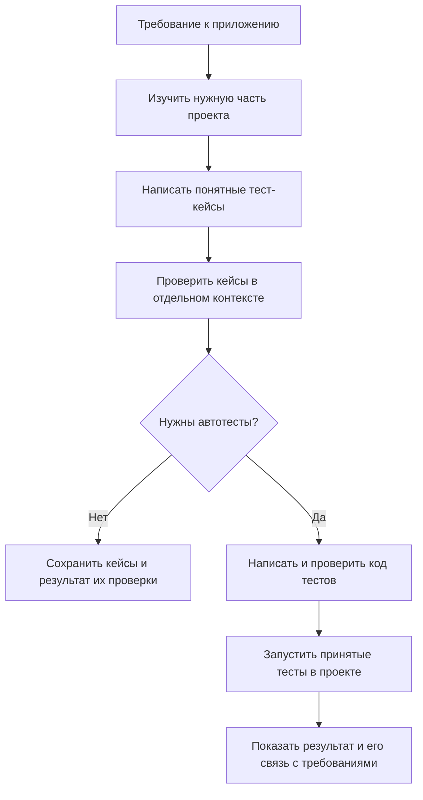
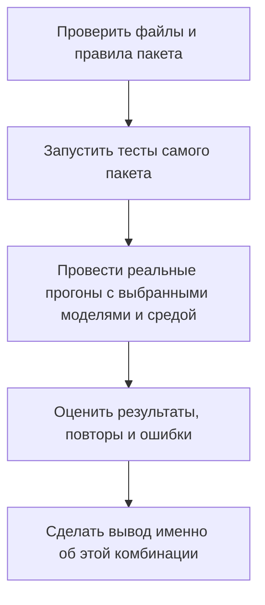
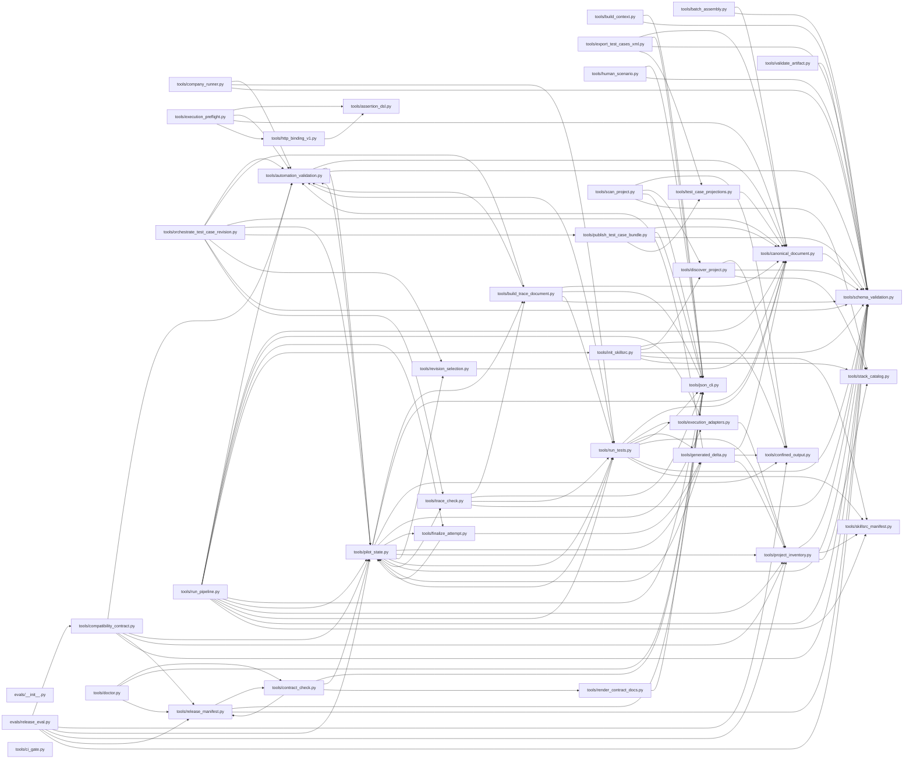

# Как устроен наш тестовый пайплайн

Этот документ помогает разобраться в проекте и объяснить его коллегам. Сначала
разберём путь от требования до результата на одном примере, затем посмотрим,
за что отвечает каждый файл.

Здесь описан **181 файл**: инструкции для модели, программы, правила проверки
данных, тесты самого пакета и документация. Описание относится к версии кода
`d9e1ad9`, на которой создан справочник; сам справочник впервые опубликован
коммитом `f04a052`.

## Короткое объяснение для коллег

Наш пайплайн помогает превратить требования к приложению в тест-кейсы, а затем —
в автотесты. Сначала модель изучает требования и разрешённые файлы проекта.
Потом составляет кейсы: что подготовить, какое действие выполнить и какой
результат ожидать. В отдельном контексте модель проверяет этот набор кейсов.

Если нужны автотесты, модель пишет их по проверенным кейсам. Код проходит
отдельное ревью, после чего пайплайн может записать новые тесты в проект и
запустить их обычными средствами проекта: pytest, Maven или Gradle.

На выходе остаются кейсы, результаты проверок и связь каждого результата с
исходным требованием. Если выполнить проверку не удалось, пайплайн должен
показать причину, а не объявить успех.

Пакет переносится в рабочий проект вместе с инструкциями и Python-инструментами.
Для работы нужна совместимая программа с доступом к модели. Именно она обращается
к модели; Python-инструменты пакета проверяют данные, ведут журнал, сохраняют
файлы и запускают разрешённые тесты.

## На одном примере

Допустим, нам дали требование: **«Владельца нельзя создать без имени»**.
Это пример для объяснения процесса, а не новая функция нашего пакета.

1. **Разобраться в требовании.** Найти код создания владельца, существующие
   проверки и настройки тестов. Зафиксировать, какие исходные данные использованы.
2. **Описать тест-кейс.** Например: попробовать создать владельца с пустым
   именем; ожидать сообщение об ошибке и отсутствие новой записи.
3. **Проверить тест-кейс.** Убедиться, что действия понятны, данные указаны,
   а ожидаемый результат следует из требования.
4. **Написать и проверить автотест.** Перевести эти действия и ожидания в код
   на языке проекта. Проверить, что автотест действительно проверяет пустое имя.
5. **Запустить и объяснить результат.** Выполнить именно проверенный автотест.
   Если приложение всё-таки сохранило владельца, показать провал проверки.
   Если тест не удалось запустить, сообщить об этом отдельно.



Схема показывает успешную последовательность. На любом шаге могут обнаружиться
неполные входные данные или ошибка. Тогда пайплайн останавливается в подходящем
месте и сохраняет причину. Исправления ограничены: для кода автотестов разрешены
первая версия и одна полная исправленная версия. Кейсы проверяются по отдельному
правилу: проверяющий может вернуть один полный исправленный документ в рамках
той же проверки.

## Кто за что отвечает

Проще всего разделить работу на три части.

| Участник | Его работа | Пример |
|---|---|---|
| Программа с доступом к модели | Читает инструкции, обращается к модели и создаёт отдельные контексты для написания и проверки | Отправляет набор кейсов на независимое ревью |
| Python-инструменты нашего пакета | Проверяют формат и связи данных, сохраняют результаты, ведут журнал и управляют разрешённым запуском | Проверяют, что ревью относится к той версии кода, которую собираются запустить |
| Средства рабочего проекта | Собирают и исполняют тесты в своей обычной среде | Maven компилирует Java-тест и возвращает отчёт |

«Отдельная проверка» не обязательно означает другую модель. Важен отдельный
контекст: проверяющий не должен получать рассуждения автора и просто соглашаться
с ними. Подтверждение такого разделения предоставляет программа, которая
управляет вызовами модели.


## Что хранится в папках

| Папка или файл | Простое объяснение |
|---|---|
| `skills/` | Инструкции для каждой роли модели: разобрать требования, написать кейсы, проверить их, написать и проверить автотесты |
| `tools/` | Python-программы, которые выполняют точные операции с данными, файлами и запуском тестов |
| `schemas/` | Правила формы данных: какие поля должны быть в документе и какие значения допустимы |
| `contracts/pipeline.json` | Общие правила работы: порядок шагов, ограничения и условия принятия результата |
| `tests/` | Проверки самого пайплайна и небольшие примеры для этих проверок |
| `evals/` | Проверка того, насколько надёжно весь пайплайн работает с конкретными моделями и окружением |
| `release/` | Состав выпуска и сведения о его проверенности |
| `docs/` и документы в корне | Руководства, презентация, принятые решения и результаты пилота |

## Что происходит с результатами и файлами

Пайплайн хранит не только итоговое сообщение. Он записывает, какое требование
использовал, какую версию кейсов проверили, какой код приняли и что действительно
запустилось. Благодаря этому можно вернуться к результату после перерыва.

Перед запуском проверяется весь набор новых тестов. Если часть файлов записать
не удалось, исполнение не начинается. После запуска решается судьба каждого
созданного файла. Затем пайплайн проверяет полноту сохранённых результатов и
закрывает работу.


| Что произошло | Как это понимать |
|---|---|
| Тест выполнился и подтвердил ожидание | Проверка прошла |
| Тест выполнился и обнаружил расхождение | Проверка провалилась; это может быть полезным результатом |
| Тест не удалось запустить из-за неподходящей среды или входных данных | Проверка не выполнена |
| Процесс прервался и надёжного результата нет | Результат неизвестен; нельзя выдавать его за успех или автоматически повторять запуск |

Поэтому «работа завершена» и «все тесты прошли» — разные утверждения. Пайплайн
может успешно закончить свою работу и сообщить о дефекте приложения.

При неизвестном результате созданные файлы сохраняются. При провале проверки
или невозможности запуска можно удалить только те файлы, которые создала эта
попытка и которые после этого никто не изменил. Сохранённые копии тестов и отчётов
позволяют разобраться в причине. Существующие файлы проекта не считаются
собственностью пайплайна.

## Можно ли запускать это на работе

Есть три разных варианта.

| Где происходит работа | Что требуется |
|---|---|
| На рабочем компьютере | Совместимая программа с моделью и настроенная среда проекта |
| Внутри задания корпоративного CI | Те же возможности внутри среды CI; отдельный корпоративный адаптер сам по себе не обязателен |
| Программа отправляет тесты отдельному сервису компании | Подключение к API этого сервиса: отправить задание и получить результат |

Файл `company_runner.py` оставлен для последнего варианта. **Сейчас это
заготовка, а не готовое подключение к корпоративному сервису.** По умолчанию он
сообщает, что такой исполнитель недоступен. Для обычного локального запуска
пайплайн его не использует.

## Что уже проверено, а что требует отдельной проверки

У самого пакета есть тесты. Они проверяют, например, что он не потеряет
требование, не запустит непроверенный код и не удалит изменённый пользователем файл.
Есть и быстрая проверка комплектности: на месте ли нужные файлы и библиотеки.

Но этого недостаточно, чтобы обещать одинаковое качество на любой модели.
Для каждой рабочей комбинации модели, программы, языка и среды нужны реальные
прогоны всего процесса, включая независимое ревью и исправления.



Текущая отметка выпуска означает: реализация есть, но общей подтверждённой
готовности для произвольных моделей и сред нет. Точные технические названия
этого состояния приведены в описании `release/manifest.json`.

## Как пользоваться подробной частью

Чтобы объяснить идею коллеге, достаточно предыдущих разделов. Для сопровождения
ниже есть описание каждого файла. Сначала идёт объяснение обычными словами.
Названия функций и точные поля данных спрятаны под «Технические подробности» —
их можно раскрыть, когда нужно найти конкретное место в коде.

- [Документы и настройки](#документы-и-настройки)
- [Инструкции для модели](#инструкции-для-модели)
- [Программы пайплайна](#программы-пайплайна)
- [Проверка работы в разных средах](#проверка-работы-в-разных-средах)
- [Правила формы данных](#правила-формы-данных)
- [Тесты самого пайплайна](#тесты-самого-пайплайна)
- [Связи между программами](#связи-между-программами)
- [Какие результаты передаются между шагами](#какие-результаты-передаются-между-шагами)
- [Где искать нужное изменение](#где-искать-нужное-изменение)
- [Словарь названий из кода](#словарь-названий-из-кода)


## Документы и настройки

Эти файлы помогают начать работу, настроить пакет и понять принятые решения.
Не все из них участвуют в каждом запуске: презентация нужна для обсуждения,
а файл настроек тестов — для разработки самого пакета.


### `.gitattributes`

**Одинаковые текстовые файлы на разных компьютерах.**

Просит Git сохранять одинаковый перевод строк на Windows и Linux. Это важно для контрольных сумм: внешне одинаковые документы не должны считаться разными только из-за настроек компьютера.

[Открыть файл](../.gitattributes)


### `.github/workflows/portable.yml`

**Автоматическая проверка пакета на GitHub.**

Запускает проверки самого пайплайна на Ubuntu и Windows с выбранными версиями Python. Используется при изменениях репозитория. Настройки CI рабочего проекта пользователя этот файл не создаёт.

[Открыть файл](../.github/workflows/portable.yml)


### `.gitignore`

**Файлы, которые не нужно добавлять в репозиторий.**

Исключает временные файлы Python, кэш pytest и один старый служебный отчёт. Благодаря этому результаты локальной работы инструментов не смешиваются с исходниками пакета.

[Открыть файл](../.gitignore)


### `.skillsrc.example`

**Пример настроек для своего проекта.**

Показывает, как перечислить модули проекта, папки исходников и тестов, а также средство запуска. Его нужно воспринимать как образец, а не готовые настройки для любого компьютера: например, путь к Python в примере рассчитан на Windows.

[Открыть файл](../.skillsrc.example)


### `CONTRACTS.md`

**Общие правила в виде документа.**

Показывает в читаемой форме данные из contracts/pipeline.json. Создаётся специальной командой, чтобы описание не расходилось с правилами, которые проверяют программы. При изменении правил обновлять нужно источник, а затем пересоздать этот документ.

[Открыть файл](../CONTRACTS.md)


### `HOW-IT-WORKS.md`

**Подробное объяснение порядка работы.**

Описывает, как создаётся работа по запросу, как выбираются исходные данные, проходят генерация и ревью, запускаются тесты и сохраняется итог. Полезен, когда нужно глубже разобраться в порядке шагов и ограничениях.

[Открыть файл](../HOW-IT-WORKS.md)


### `PIPELINE.md`

**Карта шагов и результатов.**

Показывает этапы, порядок событий и правила определения результата. Как и CONTRACTS.md, создаётся из общего файла правил. Это помогает не поддерживать несколько независимых описаний одного процесса.

[Открыть файл](../PIPELINE.md)


### `README.md`

**Главная страница проекта.**

Объясняет назначение пакета, способ начала работы и основные ограничения. С неё удобно переходить к руководству, презентации и этому справочнику.

[Открыть файл](../README.md)


### `RELEASE.md`

**Как готовить и проверять выпуск.**

Объясняет, как зафиксировать состав пакета и на каком основании можно говорить о его готовности для конкретных моделей и среды. Помогает отделять исправность файлов от доказанной работы всего процесса.

[Открыть файл](../RELEASE.md)


### `USAGE.md`

**Практическое руководство пользователя.**

Рассказывает, какие входные данные подготовить, как настроить проект, вызвать нужную инструкцию и продолжить работу после перерыва. Справочник объясняет устройство, а этот файл нужен, когда требуется выполнить конкретный запуск.

[Открыть файл](../USAGE.md)


### `contracts/pipeline.json`

**Главный набор правил пайплайна.**

Хранит согласованный порядок шагов, роли, форматы данных, разрешённые способы запуска и условия принятия результата. На него опираются программы и инструкции. Изменение этих правил может влиять на весь процесс, поэтому этот файл проверяется отдельно.

[Открыть файл](../contracts/pipeline.json)

<details>
<summary>Технические подробности</summary>

Версия контракта — `4.0`; режимы — `cases-only-v1` и `local-pilot-v1`. Здесь же заданы реестры стадий, схем, адаптеров и условия принятия результата.

</details>


### `docs/pilot-evidence.md`

**Что показал большой пилот.**

Сохраняет результаты проведённой проверки и объясняет, какие выводы из неё можно сделать. Это история конкретного опыта: новая модель или новая версия пакета требуют своих подтверждений.

[Открыть файл](../docs/pilot-evidence.md)


### `docs/pipeline-file-guide-ru.md`

**Этот справочник.**

Объясняет общую идею на примере, описывает каждый файл и показывает связи между программами. Его задача — помочь человеку разобраться в проекте, рассказать о нём и найти нужное место при сопровождении.

[Открыть файл](../docs/pipeline-file-guide-ru.md)


### `docs/portable-pipeline-overview-ru.md`

**Краткий обзор для знакомства.**

Объясняет, что получилось, из чего состоит пакет и зачем его пробовать на проекте. Подходит для первого разговора с коллегами перед погружением в устройство отдельных файлов.

[Открыть файл](../docs/portable-pipeline-overview-ru.md)


### `docs/portable-testing-pipeline-ru.pptx`

**Презентация для команды.**

Содержит 16 слайдов о переносимом тестовом пайплайне. Нужна для выступления или обсуждения идеи; в запуске программы не участвует.

[Открыть файл](../docs/portable-testing-pipeline-ru.pptx)


### `docs/presentation-notes-ru.md`

**Заметки к выступлению.**

Дополняет презентацию объяснениями для докладчика. Помогает раскрыть смысл слайдов и не забыть условия применения и ограничения.

[Открыть файл](../docs/presentation-notes-ru.md)


### `docs/superpowers/plans/2026-08-26-portable-testing-skills-pilot-delivery.md`

**История плана реализации.**

Показывает, на какие этапы была разбита разработка, какие файлы планировалось менять и как проверять результат. Нужен для понимания причин принятых решений. Заново выполнять этот исторический план при каждом запуске не требуется.

[Открыть файл](../docs/superpowers/plans/2026-08-26-portable-testing-skills-pilot-delivery.md)


### `docs/superpowers/specs/2026-08-26-portable-testing-skills-frozen-pilot-contract.md`

**Подробные договорённости об устройстве пилота.**

Описывает согласованные границы продукта, разрешённые действия, порядок работы и требования к результатам. Помогает понять, почему в коде существуют конкретные ограничения. Читать его следует вместе с принятой поправкой и действующими правилами в contracts/pipeline.json.

[Открыть файл](../docs/superpowers/specs/2026-08-26-portable-testing-skills-frozen-pilot-contract.md)


### `docs/superpowers/specs/2026-09-01-portable-testing-skills-pilot-contract-erratum.md`

**Поправка к прежним договорённостям.**

Уточняет четыре положения исходного описания пилота. Позволяет увидеть, какое решение изменилось, сохраняя историю обсуждения.

[Открыть файл](../docs/superpowers/specs/2026-09-01-portable-testing-skills-pilot-contract-erratum.md)


### `pytest.ini`

**Настройки тестов самого пакета.**

Указывает pytest искать проверки в папке tests/ и отключает сохранение его кэша. Это относится к проверкам нашего репозитория, а не к настройкам тестов приложения пользователя.

[Открыть файл](../pytest.ini)


### `release/dependencies.lock.txt`

**Зафиксированный список зависимостей выпуска.**

Сохраняет версии библиотек, относящиеся к выпуску пакета. Помогает воспроизвести его окружение при проверке. К зависимостям приложения пользователя этот список не относится.

[Открыть файл](../release/dependencies.lock.txt)


### `release/manifest.json`

**Описание конкретного комплекта файлов.**

Содержит версию пакета, список его рабочих файлов и контрольные суммы. По нему можно обнаружить неполный комплект или изменённый файл. Здесь же указано текущее состояние: реализация есть, но подтверждённая готовность для конкретной комбинации моделей и среды ещё не зафиксирована.

[Открыть файл](../release/manifest.json)

<details>
<summary>Технические подробности</summary>

Текущие значения: `qualification.state=implemented_unverified`, `ready_tuple=null`. Файл создаётся командой `python -m tools.release_manifest --root .`. Ручное редактирование может нарушить контрольные суммы.

</details>


### `requirements-dev.txt`

**Дополнительные библиотеки для разработки.**

Подключает основные зависимости и добавляет pytest, которым проверяется сам пакет. Пользователю и разработчику таким образом показаны разные потребности в инструментах.

[Открыть файл](../requirements-dev.txt)


### `requirements.txt`

**Библиотеки, нужные для работы пакета.**

Перечисляет точные версии Python-библиотек для чтения настроек и проверки JSON-документов. Такой список помогает установить одинаковый набор зависимостей при переносе на другой компьютер.

[Открыть файл](../requirements.txt)


## Инструкции для модели

Каждая роль получает свою задачу: разобрать требования, написать результат или
проверить его. Файл SKILL.md описывает основную задачу, а соседний reference
раскрывает подробные правила. Это разделение обязанностей; оно не требует
обязательно использовать шесть разных моделей.


### `skills/autotest-reviewer/SKILL.md`

**Инструкция проверяющему код автотестов.**

Поручает отдельно проверить, что предложенный код соответствует кейсам, содержит нужные проверки и соблюдает ограничения работы с проектом. Это происходит до записи и запуска тестов.

[Открыть файл](../skills/autotest-reviewer/SKILL.md)


### `skills/autotest-reviewer/references/autotest-review-contract.md`

**Что именно проверять в автотестах.**

Подробно описывает критерии ревью кода и его связей с ожиданиями. Нужно проверить содержание тестов и точную версию предложенных файлов, а не просто убедиться, что текст похож на корректный Java или Python.

[Открыть файл](../skills/autotest-reviewer/references/autotest-review-contract.md)


### `skills/context-marker/SKILL.md`

**Инструкция разбору исходного запроса.**

Поручает модели выделить требования, понять их источники и отметить, каких сведений не хватает. Результат передаётся генератору кейсов, чтобы тот работал по запросу пользователя, а не по своим предположениям.

[Открыть файл](../skills/context-marker/SKILL.md)


### `skills/context-marker/references/context-artifact-contract.md`

**Что сохранить после разбора требований.**

Объясняет, как записать каждое исходное требование и связать его с документом или подтверждающими сведениями. Помогает различать запрос пользователя, факты реализации и выводы модели.

[Открыть файл](../skills/context-marker/references/context-artifact-contract.md)


### `skills/orchestrate/SKILL.md`

**Инструкция ведущему всего процесса.**

Объясняет программе с моделью, как пройти путь от запроса пользователя до итогового отчёта: какие шаги выполнять, какие данные сохранять, когда обращаться за ревью и когда останавливаться. Это основная точка входа в пайплайн.

[Открыть файл](../skills/orchestrate/SKILL.md)


### `skills/orchestrate/references/orchestration-contract.md`

**Подробные правила ведения работы.**

Раскрывает порядок действий из главной инструкции: как создавать записи, передавать результат следующему шагу, ограничивать исправления и закрывать работу. Точные правила вынесены сюда, чтобы не перегружать саму точку входа.

[Открыть файл](../skills/orchestrate/references/orchestration-contract.md)


### `skills/tc-generator/SKILL.md`

**Инструкция автору тест-кейсов.**

Поручает модели написать кейсы для заданных требований: указать подготовку, конкретные данные, действия и наблюдаемые результаты. Именно эти кейсы затем читают люди и используют для создания автотестов.

[Открыть файл](../skills/tc-generator/SKILL.md)


### `skills/tc-generator/references/case-generation-contract.md`

**Как должен выглядеть хороший тест-кейс.**

Подробно объясняет, что писать в цели, предусловиях, шагах и ожидаемых результатах, как задавать данные и не смешивать несвязанные сценарии. Это одно из главных мест для улучшения читаемости будущих кейсов сразу во всех генерациях.

[Открыть файл](../skills/tc-generator/references/case-generation-contract.md)


### `skills/tc-reviewer/SKILL.md`

**Инструкция проверяющему тест-кейсы.**

Поручает отдельно оценить смысл кейсов, их понятность и соответствие требованиям. Проверяющий может принять документ, указать проблемы или в пределах правил вернуть полную исправленную версию.

[Открыть файл](../skills/tc-reviewer/SKILL.md)


### `skills/tc-reviewer/references/review-verdicts.md`

**Как оформлять решение по кейсам.**

Объясняет, что означает каждое решение ревью и в каких случаях требуется исправление. Это нужно, чтобы проверяющий и управляющая программа одинаково понимали результат проверки и следующий допустимый шаг.

[Открыть файл](../skills/tc-reviewer/references/review-verdicts.md)


### `skills/tc-to-autotest/SKILL.md`

**Инструкция автору автотестов.**

Поручает модели превратить принятую версию кейсов в код на языке проекта. Требует сохранить действия и ожидания, а также указать, какие части кода проверяют каждый пункт кейса.

[Открыть файл](../skills/tc-to-autotest/SKILL.md)


### `skills/tc-to-autotest/assets/java-python-conventions/java-junit5.md`

**Памятка по Java и JUnit 5.**

Содержит правила написания Java-автотестов, которые модель использует вместе с устройством реального проекта. Помогает выбрать подходящие для проекта способы объявления и выполнения проверок.

[Открыть файл](../skills/tc-to-autotest/assets/java-python-conventions/java-junit5.md)


### `skills/tc-to-autotest/assets/java-python-conventions/python-pytest.md`

**Памятка по Python и pytest.**

Объясняет, как учитывать настройки, подготовку данных и обычные правила обнаружения тестов в Python-проекте. Помогает не создавать тесты, работающие только в искусственно упрощённой среде.

[Открыть файл](../skills/tc-to-autotest/assets/java-python-conventions/python-pytest.md)


### `skills/tc-to-autotest/references/automation-output-contract.md`

**Требования к сгенерированному коду.**

Объясняет, как оформить полный набор тестовых файлов, связать его с кейсами и подготовить к ревью. Также задаёт ограничения на изменения проекта и рекомендации по устройству тестов, включая безопасное использование общих настроек Spring.

[Открыть файл](../skills/tc-to-autotest/references/automation-output-contract.md)


## Программы пайплайна

Это Python-файлы, которые выполняют конкретные операции. Их можно условно разделить
на подготовку проекта, проверку документов, работу с файлами, запуск тестов и
ведение результатов. Некоторые вызываются по отдельной команде, другие служат
общими помощниками для нескольких шагов.


### `tools/assertion_dsl.py`

**Общий смысл проверок.**

Описывает, как сравнить ожидаемое значение с полученным: например, проверить равенство, наличие данных или соответствие заданному образцу. Различает ситуации «значение не получено» и «значение получено, но оно пустое». Это нужно, чтобы одинаковая проверка не меняла смысл при переходе между языками и тестовыми инструментами.

[Открыть файл](../tools/assertion_dsl.py)

<details>
<summary>Технические подробности</summary>

**Основные определения в коде:** `ValueState`, `EvaluationContext`, `AssertionResult`, `portable_fullmatch`, `evaluate_assertion`.

</details>


### `tools/automation_validation.py`

**Проверка кода перед запуском.**

Проверяет результат генерации автотестов: какие файлы предложены, какие тестовые методы в них объявлены и какие ожидания из кейсов они должны проверять. Затем сверяет, что ревью относится именно к этой версии кода. Так в запуск не попадёт другой черновик или набор тестов, в котором потерялась часть обязательных проверок.

[Открыть файл](../tools/automation_validation.py)

<details>
<summary>Технические подробности</summary>

**Основные определения в коде:** `AutomationArtifactError`, `canonical_automation_bytes`, `automation_sha256`, `implementation_relations_sha256`, `autotest_review_sha256`, `host_isolation_sha256`, `portable_path_key`, `validate_automation_artifact`, `required_symbol_pairs`, `validate_accepted_autotest_review`, `validate_automation_revision_chain`.

</details>


### `tools/batch_assembly.py`

**Сборка кейсов из нескольких частей.**

Помогает обрабатывать большой набор требований по частям и затем собрать результаты в один документ. Заранее определяет, какая часть за какие требования отвечает, а при сборке проверяет полноту и отсутствие конфликтов. Делить работу можно только по подтверждённым независимым частям; если такая независимость не установлена, остаётся один общий набор.

[Открыть файл](../tools/batch_assembly.py)

<details>
<summary>Технические подробности</summary>

**Основные определения в коде:** `BatchAssemblyError`, `canonical_bytes`, `plan_batches`, `validate_fragment`, `assemble_candidate`, `publish_fragment`.

</details>


### `tools/build_context.py`

**Подготовка требований для генератора.**

Собирает исходные требования и нужные сведения из проекта в понятный для следующего шага набор данных. Для каждого требования сохраняет, откуда оно взялось, и отмечает противоречия или пробелы. Это помогает модели писать кейсы по реальному запросу, а не придумывать требования по названиям классов и файлов.

[Открыть файл](../tools/build_context.py)

<details>
<summary>Технические подробности</summary>

**Основные определения в коде:** `extract_inventory`, `extract_handles`, `RequirementConflict`, `grounding_diagnostics`, `uncovered_requirements`, `build_context`, `main`.

</details>


### `tools/build_trace_document.py`

**Связь требований с результатами.**

Собирает таблицу связей: исходное требование → тест-кейс → шаг → ожидаемый результат → проверка в коде → результат запуска. По ней можно ответить, чем проверено конкретное требование и что показал этот тест. Это ещё промежуточный отчёт: окончательный итог работы сохраняется позднее, после проверки всех результатов.

[Открыть файл](../tools/build_trace_document.py)

<details>
<summary>Технические подробности</summary>

**Основные определения в коде:** `TraceBuildError`, `project_declared_order`, `trace_sha256`, `build_trace`, `validate_trace_document`, `main`.

</details>


### `tools/canonical_document.py`

**Проверка основного документа с кейсами.**

Читает основной JSON-документ с тест-кейсами и проверяет его внутреннюю согласованность. Например, что упомянутый шаг существует, проверка относится к нужному ожиданию, а новая версия связана с предыдущей. Этот же файл вычисляет контрольную сумму документа, чтобы дальнейшие решения относились к его точной версии.

[Открыть файл](../tools/canonical_document.py)

<details>
<summary>Технические подробности</summary>

**Основные определения в коде:** `CanonicalDocumentError`, `validate_canonical_document`, `require_valid_canonical_document`, `canonical_bytes`, `document_sha256`, `load_canonical_document`.

</details>


### `tools/ci_gate.py`

**Одна команда для проверки самого пакета.**

По очереди проверяет общие правила, соответствие документации этим правилам и тесты пайплайна. Если один шаг завершается ошибкой, следующие не скрывают её своим успехом. Эту команду используют при разработке и в GitHub Actions; обычная генерация кейсов не запускает её автоматически.

[Открыть файл](../tools/ci_gate.py)

<details>
<summary>Технические подробности</summary>

**Основные определения в коде:** `main`.

</details>


### `tools/company_runner.py`

**Заготовка подключения к сервису компании.**

Нужен для случая, когда тесты требуется отправить отдельному корпоративному сервису и получить от него результат. Здесь уже описаны запрос, ответ и проверки того, что полученный отчёт относится к нужному заданию. Само подключение ещё не реализовано: по умолчанию файл сообщает, что сервис недоступен. Локальный запуск pytest, Maven и Gradle от него не зависит.

[Открыть файл](../tools/company_runner.py)

<details>
<summary>Технические подробности</summary>

**Основные определения в коде:** `CompanyRunnerError`, `CompanyExecutionError`, `CompanyRunRequest`, `CompanyRunResult`, `validate_company_result`, `execution_report_digest`, `validate_company_execution_receipt`, `CompanyRunner`, `UnavailableCompanyRunner`, `resolve_company_runner`, `ScriptedCompanyRunner`, `request_from_artifacts`, `result_as_dict`, `matching_result`, `execute_company_details`, `execute_company`.

</details>


### `tools/compatibility_contract.py`

**Проверка возможностей программы, управляющей моделью.**

Проверяет, что внешняя программа действительно выполнила нужные шаги: передала модели правильные входы, сохранила ответы, отделила ревью от генерации и корректно продолжила прерванную работу. Для этого читает записи реального запуска. Одного заявления «я совместим с пайплайном» недостаточно.

[Открыть файл](../tools/compatibility_contract.py)

<details>
<summary>Технические подробности</summary>

**Основные определения в коде:** `evidence_digest`, `validate_compatibility_evidence`.

</details>


### `tools/confined_output.py`

**Безопасная работа с файлами.**

Помогает другим частям пакета создавать, читать и удалять файлы только в разрешённых местах. Проверяет путь, защищает от незавершённой записи и перед удалением сверяет содержимое. Это общая защита от выхода за нужную папку и случайной перезаписи чужих данных. Решение о том, какой шаг разрешён, принимают вызывающие программы.

[Открыть файл](../tools/confined_output.py)

<details>
<summary>Технические подробности</summary>

**Основные определения в коде:** `OutputConfinementError`, `ConfinedOutputTarget`, `acquire_confined_output`, `atomic_write_confined_bytes`, `atomic_write_confined_bytes_at_root`, `create_confined_bytes_exclusive`, `create_confined_directory_exclusive`, `ensure_project_child_directory`, `read_confined_bytes`, `remove_confined_bytes_if_equal`.

</details>


### `tools/contract_check.py`

**Проверка согласованности правил.**

Сверяет главный файл правил с инструкциями, схемами данных, программами и описанием порядка работы. Например, обнаружит, что в правилах указана стадия, а её инструкции отсутствуют, или что документ описывает устаревший порядок шагов. Помогает заметить такое расхождение ещё до пользовательского запуска.

[Открыть файл](../tools/contract_check.py)

<details>
<summary>Технические подробности</summary>

**Основные определения в коде:** `validate_pipeline_contract`, `main`.

</details>


### `tools/discover_project.py`

**Поиск частей проекта и средств сборки.**

Осматривает проект, находит файлы сборки и определяет, из каких модулей он состоит. Возвращает найденные варианты, предупреждения и вопросы, если выбор неоднозначен. Это фактическая основа для настройки пайплайна; найденный вариант ещё не означает, что пользователь выбрал именно его.

[Открыть файл](../tools/discover_project.py)

<details>
<summary>Технические подробности</summary>

**Основные определения в коде:** `find_confined_manifests`, `analyze_module_roots`, `project_fingerprint`, `validate_report`, `build_report`, `discover_project`, `main`.

</details>


### `tools/doctor.py`

**Быстрая проверка комплектности.**

Проверяет, на месте ли нужные файлы пакета, подходят ли версия Python и установленные библиотеки, совпадает ли содержимое с описанием выпуска. Удобен при переносе пакета на другой компьютер. Успех этой проверки означает, что комплект выглядит исправным; качество работы модели и возможность запуска конкретного проекта проверяются отдельно.

[Открыть файл](../tools/doctor.py)

<details>
<summary>Технические подробности</summary>

**Основные определения в коде:** `inspect_environment`, `main`.

</details>


### `tools/execution_adapters.py`

**Подготовка и запуск разрешённой команды.**

Собирает команду запуска под выбранный инструмент проекта: pytest, Maven или Gradle. Берёт зафиксированные пути и настройки, добавляет именно те тесты, которые прошли ревью, и передаёт команду на исполнение. Набор допустимых вариантов ограничен: произвольную строку команд сюда передать нельзя.

[Открыть файл](../tools/execution_adapters.py)

<details>
<summary>Технические подробности</summary>

**Основные определения в коде:** `AdapterRequestError`, `ExecutionRequest`, `request_digest`, `build_request`, `command_for`, `classify_prestart`, `invoke_request`, `is_zero_test_report`, `classify_execution`, `unknown_allows_automatic_retry`.

</details>


### `tools/execution_preflight.py`

**Проверка необходимых данных до действия.**

Проверяет, доступны ли значения и способы обращения к системе, которые требуются для описанных проверок. Например, можно ли получить адрес сервиса и подходят ли переданные входные значения. Сам сетевых запросов и тестовых процессов не запускает. Для запуска сгенерированного кода также нужны отдельное ревью и проверки среды проекта.

[Открыть файл](../tools/execution_preflight.py)

<details>
<summary>Технические подробности</summary>

**Основные определения в коде:** `ProviderResolver`, `AdapterRegistry`, `PreflightResult`, `EnvironmentOnlyProviderResolver`, `RejectingAdapterRegistry`, `ExactAdapterRegistry`, `is_reviewed_adapter_registry`, `reviewed_adapter_registry`, `preflight_execution`.

</details>


### `tools/export_test_cases_xml.py`

**Выгрузка кейсов в XML для Zephyr.**

По явной команде создаёт XML-файл из основного документа с кейсами. Такой файл нужен, если команда хочет перенести кейсы в Zephyr через импорт. Формат построен по наблюдавшемуся образцу; успешный импорт и обратная выгрузка в реальной рабочей системе пока требуют отдельной проверки.

[Открыть файл](../tools/export_test_cases_xml.py)

<details>
<summary>Технические подробности</summary>

**Основные определения в коде:** `main`.

</details>


### `tools/finalize_attempt.py`

**Подведение окончательного итога.**

Проверяет, все ли обязательные результаты сохранены, что произошло с созданными файлами и можно ли закрыть текущую попытку. Затем формирует окончательный результат и ссылки на подтверждающие данные. Работает и при успехе, и при отказе до запуска тестов. Сам тесты не запускает.

[Открыть файл](../tools/finalize_attempt.py)

<details>
<summary>Технические подробности</summary>

**Основные определения в коде:** `FinalizationError`, `decide_dispositions`, `disposition_receipt`, `build_pre_finalization_trace`, `verify_finalization`, `publish_terminal_result`, `derive_terminal_trace`, `finalize_attempt`, `finalize_durable_execution_attempt`.

</details>


### `tools/generated_delta.py`

**Учёт новых файлов автотестов.**

Отвечает за весь набор тестовых файлов, который предложила модель: проверяет их пути и содержимое, записывает принятые файлы и выясняет, записан ли набор целиком. После исполнения помогает сохранить или очистить эти файлы по принятому решению. Отличает созданные пайплайном файлы от существовавших в проекте и от изменённых человеком.

[Открыть файл](../tools/generated_delta.py)

<details>
<summary>Технические подробности</summary>

**Основные определения в коде:** `GeneratedDeltaError`, `materialize_delta`, `inspect_delta`, `inspect_attempt_delta`, `execution_readiness`, `resolve_disposition_policy`, `apply_dispositions`.

</details>


### `tools/http_binding_v1.py`

**Единые правила HTTP-проверок.**

Описывает, как из данных проверки составить HTTP-запрос и как разобрать полученный ответ. Например, какие значения отправить и где искать нужное значение в ответе. Способ передачи запроса предоставляет вызывающий код: своей сетевой библиотеки этот файл не выбирает. Это правила проверки HTTP, а не подключение к корпоративному исполнителю.

[Открыть файл](../tools/http_binding_v1.py)

<details>
<summary>Технические подробности</summary>

**Основные определения в коде:** `AbstractRequest`, `RawResponse`, `ExecutionError`, `Transport`, `build_request`, `execute_once`, `observe_response`, `validate_preflight_base_url`, `validate_preflight_input_value`, `validate_preflight_typed_value`.

</details>


### `tools/human_scenario.py`

**Проверка понятности тест-кейса.**

Помогает отличить содержательный сценарий от короткого списка названий вроде «проверить создание». Проверяет, что документ содержит нужное описание действий и ожидаемых результатов. Дополняет проверку формы JSON: файл может быть технически правильным, но всё ещё бесполезным для человека, который должен выполнить или объяснить тест.

[Открыть файл](../tools/human_scenario.py)

<details>
<summary>Технические подробности</summary>

**Основные определения в коде:** `check_canonical`, `main`.

</details>


### `tools/init_skillsrc.py`

**Подготовка настроек проекта.**

На основе найденных модулей готовит файл .skillsrc: где исходники, где тесты и чем их запускать. Если настройки уже существуют, сначала сверяет их с предложением и показывает конфликт. Корректный существующий файл остаётся главным источником настроек; новые догадки сканера не дают права молча его заменить.

[Открыть файл](../tools/init_skillsrc.py)

<details>
<summary>Технические подробности</summary>

**Основные определения в коде:** `InitError`, `NeedsInput`, `Conflict`, `compile_skillsrc`, `reconcile_skillsrc`, `atomic_write_skillsrc`, `ensure_skillsrc`, `main`.

</details>


### `tools/json_cli.py`

**Понятный программам ответ на ошибку команды.**

Делает ответы небольших Python-команд единообразными. Например, при неверном аргументе возвращает структурированное описание ошибки, которое может прочитать управляющая программа. Благодаря этому ей не приходится угадывать результат по разным текстам ошибок.

[Открыть файл](../tools/json_cli.py)

<details>
<summary>Технические подробности</summary>

**Основные определения в коде:** `emit_error`, `JsonArgumentParser`.

</details>


### `tools/orchestrate_test_case_revision.py`

**Выбор проверенной версии кейсов.**

Сохраняет первоначальный документ, готовит его для независимого ревью и проверяет результат этой проверки. Затем определяет, какой документ передавать дальше: исходный или единственную допустимую исправленную версию. Решение связано с точным содержимым файла, поэтому чужое ревью или случайный более новый черновик использовать нельзя.

[Открыть файл](../tools/orchestrate_test_case_revision.py)

<details>
<summary>Технические подробности</summary>

**Основные определения в коде:** `OrchestrationResult`, `OrchestrationError`, `reviewer_package_binding`, `open_reviewer_session`, `validate_reviewer_session`, `publish_unreviewed_candidate`, `orchestrate_revision`, `finalize_orchestration`, `main`.

</details>


### `tools/pilot_state.py`

**Память о ходе работы.**

Хранит, что уже произошло: какие требования взяли, что модель подготовила, что проверили, какие тесты запустили и чем они закончились. После перерыва программа читает эти записи и понимает, откуда продолжать. Каждая новая запись проверяется вместе с предыдущими, чтобы нельзя было подменить выполненное действие простой отметкой «готово». Завершённая попытка остаётся неизменной.

[Открыть файл](../tools/pilot_state.py)

<details>
<summary>Технические подробности</summary>

**Основные определения в коде:** `create_run`, `derive_state`, `model_lifecycle_projection`, `append_event`, `claim_execution_start`, `record_execution_unknown`, `record_process_stopped`, `module_selection_digest`, `create_attempt`, `freeze_phase_two_inputs`, `publish_model_request`, `read_model_request`, `publish_model_stage_artifact`, `read_model_stage_artifact`, `publish_context_selection`, `read_context_selection`, `publish_reviewer_session_ledger`, `read_reviewer_session_ledger`, `reviewer_lifecycle_projection`, `terminal_reviewer_evidence`, `read_run`, `publish_attempt_receipt`, `read_attempt_receipt`, `publish_execution_trace_pair`, `publish_effective_canonical`, `publish_execution_inputs`, `recover_execution_inputs_events`, `read_execution_inputs`, `publish_resume_validation`, `read_resume_validation_if_present`, `read_effective_canonical`, `read_effective_canonical_if_present`, `recover_phase5_receipt_events`, `recover_execution_receipt_events`, `open_automation_review_boundary`, `publish_generated_delta`, `publish_phase5_receipt`, `remove_attempt_receipt_if_created`, `terminal_result`, `publish_closure_artifact`, `read_closure_artifact`, `read_closure_artifact_if_present`, `publish_terminal_result`, `read_terminal_result`, `publish_run_artifact_bytes`, `read_retained_native_rerun`, `read_scenario_observation`, `publish_project_state_observation`, `publish_resume_observations`, `publish_retained_rerun_observation`, `exit_code`.

</details>


### `tools/project_inventory.py`

**Снимок исходных условий.**

Составляет перечень разрешённых файлов проекта и запоминает их состояние вместе с настройками запуска. Отдельно отмечает исключённые файлы, например содержащие возможные секреты. По этому перечню выдаёт модели нужные части исходников и перед дальнейшей работой проверяет, не изменились ли важные входные данные.

[Открыть файл](../tools/project_inventory.py)

<details>
<summary>Технические подробности</summary>

**Основные определения в коде:** `InventoryError`, `ContextSelectionError`, `build_skillsrc_authority_receipt`, `module_runtime_path`, `runtime_identity`, `project_identity`, `token_signature_rule`, `build_inventory`, `build_execution_baseline`, `validate_execution_baseline_binding`, `freeze_inventory_receipt`, `read_inventory_receipt`, `build_exclusion_receipt`, `freeze_exclusion_receipt`, `read_exclusion_receipt`, `freeze_execution_baseline`, `read_execution_baseline`, `validate_execution_baseline`, `baseline_external_input_paths`, `select_context_batches`, `freeze_context_receipt`, `validate_context_receipt_binding`.

</details>


### `tools/publish_test_case_bundle.py`

**Сохранение кейсов для программ и людей.**

Сохраняет основной JSON и его представления для чтения и экспорта: HTML, CSV и Markdown. При повторном сохранении сверяет содержимое, чтобы не затереть изменённую вручную копию. Все представления строятся из одного основного документа, поэтому у них не должно появляться собственных, отличающихся требований.

[Открыть файл](../tools/publish_test_case_bundle.py)

<details>
<summary>Технические подробности</summary>

**Основные определения в коде:** `BundlePayloads`, `Receipt`, `BundleMismatchError`, `BundlePublicationError`, `build_bundle`, `publish_bundle`, `verify_bundle`, `main`.

Markdown сверяется при публикации, но не входит в receipt основного набора. Команда `--verify-only` проверяет JSON, HTML и CSV.

</details>


### `tools/release_manifest.py`

**Список файлов конкретного выпуска.**

Собирает перечень рабочих файлов пакета и контрольную сумму каждого из них, а затем сохраняет этот перечень в release/manifest.json. При проверке обнаруживает добавленный, удалённый или изменённый файл. Так можно убедиться, что используется именно тот комплект, который собирались проверять. Пользовательские руководства и тесты самого пакета в этот список рабочих файлов не входят.

[Открыть файл](../tools/release_manifest.py)

<details>
<summary>Технические подробности</summary>

**Основные определения в коде:** `build_release_manifest`, `verify_release_manifest`, `load_release_manifest`, `main`.

В реестр входят файлы из `contracts/`, `schemas/`, `skills/`, `tools/` и `evals/`. Это перечень поставляемых рабочих файлов, включая инструменты проверки выпуска, а не только кода, который вызывается в каждом запуске.

</details>


### `tools/render_contract_docs.py`

**Обновление документов из общих правил.**

Создаёт CONTRACTS.md и PIPELINE.md по данным из contracts/pipeline.json. Умеет и просто проверить, что уже сохранённые документы совпадают с правилами. Это позволяет поддерживать один источник правил, не переписывая вручную несколько похожих описаний.

[Открыть файл](../tools/render_contract_docs.py)

<details>
<summary>Технические подробности</summary>

**Основные определения в коде:** `main`.

</details>


### `tools/revision_selection.py`

**Проверка допустимого исправления кейсов.**

Проверяет, что новая версия действительно исправляет тот документ, который отправляли на ревью, и сохраняет связи с исходными требованиями. После этого выбирает документ для дальнейшей работы. Исправление не должно незаметно поменять подтверждённые ожидания или начать бесконечную цепочку новых версий.

[Открыть файл](../tools/revision_selection.py)

<details>
<summary>Технические подробности</summary>

**Основные определения в коде:** `reviewer_verdict_is_bound`, `effective_review_is_bound`, `SelectionError`, `validate_successor`, `validate_review_decision`, `select_effective_document`.

</details>


### `tools/run_pipeline.py`

**Команды управления работой.**

Предоставляет команды для изучения проекта, чтения состояния, исполнения принятых тестов и повторной проверки сохранённых тестов. Соединяет нужные операции других модулей в правильном порядке. Сам к модели не обращается: вызовами модели управляет внешняя программа по инструкциям из skills/.

[Открыть файл](../tools/run_pipeline.py)

<details>
<summary>Технические подробности</summary>

**Основные определения в коде:** `HostStop`, `cmd_scan`, `cmd_exec`, `rerun_retained_tests`, `cmd_rerun_retained`, `cmd_status`, `run_phase_one_spine`, `resume_phase_one_spine`, `finalize_phase_one_spine`, `build_parser`, `argparse_parent`, `main`.

Команды: `scan`, `status`, `exec`, `rerun-retained`. Для `exec` сейчас допустим только `--executor local`.

</details>


### `tools/run_tests.py`

**Исполнение тестов и разбор результата.**

Проверяет готовность запуска, выполняет принятые тестовые методы и читает отчёт тестового инструмента. Сопоставляет результат с точными файлами и проверками, которые прошли ревью. Отличает провал теста от невозможности запуска и от неизвестного результата. Старое имя run_tests_v3 оставлено только для явного отказа от устаревшего способа запуска; код оно не исполняет.

[Открыть файл](../tools/run_tests.py)

<details>
<summary>Технические подробности</summary>

**Основные определения в коде:** `DurableNativeReportError`, `RunnerCompatibility`, `ProcessOutcome`, `consume_controller_process_stop_proof`, `resolve_execution_context`, `resolve_execution_context_document`, `RunnerInputError`, `load_automation_artifact`, `load_autotest_review_artifact`, `validate_artifact_runner_compatibility`, `validate_process_evidence`, `validate_execution_evidence`, `run_subprocess`, `JUnitCase`, `JUnitParseResult`, `parse_junit_element`, `parse_junit_bytes`, `match_junit_cases`, `validate_execution_eligibility`, `build_closed_execution_request`, `run_tests_v5`, `run_tests_v3`, `main`.

**Историческое имя.** `run_tests_v3` сохранён как явно отключённая точка входа:
он возвращает `NOT_RUNNABLE` с `RUNNER_LEGACY_DISABLED` и не может запустить код.
Рабочая ветка — `run_tests_v5` с разрешением и доказательствами текущего протокола.
Это не второй работающий executor.

</details>


### `tools/scan_project.py`

**Сведения о выбранном участке кода.**

Определяет технологии проекта по файлам сборки и собирает выбранный исходник вместе с нужными соседними файлами. Например, это помогает увидеть не только обработчик запроса, но и связанные с ним части реализации. Возвращает технический контекст для дальнейшей работы; настройки .skillsrc не меняет и требований из кода не придумывает.

[Открыть файл](../tools/scan_project.py)

<details>
<summary>Технические подробности</summary>

**Основные определения в коде:** `build_parser`, `detect_stack`, `resolve_target`, `extract_companions`, `render_source_block`, `render_analytics_block`, `build_report`, `main`.

</details>


### `tools/schema_validation.py`

**Проверка формы данных.**

Читает JSON и проверяет его по правилам из schemas/. Отбрасывает неоднозначные записи, неподдерживаемые версии и недопустимые поля. Например, не позволит дважды указать один ключ с разными значениями. Эта проверка отвечает за устройство документа; правильность его смысла дополнительно проверяют специализированные модули.

[Открыть файл](../tools/schema_validation.py)

<details>
<summary>Технические подробности</summary>

**Основные определения в коде:** `StrictJsonError`, `SchemaRegistryError`, `loads_json_strict`, `load_json_strict`, `classify_version`, `validator_for`, `schema_diagnostics`.

</details>


### `tools/skillsrc_manifest.py`

**Чтение настроек выбранного модуля.**

Читает .skillsrc, приводит поддерживаемые варианты записи к общему виду и определяет, с каким модулем проекта работать. Проверяет, что его папка существует и находится в разрешённом месте. Благодаря этому сканирование, подготовка данных и запуск одинаково понимают настройки проекта.

[Открыть файл](../tools/skillsrc_manifest.py)

<details>
<summary>Технические подробности</summary>

**Основные определения в коде:** `SkillsrcError`, `load_skillsrc`, `parse_skillsrc_bytes`, `normalize_skillsrc`, `select_module`, `resolve_module_root`.

</details>


### `tools/stack_catalog.py`

**Общий справочник технологий проекта.**

Хранит признаки, по которым распознаются языки и средства сборки, а также правила пропуска ненужных папок. Им пользуются программы обнаружения и сканирования. Общий справочник помогает им не расходиться в ответе на вопрос, какой проект перед ними и какие файлы стоит смотреть.

[Открыть файл](../tools/stack_catalog.py)

<details>
<summary>Технические подробности</summary>

**Основные определения в коде:** `is_ignored_dir_name`, `confined_files`, `match_marker`, `manifest_language`, `normalize_build_tool`.

</details>


### `tools/test_case_projections.py`

**Представление кейсов в удобных форматах.**

Превращает основной документ с кейсами в HTML, Markdown, CSV или XML. Сохраняет порядок действий, данные и ожидаемые результаты, а специальные символы записывает так, чтобы они не ломали формат. Изменения смысла кейсов должны происходить в основном документе, а не отдельно в каждой выгрузке.

[Открыть файл](../tools/test_case_projections.py)

<details>
<summary>Технические подробности</summary>

**Основные определения в коде:** `Projection`, `escape_inline`, `render_html_preview`, `render_markdown`, `render_zephyr_xml`, `render_zephyr_csv`.

</details>


### `tools/trace_check.py`

**Проверка полноты связей в отчёте.**

Проверяет отчёт, который связывает требования, кейсы, код и результаты исполнения. Ищет отсутствующие или несогласованные связи и возвращает список ошибок и предупреждений. Это помогает заметить случай, когда какие-то тесты прошли, но нужное требование ими так и не было подтверждено.

[Открыть файл](../tools/trace_check.py)

<details>
<summary>Технические подробности</summary>

**Основные определения в коде:** `check`, `main`.

</details>


### `tools/validate_artifact.py`

**Отдельная команда проверки JSON.**

Позволяет взять файл с результатом любого шага и проверить его по выбранной схеме. Полезна для диагностики: можно сразу увидеть, подходит ли форма документа следующему шагу. Успех этой команды ещё не означает, что все факты внутри документа верны.

[Открыть файл](../tools/validate_artifact.py)

<details>
<summary>Технические подробности</summary>

**Основные определения в коде:** `validate`, `main`.

</details>


## Проверка работы в разных средах

Этот раздел нужен, когда мы хотим проверить весь процесс на выбранной модели
и в конкретной рабочей среде. Он собирает фактические результаты прогонов и
проверяет, достаточно ли их для обоснованного вывода.


### `evals/__init__.py`

**Служебный файл раздела проверочных прогонов.**

Обозначает папку evals как Python-пакет и коротко поясняет её назначение. Сам проверки не запускает.

[Открыть файл](../evals/__init__.py)


### `evals/release_eval.py`

**Подведение итогов реальных проверочных прогонов.**

Читает результаты серии запусков и проверяет, достаточно ли данных для вывода о работе пайплайна с выбранными моделями и средой. Учитывает обязательные сценарии, повторы и нарушения правил. Сам к модели не обращается и тесты не генерирует.

[Открыть файл](../evals/release_eval.py)

<details>
<summary>Технические подробности</summary>

**Основные определения в коде:** `ReleaseEvalError`, `evaluate_campaign`, `main`.

</details>


### `evals/scenarios/pilot-critical.json`

**План проверки надёжности всего процесса.**

Перечисляет пробный запуск и 13 важных сценариев: например, прерывание, продолжение работы, отказ ревью или ошибка записи тестов. Для каждого задан ожидаемый результат. Такой заранее составленный список не позволяет оценивать надёжность только по удобным успешным примерам.

[Открыть файл](../evals/scenarios/pilot-critical.json)

<details>
<summary>Технические подробности</summary>

Политика `adaptive-1-3-5-v1`: сначала один пробный запуск, затем три повтора каждого обязательного сценария; при нестабильности или нарушении протокола количество увеличивается до пяти. Нарушение протокола блокирует вывод о готовности.

</details>


## Правила формы данных

Схему удобно понимать как описание бланка: какие разделы и поля в нём должны
быть и что в них разрешено записывать. Например, в отчёте о запуске нужен
результат тестов, а в записи о ревью — сведения о проверенной версии.

Схема проверяет устройство документа. Правдивость записанных фактов и смысл
проверок дополнительно проверяются программами и независимым ревью.
Точные названия полей в карточках можно раскрыть при необходимости.


### `schemas/assembly-receipt.schema.json`

**Подтверждение сборки кейсов.**

Задаёт, что нужно записать после объединения нескольких частей в один документ: какой план использовали, какие части получили и какой итоговый файл собрали. Такая запись позволяет проверить, что при сборке ничего не подменили и не потеряли.

[Открыть файл](../schemas/assembly-receipt.schema.json)

<details>
<summary>Технические подробности</summary>

**Обязательные поля верхнего уровня:** `schema_version`, `plan_digest`, `header_digest`, `fragment_digests`, `document_digest`, `pre_review_audit`, `warnings`, `digest`. Ограничения вложенных объектов и веток заданы в самой схеме.

</details>


### `schemas/attempt.schema.json`

**Описание одной попытки.**

Задаёт сведения о конкретной попытке работы: к какому запросу, проекту и модулю она относится, какой режим выбран и на каких исходных данных она началась. Это мешает незаметно перенести уже начатую работу на другой проект или другие условия.

[Открыть файл](../schemas/attempt.schema.json)

<details>
<summary>Технические подробности</summary>

**Обязательные поля верхнего уровня:** `schema_version`, `run_id`, `attempt_id`, `project`, `module`, `policy_profile`, `baseline_digest`, `digest`. Ограничения вложенных объектов и веток заданы в самой схеме.

</details>


### `schemas/autotest-reviewer-output.schema.json`

**Ответ проверяющего автотесты.**

Описывает форму результата ревью кода: решение проверяющего и сведения о том, какую версию он рассмотрел. По этим данным программа проверяет, можно ли передавать предложенные тесты к записи и запуску.

[Открыть файл](../schemas/autotest-reviewer-output.schema.json)

<details>
<summary>Технические подробности</summary>

**Обязательные поля верхнего уровня:** `schema_version`, `stage`, `artifacts`, `warnings`. Ограничения вложенных объектов и веток заданы в самой схеме.

</details>


### `schemas/batch-plan.schema.json`

**План разделения генерации на части.**

Задаёт, как записать исходные требования и распределить их между частями работы. Каждая часть получает своё назначение заранее. Это нужно, чтобы после генерации проверить полноту всего набора, а не просто сложить случайные ответы модели.

[Открыть файл](../schemas/batch-plan.schema.json)

<details>
<summary>Технические подробности</summary>

**Обязательные поля верхнего уровня:** `schema_version`, `source_requirements`, `header_digest`, `context_receipt_digest`, `batches`, `digest`. Ограничения вложенных объектов и веток заданы в самой схеме.

</details>


### `schemas/candidate-fragment.schema.json`

**Одна часть будущего документа.**

Описывает результат генератора для отдельной части плана: какие требования он получил, какие кейсы написал и к каким исходным данным они относятся. Проверка этого формата помогает не перепутать части и не принять результат, созданный по чужому заданию.

[Открыть файл](../schemas/candidate-fragment.schema.json)

<details>
<summary>Технические подробности</summary>

**Обязательные поля верхнего уровня:** `schema_version`, `status`, `batch_id`, `namespace`, `plan_digest`, `header_digest`, `context_receipt_digest`, `context_receipt`, `owned_source_requirement_ids`, `requirements`, `source_to_canonical_mappings`, `operation_capabilities`, `test_cases`, `diagnostics`, `digest`. Ограничения вложенных объектов и веток заданы в самой схеме.

</details>


### `schemas/canonical-test-document.schema.json`

**Устройство основного документа с кейсами.**

Задаёт, где в документе находятся требования, кейсы, шаги, данные, ожидаемые результаты и проверки. Также описывает номера версий и связи между элементами. Это общий формат, который понимают генератор, проверяющий, выгрузка, создание автотестов и отчёт.

[Открыть файл](../schemas/canonical-test-document.schema.json)

<details>
<summary>Технические подробности</summary>

**Обязательные поля верхнего уровня:** `schema_version`, `content_locale`, `document_id`, `revision`, `parent_sha256`, `metadata`, `operation_capabilities`, `source_requirements`, `requirements`, `source_to_canonical_mappings`, `test_cases`. Ограничения вложенных объектов и веток заданы в самой схеме.

</details>


### `schemas/company-execution-receipt.schema.json`

**Ответ корпоративного исполнителя.**

Описывает запись о внешнем запуске: какое задание отправили, какой код и ревью использовали, что вернул сервис и была ли ошибка. Связана с заготовкой company_runner.py. Обычному локальному запуску такая запись не нужна; готового подключения к сервису этот файл не создаёт.

[Открыть файл](../schemas/company-execution-receipt.schema.json)

<details>
<summary>Технические подробности</summary>

**Обязательные поля верхнего уровня:** `version`, `status`, `input_snapshot_digest`, `autotest_commit_digest`, `source_digest`, `automation_digest`, `review_digest`, `runner_profile`, `request_digest`, `execution_report_digest`, `result`, `error`. Ограничения вложенных объектов и веток заданы в самой схеме.

</details>


### `schemas/compatibility-evidence.schema.json`

**Сведения о возможностях управляющей программы.**

Задаёт форму данных, которыми внешняя программа подтверждает выполнение нужных шагов: обращений к модели, отдельного ревью, сохранения результатов и продолжения после перерыва. Затем эти сведения проверяются по записям реальной работы.

[Открыть файл](../schemas/compatibility-evidence.schema.json)

<details>
<summary>Технические подробности</summary>

**Обязательные поля верхнего уровня:** `schema_version`, `compatibility_version`, `release_manifest_digest`, `host`, `role_policy`, `profile`, `branch`, `registry`, `durable_context`, `stages`, `resume`, `review_bindings`, `digest`. Ограничения вложенных объектов и веток заданы в самой схеме.

</details>


### `schemas/context-marker-output.schema.json`

**Результат разбора требований.**

Описывает ответ шага, который разбирает исходный запрос и готовит требования для генерации кейсов. Помогает следующему шагу однозначно понять, какие требования выделены и откуда они взяты.

[Открыть файл](../schemas/context-marker-output.schema.json)

<details>
<summary>Технические подробности</summary>

**Обязательные поля верхнего уровня:** `schema_version`, `stage`, `artifacts`, `warnings`. Ограничения вложенных объектов и веток заданы в самой схеме.

</details>


### `schemas/context-selection-receipt.schema.json`

**Список данных, показанных модели.**

Задаёт запись о выбранных файлах и точном объёме переданного содержимого. По ней проверяют, что модель получила разрешённую часть проекта, а важный файл не изменился и не был молча обрезан.

[Открыть файл](../schemas/context-selection-receipt.schema.json)

<details>
<summary>Технические подробности</summary>

**Обязательные поля верхнего уровня:** `schema_version`, `inventory_digest`, `batch_index`, `files`, `byte_count`, `byte_set_digest`, `digest`. Ограничения вложенных объектов и веток заданы в самой схеме.

</details>


### `schemas/derived-terminal-trace.schema.json`

**Ссылки из окончательного отчёта.**

Описывает связь окончательного отчёта с итоговым результатом и проверкой завершения работы. Эта запись создаётся после этих результатов, поэтому может ссылаться на уже существующие файлы и их точное содержимое.

[Открыть файл](../schemas/derived-terminal-trace.schema.json)

<details>
<summary>Технические подробности</summary>

**Обязательные поля верхнего уровня:** `schema_version`, `stage`, `policy_profile`, `pre_finalization_trace_digest`, `finalization_receipt_digest`, `terminal_result_digest`, `run_id`, `attempt_id`, `digest`. Ограничения вложенных объектов и веток заданы в самой схеме.

</details>


### `schemas/disposition-receipt.schema.json`

**Решение о судьбе созданных файлов.**

Описывает план и результат действий с новыми тестами: какие оставить, какие удалить, а какие сохранить из-за изменения содержимого или неизвестного результата запуска. Нужна запись по всему набору, чтобы отдельный файл не оказался забытым.

[Открыть файл](../schemas/disposition-receipt.schema.json)

<details>
<summary>Технические подробности</summary>

**Структура:** требования разделены по вариантам схемы; отсутствие общего списка required не означает отсутствие обязательных полей.

</details>


### `schemas/event.schema.json`

**Одна запись в журнале работы.**

Задаёт номер, вид и автора события, его время, связь с результатом шага и предыдущей записью. Из таких записей складывается история. Проверка последовательности позволяет заметить пропуск, подмену или недопустимый переход.

[Открыть файл](../schemas/event.schema.json)

<details>
<summary>Технические подробности</summary>

**Обязательные поля верхнего уровня:** `schema_version`, `seq`, `event_type`, `run_id`, `actor`, `observed_at`, `prev_digest`, `artifact_digest`, `digest`. Ограничения вложенных объектов и веток заданы в самой схеме.

</details>


### `schemas/exclusion-receipt.schema.json`

**Список исключённых файлов.**

Описывает запись о том, какие входные данные не включили в работу. Например, файл могли исключить из-за возможного секрета. Это позволяет отличать обоснованное исключение от ситуации, когда часть проекта просто забыли просмотреть.

[Открыть файл](../schemas/exclusion-receipt.schema.json)

<details>
<summary>Технические подробности</summary>

**Обязательные поля верхнего уровня:** `schema_version`, `exclusions`, `digest`. Ограничения вложенных объектов и веток заданы в самой схеме.

</details>


### `schemas/execution-baseline.schema.json`

**Исходные условия запуска.**

Задаёт сохранённое описание проекта, выбранного модуля, требований, настроек, нужных файлов и команды исполнения. Позже программа сравнивает текущие условия с этой записью. Так изменения проекта не остаются незамеченными между подготовкой тестов и запуском.

[Открыть файл](../schemas/execution-baseline.schema.json)

<details>
<summary>Технические подробности</summary>

**Обязательные поля верхнего уровня:** `schema_version`, `project`, `project_identity`, `module`, `inventory_digest`, `requirements`, `skillsrc_file_id`, `skillsrc_authority`, `test_root`, `inputs`, `adapter_id`, `build_profile`, `adapter_parameters`, `digest`. Ограничения вложенных объектов и веток заданы в самой схеме.

</details>


### `schemas/execution-inputs-receipt.schema.json`

**Входные файлы для исполнения.**

Задаёт запись о том, какие автотесты и какое ревью выбраны для текущей попытки. После перерыва программа читает эти же входы, а не ищет произвольный последний файл в папке.

[Открыть файл](../schemas/execution-inputs-receipt.schema.json)

<details>
<summary>Технические подробности</summary>

**Обязательные поля верхнего уровня:** `schema_version`, `kind`, `run_id`, `attempt_id`, `policy_profile`, `automation_artifact`, `autotest_review`, `digest`. Ограничения вложенных объектов и веток заданы в самой схеме.

</details>


### `schemas/finalization-receipt.schema.json`

**Результат проверки завершения.**

Описывает, какие итоговые данные проверены, найдены ли ошибки и можно ли считать работу корректно закрытой. Позволяет отделить результат самих тестов от проверки того, что весь процесс оформлен и завершён правильно.

[Открыть файл](../schemas/finalization-receipt.schema.json)

<details>
<summary>Технические подробности</summary>

**Обязательные поля верхнего уровня:** `schema_version`, `stage`, `run_id`, `attempt_id`, `policy_profile`, `pre_finalization_trace_digest`, `valid`, `errors`, `checked_artifacts`, `digest`. Ограничения вложенных объектов и веток заданы в самой схеме.

</details>


### `schemas/generated-delta.schema.json`

**Полный набор новых тестовых файлов.**

Задаёт список файлов, их содержимое и связи с кейсами, ревью и исходным состоянием проекта. По нему пайплайн понимает, что именно разрешено записать и какие файлы позднее можно считать созданными этой попыткой.

[Открыть файл](../schemas/generated-delta.schema.json)

<details>
<summary>Технические подробности</summary>

**Обязательные поля верхнего уровня:** `schema_version`, `module`, `test_root`, `baseline_digest`, `automation_digest`, `review_digest`, `effective_canonical_digest`, `effective_bundle_receipt_digest`, `files`, `facts`, `digest`. Ограничения вложенных объектов и веток заданы в самой схеме.

</details>


### `schemas/inventory-receipt.schema.json`

**Перечень разрешённых файлов проекта.**

Описывает список найденных файлов, их состояние, выбранный модуль и исключения. Самих исходников в такой записи нет. Она служит основой для последующего выбора данных модели и проверки, что проект не изменился.

[Открыть файл](../schemas/inventory-receipt.schema.json)

<details>
<summary>Технические подробности</summary>

**Обязательные поля верхнего уровня:** `schema_version`, `project`, `project_identity`, `module`, `files`, `exclusions`, `digest`. Ограничения вложенных объектов и веток заданы в самой схеме.

</details>


### `schemas/materialization-receipt.schema.json`

**Подтверждение записи новых тестов.**

Задаёт сведения о том, какие файлы удалось записать и записан ли весь набор. Это помогает отличить полную подготовку к запуску от частичного результата, например когда запись второго файла завершилась ошибкой.

[Открыть файл](../schemas/materialization-receipt.schema.json)

<details>
<summary>Технические подробности</summary>

**Структура:** требования разделены по вариантам схемы; отсутствие общего списка required не означает отсутствие обязательных полей.

</details>


### `schemas/model-request.schema.json`

**Запись о задании модели.**

Описывает, какой модели, в какой роли и с какими входными файлами поручен конкретный шаг. Запись сохраняется до обращения к модели. Позже её используют, чтобы привязать ответ к нужному заданию.

[Открыть файл](../schemas/model-request.schema.json)

<details>
<summary>Технические подробности</summary>

**Обязательные поля верхнего уровня:** `schema_version`, `run_id`, `attempt_id`, `stage_instance_id`, `stage`, `role`, `role_policy`, `model_id`, `invocation_id`, `input_digests`, `digest`. Ограничения вложенных объектов и веток заданы в самой схеме.

</details>


### `schemas/orchestrator-output.schema.json`

**Результат выбора версии кейсов.**

Задаёт форму ответа после публикации и ревью документа: какой набор результатов получен и какую версию использовать дальше. Следующему шагу не приходится угадывать выбор по свободному тексту сообщения.

[Открыть файл](../schemas/orchestrator-output.schema.json)

<details>
<summary>Технические подробности</summary>

**Обязательные поля верхнего уровня:** `schema_version`, `stage`, `artifacts`, `warnings`. Ограничения вложенных объектов и веток заданы в самой схеме.

</details>


### `schemas/pilot-common.schema.json`

**Общие поля служебных записей.**

Описывает минимальные общие сведения: версию формата и контрольную сумму. Это небольшой общий элемент схем. Для каждого конкретного действия всё равно используется более подробная схема со своими обязательными данными.

[Открыть файл](../schemas/pilot-common.schema.json)

<details>
<summary>Технические подробности</summary>

**Обязательные поля верхнего уровня:** `schema_version`, `digest`. Ограничения вложенных объектов и веток заданы в самой схеме.

</details>


### `schemas/pipeline.schema.json`

**Правила устройства главного файла настроек.**

Проверяет сам contracts/pipeline.json: какие разделы и значения в нём допустимы. Без такой проверки опечатка в общем правиле могла бы остаться незамеченной и создать расхождение между частями пайплайна.

[Открыть файл](../schemas/pipeline.schema.json)

<details>
<summary>Технические подробности</summary>

**Обязательные поля верхнего уровня:** `$schema`, `version`, `pipeline`, `core_skills`, `skill_files`, `artifact_registry`, `schema_registry`, `controller_schemas`, `policy_profiles`, `adapter_registry`, `stage_registry`, `projection_profiles`, `release_qualification`, `runtime_signatures`, `event_order`, `global_event_constraints`, `reviewer_session_contract`, `physical_lifecycle`, `result_axes`, `result_tuples`, `acceptance_predicates`, `exit_priority`, `projections`. Ограничения вложенных объектов и веток заданы в самой схеме.

</details>


### `schemas/pre-finalization-trace.schema.json`

**Сводка перед завершением работы.**

Описывает собранные к этому моменту сведения о кейсах, ревью, запуске и созданных файлах. По этой сводке проверяется, можно ли закрывать попытку. Она должна учитывать и те ветки, в которых исполнение вообще не требовалось.

[Открыть файл](../schemas/pre-finalization-trace.schema.json)

<details>
<summary>Технические подробности</summary>

**Обязательные поля верхнего уровня:** `schema_version`, `stage`, `policy_profile`, `run_id`, `attempt_id`, `canonical_digest`, `effective_canonical_digest`, `reviewer`, `execution_trace`, `execution`, `evidence`, `resume_validation_digest`, `generated_delta_digest`, `disposition_receipt_digest`, `disposition_verification`, `dispositions`, `stage_causes`, `digest`. Ограничения вложенных объектов и веток заданы в самой схеме.

</details>


### `schemas/project-discovery-output.schema.json`

**Отчёт об обнаруженных модулях.**

Задаёт список найденных частей проекта, предупреждения, ошибки и вопросы. Такой отчёт показывает результат осмотра. Он ещё не равен подтверждённым настройкам, по которым разрешено запускать тесты.

[Открыть файл](../schemas/project-discovery-output.schema.json)

<details>
<summary>Технические подробности</summary>

**Обязательные поля верхнего уровня:** `status`, `project_name`, `modules`, `questions`, `warnings`, `errors`, `fingerprint`, `scanned_at`. Ограничения вложенных объектов и веток заданы в самой схеме.

</details>


### `schemas/release-eval-receipt.schema.json`

**Вывод о серии проверочных прогонов.**

Описывает, какую комбинацию моделей и среды проверяли, сколько нужных сценариев выполнили, какие ошибки заметили и какой вывод получили. Позволяет проверить обоснованность вывода, а не довольствоваться общей фразой «всё работает».

[Открыть файл](../schemas/release-eval-receipt.schema.json)

<details>
<summary>Технические подробности</summary>

**Обязательные поля верхнего уровня:** `schema_version`, `policy`, `campaign_id`, `tuple`, `scenario_suite`, `scenario_counts`, `smoke_runs`, `critical_runs`, `required_critical_runs`, `instability_observed`, `protocol_violations`, `require_real_execution`, `require_independent_review`, `ready`, `predecessor_evaluation_digest`, `evaluated_run_digests`, `digest`. Ограничения вложенных объектов и веток заданы в самой схеме.

</details>


### `schemas/release-eval-run.schema.json`

**Один прогон в серии проверок.**

Задаёт сведения об отдельном запуске: его сценарий, номер, рабочую попытку и подтверждающие результаты. Это нужно, чтобы не посчитать копию одного успешного отчёта несколькими независимыми прогонами.

[Открыть файл](../schemas/release-eval-run.schema.json)

<details>
<summary>Технические подробности</summary>

**Обязательные поля верхнего уровня:** `schema_version`, `campaign_id`, `suite_id`, `suite_digest`, `scenario_id`, `run_id`, `attempt_id`, `sequence`, `kind`, `compatibility_evidence`, `scenario_checks`, `digest`. Ограничения вложенных объектов и веток заданы в самой схеме.

</details>


### `schemas/release-manifest.schema.json`

**Формат описания выпуска.**

Задаёт, как хранить версию пакета, список его рабочих файлов, их контрольные суммы, поддержанные способы запуска и состояние проверки. Сам файл с этими сведениями находится в release/manifest.json.

[Открыть файл](../schemas/release-manifest.schema.json)

<details>
<summary>Технические подробности</summary>

**Обязательные поля верхнего уровня:** `schema_version`, `package_version`, `skill_pack_digest`, `pipeline_contract`, `compatibility_contract_version`, `execution_profile_version`, `policy_profiles`, `adapter_registry`, `stage_registry`, `projection_profiles`, `release_eval`, `registry`, `qualification`, `digest`. Ограничения вложенных объектов и веток заданы в самой схеме.

</details>


### `schemas/resume-validation-receipt.schema.json`

**Проверка продолжения после перерыва.**

Описывает результат проверки сохранённого состояния перед продолжением работы. В ней записано, к какой попытке и исходным условиям относится решение и почему продолжение разрешено или остановлено.

[Открыть файл](../schemas/resume-validation-receipt.schema.json)

<details>
<summary>Технические подробности</summary>

**Обязательные поля верхнего уровня:** `schema_version`, `kind`, `run_id`, `attempt_id`, `policy_profile`, `baseline_digest`, `execution_request_digest`, `execution_receipt_digest`, `pre_finalization_trace_digest`, `status`, `reason_code`, `digest`. Ограничения вложенных объектов и веток заданы в самой схеме.

</details>


### `schemas/retained-native-rerun-receipt.schema.json`

**Подтверждение повторного запуска сохранённых тестов.**

Задаёт новую запись о повторном исполнении уже оставленных в проекте тестов: с чем их сравнили, что запустили и что получилось. Старый итог работы при этом не переписывается.

[Открыть файл](../schemas/retained-native-rerun-receipt.schema.json)

<details>
<summary>Технические подробности</summary>

**Обязательные поля верхнего уровня:** `schema_version`, `kind`, `run_id`, `attempt_id`, `policy_profile`, `terminal_result_digest`, `execution_receipt_digest`, `execution_request_digest`, `disposition_receipt_digest`, `before`, `after`, `outcome`, `reports`, `digest`. Ограничения вложенных объектов и веток заданы в самой схеме.

</details>


### `schemas/reviewer-session.schema.json`

**История независимого ревью.**

Описывает, какой документ показали проверяющему, кто писал и проверял, как разделили их контексты и чем закончилась проверка. Эти данные нужны, чтобы подтвердить независимость ревью и его связь с точной версией документа.

[Открыть файл](../schemas/reviewer-session.schema.json)

<details>
<summary>Технические подробности</summary>

**Обязательные поля верхнего уровня:** `schema_version`, `session_id`, `boundary_digest`, `package_binding`, `context_budget_bytes`, `generator_role`, `reviewer_role`, `generator_invocation_id`, `reviewer_invocation_id`, `host_isolation`, `events`, `status`, `digest`. Ограничения вложенных объектов и веток заданы в самой схеме.

</details>


### `schemas/run-authorization-receipt.schema.json`

**Разрешение на текущую работу.**

Задаёт запись о запросе пользователя, выбранном режиме и разрешении исполнять код проекта. Простой доступ к папке проекта не должен автоматически давать право запускать её код.

[Открыть файл](../schemas/run-authorization-receipt.schema.json)

<details>
<summary>Технические подробности</summary>

**Обязательные поля верхнего уровня:** `schema_version`, `run_id`, `request_id`, `policy_profile`, `execution_requested`, `digest`. Ограничения вложенных объектов и веток заданы в самой схеме.

</details>


### `schemas/run-manifest.schema.json`

**Описание работы по одному запросу.**

Фиксирует, с каким проектом, режимом и разрешением началась работа. Такая запись появляется до дальнейшего изучения проекта и объединяет связанные с запросом попытки.

[Открыть файл](../schemas/run-manifest.schema.json)

<details>
<summary>Технические подробности</summary>

**Обязательные поля верхнего уровня:** `schema_version`, `run_id`, `project`, `policy_profile`, `authorization_digest`, `project_state`, `digest`. Ограничения вложенных объектов и веток заданы в самой схеме.

</details>


### `schemas/run-tests-output.schema.json`

**Отчёт о запуске тестов.**

Задаёт данные о проверенном коде, команде, среде, отдельных тестах, ошибках процесса и итоговом результате. С её помощью следующие шаги отличают реальный провал проверки от ситуации, когда тесты не удалось выполнить или результат потерян.

[Открыть файл](../schemas/run-tests-output.schema.json)

<details>
<summary>Технические подробности</summary>

**Обязательные поля верхнего уровня:** `schema_version`, `stage`, `source`, `automation_sha256`, `autotest_review_sha256`, `verdict`, `target`, `environment`, `execution`, `stats`, `failed_methods`, `root_cause`, `raw_output_excerpt`, `ran_at`, `exit_code`, `run_id`, `execution_evidence`, `process_evidence`, `evidence_authoritative`, `diagnostics`. Ограничения вложенных объектов и веток заданы в самой схеме.

</details>


### `schemas/scan-project-output.schema.json`

**Отчёт о выбранном участке проекта.**

Описывает найденные технологии и извлечённые файлы, результат сканирования и подготовленные сведения для следующих шагов. Позволяет явно показать нехватку информации вместо выдуманного описания проекта.

[Открыть файл](../schemas/scan-project-output.schema.json)

<details>
<summary>Технические подробности</summary>

**Обязательные поля верхнего уровня:** `status`, `stack`, `files_extracted`, `skillsrc_updated`, `scanned_at`, `artifact`. Ограничения вложенных объектов и веток заданы в самой схеме.

</details>


### `schemas/scenario-observation-receipt.schema.json`

**Запись о том, что произошло в проверочном сценарии.**

Задаёт исходные условия, выполненное действие, состояние до и после, а также ссылки на журнал и результаты. По ней проверка выпуска узнаёт, что сценарий действительно выполнен.

[Открыть файл](../schemas/scenario-observation-receipt.schema.json)

<details>
<summary>Технические подробности</summary>

**Обязательные поля верхнего уровня:** `schema_version`, `kind`, `run_id`, `attempt_id`, `policy_profile`, `scenario_id`, `precondition`, `action`, `before`, `after`, `event_digests`, `receipt_digests`, `result`, `digest`. Ограничения вложенных объектов и веток заданы в самой схеме.

</details>


### `schemas/skillsrc-init-output.schema.json`

**Результат подготовки настроек проекта.**

Описывает, удалось ли создать .skillsrc, что предложено изменить, какие модули выбраны и какие вопросы остались. Различает готовую запись, предложение настроек и конфликт с существующим файлом.

[Открыть файл](../schemas/skillsrc-init-output.schema.json)

<details>
<summary>Технические подробности</summary>

**Обязательные поля верхнего уровня:** `schema_version`, `status`, `skillsrc_path`, `written`, `module_ids`, `questions`, `changes`, `warnings`, `errors`, `discovery_fingerprint`. Ограничения вложенных объектов и веток заданы в самой схеме.

</details>


### `schemas/skillsrc.schema.json`

**Правила настроек проекта.**

Описывает допустимое содержимое .skillsrc: модули, папки исходников и тестов, технологии и параметры запуска. Эти правила помогают всем программам одинаково прочитать конфигурацию и заметить неподдерживаемую настройку.

[Открыть файл](../schemas/skillsrc.schema.json)

<details>
<summary>Технические подробности</summary>

**Структура:** требования разделены по вариантам схемы; отсутствие общего списка required не означает отсутствие обязательных полей.

</details>


### `schemas/tc-generator-output.schema.json`

**Ответ генератора кейсов.**

Задаёт форму результата модели для порученной ей части требований. По этой форме можно проверить ответ и передать его программе, которая собирает общий документ.

[Открыть файл](../schemas/tc-generator-output.schema.json)

<details>
<summary>Технические подробности</summary>

**Обязательные поля верхнего уровня:** `schema_version`, `stage`, `artifacts`, `warnings`. Ограничения вложенных объектов и веток заданы в самой схеме.

</details>


### `schemas/tc-reviewer-output.schema.json`

**Ответ проверяющего кейсы.**

Описывает решение ревью, замечания и, когда это допускается, полный исправленный документ. Полная версия нужна, чтобы исправления не приходилось угадывать по отдельным фразам и обрывкам изменений.

[Открыть файл](../schemas/tc-reviewer-output.schema.json)

<details>
<summary>Технические подробности</summary>

**Обязательные поля верхнего уровня:** `schema_version`, `stage`, `artifacts`, `warnings`. Ограничения вложенных объектов и веток заданы в самой схеме.

</details>


### `schemas/tc-to-autotest-output.schema.json`

**Ответ генератора автотестов.**

Задаёт, как модель должна передать исходники тестов, перечень файлов и методов, связи с ожиданиями и замечания о невозможности автоматизации. Это предложение кода; для записи и запуска ему ещё нужны проверки и ревью.

[Открыть файл](../schemas/tc-to-autotest-output.schema.json)

<details>
<summary>Технические подробности</summary>

**Обязательные поля верхнего уровня:** `schema_version`, `stage`, `artifacts`, `warnings`. Ограничения вложенных объектов и веток заданы в самой схеме.

</details>


### `schemas/terminal-result.schema.json`

**Итог работы.**

Описывает допустимые состояния и итоговые сведения попытки. Позволяет раздельно записать завершённость работы, результат тестов и полноту проверок. Правильную форму дополняет проверка того, что сохранённые факты действительно подтверждают этот итог.

[Открыть файл](../schemas/terminal-result.schema.json)

<details>
<summary>Технические подробности</summary>

**Обязательные поля верхнего уровня:** `schema_version`, `run_id`, `attempt_id`, `policy_profile`, `attempt_state`, `digest`. Ограничения вложенных объектов и веток заданы в самой схеме.

</details>


### `schemas/trace-audit-output.schema.json`

**Результат проверки связей в отчёте.**

Задаёт ответ программы, которая проверяет связи между требованиями, кейсами, кодом и исполнением: найденные ошибки, предупреждения и вывод. Этот ответ используется перед окончательным завершением работы.

[Открыть файл](../schemas/trace-audit-output.schema.json)

<details>
<summary>Технические подробности</summary>

**Обязательные поля верхнего уровня:** `schema_version`, `stage`, `valid`, `trace_audit`, `errors`, `warnings`, `summary`. Ограничения вложенных объектов и веток заданы в самой схеме.

</details>


### `schemas/trace-document.schema.json`

**Устройство отчёта о покрытии требований.**

Задаёт, как связать требования с кейсами, шагами, ожидаемыми результатами, тестовым кодом и результатами запуска. Нужна, чтобы вопрос «чем проверено это требование?» имел конкретный проверяемый ответ.

[Открыть файл](../schemas/trace-document.schema.json)

<details>
<summary>Технические подробности</summary>

**Обязательные поля верхнего уровня:** `schema_version`, `stage`, `source`, `automation_sha256`, `autotest_review_sha256`, `automation_status`, `requirements`, `test_cases`, `steps`, `expectations`, `assertions`, `files`, `symbols`, `implementation_relations`, `manual_dispositions`, `automation_diagnostics`, `execution`, `lifecycle`. Ограничения вложенных объектов и веток заданы в самой схеме.

</details>


## Тесты самого пайплайна

Эти тесты проверяют наш пакет. Они отличаются от автотестов, которые пакет
создаёт для приложения пользователя. Маленький проект и XML-отчёты в fixtures/
нужны как постоянные примеры: с ними можно проверить поведение пакета, не
используя каждый раз большой внешний проект.


### `tests/conftest.py`

**Общие настройки проверок пакета.**

Даёт тестам путь к корню нашего репозитория, чтобы они читали нужные инструкции, схемы и программы. Это подготовка для самих проверок, а не часть запуска приложения пользователя.

[Открыть файл](../tests/conftest.py)


### `tests/fixtures/projects/python-pytest/.skillsrc`

**Настройки маленького учебного проекта.**

Описывает папки и способ запуска pytest для проекта, который используется в тестах нашего пакета. Позволяет проверить реальные настройки, не трогая приложение пользователя.

[Открыть файл](../tests/fixtures/projects/python-pytest/.skillsrc)


### `tests/fixtures/projects/python-pytest/pyproject.toml`

**Настройки pytest в примере проекта.**

Задаёт окружение, которое должен учитывать исполнитель. Проверки по этому примеру показывают, что запуск использует настройки самого проекта, а не только собственные предположения пайплайна.

[Открыть файл](../tests/fixtures/projects/python-pytest/pyproject.toml)


### `tests/fixtures/projects/python-pytest/src/project_plugin.py`

**Пример расширения pytest.**

Объявляет тестовое значение from-project-plugin. Получение именно этого значения подтверждает, что при запуске загрузилось расширение из проекта.

[Открыть файл](../tests/fixtures/projects/python-pytest/src/project_plugin.py)


### `tests/fixtures/projects/python-pytest/src/sample.py`

**Простой код для проверки.**

Содержит функцию combine, которая соединяет две строки через двоеточие. Такой маленький пример даёт настоящие исходники для сканирования и тестов без отдельного большого приложения.

[Открыть файл](../tests/fixtures/projects/python-pytest/src/sample.py)


### `tests/fixtures/projects/python-pytest/test-results/.gitkeep`

**Сохранение пустой папки в Git.**

Нужен, чтобы папка для результатов входила в пример проекта даже до появления отчётов. Сам результатов тестирования не содержит.

[Открыть файл](../tests/fixtures/projects/python-pytest/test-results/.gitkeep)


### `tests/fixtures/projects/python-pytest/tests/conftest.py`

**Пример общей подготовки тестов.**

Предоставляет значение from-conftest, по которому проверяют использование проектной подготовки. Также исключает намеренно падающий контрольный тест, когда проверки запускаются из корня нашего пакета, а не из этого маленького проекта.

[Открыть файл](../tests/fixtures/projects/python-pytest/tests/conftest.py)


### `tests/fixtures/projects/python-pytest/tests/test_existing.py`

**Контроль лишнего запуска.**

Содержит тест test_unselected, который намеренно падает. Он нужен, чтобы заметить ошибку: исполнитель запустил всю папку тестов вместо точного набора, прошедшего ревью.

[Открыть файл](../tests/fixtures/projects/python-pytest/tests/test_existing.py)


### `tests/fixtures/reports/junit-with-output.xml`

**Пример отчёта с дополнительным выводом.**

Используется для проверки разбора отчёта, в котором помимо результатов есть диагностический текст. Такой готовый пример позволяет проверить обработчик без новой сборки приложения.

[Открыть файл](../tests/fixtures/reports/junit-with-output.xml)


### `tests/fixtures/reports/junit5-pass.xml`

**Пример успешного Java-отчёта.**

Содержит маленький образец отчёта JUnit 5. Нужен для проверки чтения и сопоставления результатов; это тестовые данные, а не результат реального пилота.

[Открыть файл](../tests/fixtures/reports/junit5-pass.xml)


### `tests/fixtures/reports/junit5-timeout.xml`

**Пример таймаута Java-теста.**

Показывает, как тестовый инструмент записывает превышение времени отдельной проверки. Позволяет отличать такой отказ теста от неизвестного результата после обрыва управляющего процесса.

[Открыть файл](../tests/fixtures/reports/junit5-timeout.xml)


### `tests/fixtures/reports/pytest-pass.xml`

**Пример успешного Python-отчёта.**

Используется для проверки чтения результата pytest на небольшом постоянном образце. Не требует каждый раз запускать приложение ради проверки самого обработчика XML.

[Открыть файл](../tests/fixtures/reports/pytest-pass.xml)


### `tests/fixtures/reports/pytest-timeout.xml`

**Пример таймаута Python-теста.**

Нужен для проверки результата, в котором превышение времени зафиксировал сам pytest. Этот случай обрабатывается иначе, чем потеря процесса без надёжного отчёта.

[Открыть файл](../tests/fixtures/reports/pytest-timeout.xml)


### `tests/helpers.py`

**Повторно используемая подготовка тестов.**

Содержит небольшие функции для запуска команд и подготовки примеров документов. Нужен, чтобы одинаковая подготовка не повторялась во множестве тестовых файлов.

[Открыть файл](../tests/helpers.py)


### `tests/test_automation_revision_budget.py`

**Предел исправлений автотестов.**

Проверяет, что допускаются первая версия кода и одна полная исправленная версия, а ревью связано с нужными исходниками. Это защищает от бесконечных исправлений и запуска версии, которую никто не проверял.

[Открыть файл](../tests/test_automation_revision_budget.py)


### `tests/test_batch_assembly.py`

**Сборка частей без потерь.**

Проверяет объединение результатов генератора: порядок, полноту, принадлежность требований и обнаружение конфликтов. Помогает убедиться, что разделение большой задачи на части не испортило итоговый набор кейсов.

[Открыть файл](../tests/test_batch_assembly.py)


### `tests/test_batch_plan.py`

**Обоснованное разделение работы.**

Проверяет, что план остаётся воспроизводимым, сохраняет порядок требований и делит их только по подтверждённым независимым частям. Связанный сценарий нельзя произвольно разорвать ради маленьких заданий модели.

[Открыть файл](../tests/test_batch_plan.py)


### `tests/test_canonical_locale.py`

**Язык и объём документа с кейсами.**

Проверяет нужную версию формата и русский текст в человекочитаемых разделах. Отдельно подтверждает отсутствие искусственного фиксированного потолка числа кейсов: реальные требования могут требовать большого набора.

[Открыть файл](../tests/test_canonical_locale.py)


### `tests/test_ci_gate.py`

**Порядок автоматических проверок пакета.**

Проверяет, что общая команда выполняет шаги в нужном порядке и останавливается при первой ошибке. Отсутствующий инструмент также должен приводить к понятному отказу, а не к ложному успеху.

[Открыть файл](../tests/test_ci_gate.py)


### `tests/test_compatibility_contract.py`

**Проверка заявлений о совместимости.**

Проверяет, что внешняя программа подтверждает свои возможности записями реальной работы. Поддельные сведения о вызове модели, независимом ревью или продолжении работы должны быть отклонены.

[Открыть файл](../tests/test_compatibility_contract.py)


### `tests/test_context_selection.py`

**Правильные данные для модели.**

Проверяет, что выбираются только разрешённые файлы, содержимое не обрезается молча, а изменение файла обнаруживается до использования. Так модель получает тот контекст, который действительно разрешён и зафиксирован.

[Открыть файл](../tests/test_context_selection.py)


### `tests/test_contract_registry.py`

**Согласованность частей пайплайна.**

Проверяет, что общие правила правильно перечисляют стадии, инструкции, схемы и программы. Обнаруживает пропуски, неверные связи и расхождения в порядке работы и условиях принятия результата.

[Открыть файл](../tests/test_contract_registry.py)


### `tests/test_current_baseline.py`

**Основные условия текущего выпуска.**

Проверяет наличие зарегистрированных инструкций, работу проверки общих правил и сохранение честной отметки о готовности. Нельзя автоматически объявить неподтверждённые возможности проверенными.

[Открыть файл](../tests/test_current_baseline.py)


### `tests/test_disposition_matrix.py`

**Что делать с созданными файлами.**

Проверяет, какие файлы сохранять или удалять при разных результатах, включая неизвестный исход и изменённое человеком содержимое. Это защита от потери данных после запуска тестов.

[Открыть файл](../tests/test_disposition_matrix.py)


### `tests/test_durable_execution_trace.py`

**Связанный отчёт о реальном запуске.**

Проверяет, что сведения об исполнении и отчёт о проверенных требованиях сохраняются в правильном порядке. Простая запись в журнале не должна позволять изобразить запуск, которого не было.

[Открыть файл](../tests/test_durable_execution_trace.py)


### `tests/test_execution_adapters.py`

**Безопасная команда запуска.**

Проверяет выбранную папку, инструмент, параметры и точный набор тестов. Произвольные команды и неподтверждённые цели должны быть отклонены, а результат процесса — правильно классифицирован.

[Открыть файл](../tests/test_execution_adapters.py)


### `tests/test_execution_baseline.py`

**Неизменные исходные условия.**

Проверяет, что пути к Python или сборке, настройки модуля и нужные файлы действительно зафиксированы. Изменение этих входов или попытка выйти за допустимую папку должны быть обнаружены.

[Открыть файл](../tests/test_execution_baseline.py)


### `tests/test_execution_receipt.py`

**Достоверная запись об исполнении.**

Проверяет сохранение и повторное чтение результата запуска, его связь с запросом и принадлежность текущей попытке. Отдельно проверяет ситуацию, когда ошибка возникла ещё до старта процесса.

[Открыть файл](../tests/test_execution_receipt.py)


### `tests/test_execution_start_gate.py`

**Только один разрешённый старт.**

Проверяет, что процесс можно начать лишь после всех разрешений и только один раз в пределах попытки. Поддельная отметка о разрешении или повторный вызов не должны запускать код.

[Открыть файл](../tests/test_execution_start_gate.py)


### `tests/test_execution_timeout_semantics.py`

**Разные причины таймаута.**

Проверяет разницу между тестом, завершившимся по таймауту, и прерванным управляющим процессом без надёжного отчёта. Первый случай может быть провалом проверки, второй должен оставаться неизвестным результатом.

[Открыть файл](../tests/test_execution_timeout_semantics.py)


### `tests/test_exit_policy.py`

**Правильный итог и код завершения.**

Проверяет, как из фактов определяются завершённость, результат тестов, полнота проверок и принятие работы. Один флаг «успех» не должен заменять весь набор необходимых условий.

[Открыть файл](../tests/test_exit_policy.py)


### `tests/test_finalization_branches.py`

**Завершение разных путей работы.**

Проверяет итог при провале тестов, неизвестном результате и частичной записи файлов. Во всех этих случаях должны сохраниться правильные данные и быть принято обоснованное решение о созданных файлах.

[Открыть файл](../tests/test_finalization_branches.py)


### `tests/test_finalization_lifecycle.py`

**Завершение в правильном порядке.**

Проверяет, что сначала собираются и сверяются результаты, а затем фиксируется итог. Даже ошибка окончательной проверки должна быть честно отражена, а не скрыта отметкой о завершении.

[Открыть файл](../tests/test_finalization_lifecycle.py)


### `tests/test_generated_delta.py`

**Контроль новых тестовых файлов.**

Проверяет связи файлов с принятыми кейсами и ревью, допустимые пути, содержимое и право на запись или удаление. Это существующий большой набор проверок общей части, которая управляет файлами автотестов.

[Открыть файл](../tests/test_generated_delta.py)


### `tests/test_legacy_trace_projection.py`

**Неизвестный результат до завершения.**

Проверяет текущий формат отчёта в ситуации, когда надёжного исхода исполнения ещё нет. Несмотря на старое имя файла, тест относится к действующему протоколу и не проверяет отдельный старый пайплайн.

[Открыть файл](../tests/test_legacy_trace_projection.py)


### `tests/test_materialization_failure.py`

**Ошибка во время записи тестов.**

Проверяет случай, когда записана только часть нового набора. Программа должна сохранить сведения об этом, не запускать неполный набор и корректно обработать уже созданные файлы.

[Открыть файл](../tests/test_materialization_failure.py)


### `tests/test_orchestration_spine.py`

**Основная последовательность управления.**

Проверяет начальные шаги работы, порядок записей и состояния ожидания пользователя или модели. Управляющая команда не должна сама придумывать окончательные результаты или привязывать их к чужой попытке.

[Открыть файл](../tests/test_orchestration_spine.py)


### `tests/test_phase2_scan.py`

**Сканирование без запуска кода.**

Проверяет выбранный модуль и ограничение объёма прочитанных исходников. Само изучение проекта не должно запускать тесты, а слишком большой файл должен приводить к явному сообщению вместо незаметного усечения.

[Открыть файл](../tests/test_phase2_scan.py)


### `tests/test_phase2_spine.py`

**Подготовка до начала попытки.**

Проверяет, что перечень файлов и исходные условия сохранены и прочитаны обратно до следующего шага. Чужой модуль, неполное описание или случайное включение самого пакета в контекст должны быть обнаружены.

[Открыть файл](../tests/test_phase2_spine.py)


### `tests/test_pilot_state.py`

**Надёжное хранение хода работы.**

Проверяет создание и чтение рабочих записей, разрешения, порядок событий, безопасные пути и обнаружение подмены данных. Включает особенности каталогов Windows, чтобы их служебные изменения не путались с опасной заменой папки.

[Открыть файл](../tests/test_pilot_state.py)


### `tests/test_pipeline_acceptance.py`

**Подтверждение повторного обращения к итогу.**

Проверяет, что при оценке выпуска используется реальная запись о повторном обращении к уже завершённой попытке. Такое обращение не должно превращаться в новый запуск тестов.

[Открыть файл](../tests/test_pipeline_acceptance.py)


### `tests/test_preexecution_finalization.py`

**Отказ ещё до запуска тестов.**

Проверяет завершение после отклонённого ревью или превышения доступного контекста проверяющего. Отсутствие принятого документа не должно мешать сохранить честную причину остановки.

[Открыть файл](../tests/test_preexecution_finalization.py)


### `tests/test_project_inventory.py`

**Разрешённые файлы и исключения.**

Проверяет состав исходных данных, исключение возможных секретов и запрет чтения за пределами выбранного проекта. Перечень файлов должен сохранять сведения о них, не раскрывая само чувствительное содержимое.

[Открыть файл](../tests/test_project_inventory.py)


### `tests/test_project_native_pytest.py`

**Запуск в настоящей среде проекта.**

Проверяет, что pytest использует настройки, подготовку данных и расширения самого проекта и запускает только принятые тесты. Также проверяет связь полученных отчётов с запуском. Это важнее, чем просто выполнить тест в искусственно пустой папке.

[Открыть файл](../tests/test_project_native_pytest.py)


### `tests/test_projection_drift.py`

**Актуальность документов с правилами.**

Сравнивает CONTRACTS.md и PIPELINE.md с тем, что должно получиться из главного файла правил. Проверяет, что устаревшее описание действительно обнаруживается.

[Открыть файл](../tests/test_projection_drift.py)


### `tests/test_release_eval_policy.py`

**Обоснованность вывода о надёжности.**

Проверяет обязательные сценарии, количество повторов, реальные подтверждения и обработку нестабильных результатов. Не позволяет объявить успех по выбранным удобным примерам или неподтверждённому отчёту.

[Открыть файл](../tests/test_release_eval_policy.py)


### `tests/test_release_manifest.py`

**Целостность описания выпуска.**

Проверяет, что список файлов и контрольные суммы воспроизводимы, а изменение файла или сведений о выпуске обнаруживается. Чтение готового списка также должно повторно подтверждать его соответствие пакету.

[Открыть файл](../tests/test_release_manifest.py)


### `tests/test_requirement_traceability.py`

**Сохранение всех исходных требований.**

Проверяет связи между исходным запросом, сформулированными требованиями и кейсами. Помогает заметить требование, которое потерялось при подготовке документа или осталось без проверяющих его кейсов.

[Открыть файл](../tests/test_requirement_traceability.py)


### `tests/test_resume_and_lineage.py`

**Продолжение после прерывания.**

Проверяет, что новый процесс может прочитать сохранённое состояние и продолжить допустимую работу. Нельзя незаметно заменить исходные условия, изменить завершённую попытку или повторить процесс, остановка которого не подтверждена.

[Открыть файл](../tests/test_resume_and_lineage.py)


### `tests/test_reviewer_protocol.py`

**Независимое и ограниченное ревью.**

Проверяет отдельный контекст проверяющего, привязку к версии документа, допустимое исправление и завершение проверки. Решение автора не должно подменять независимое ревью.

[Открыть файл](../tests/test_reviewer_protocol.py)


### `tests/test_revision_budget.py`

**Одно допустимое исправление кейсов.**

Проверяет переход от первой версии документа к одной полной исправленной версии. При этом должны сохраниться связи с требованиями и подтверждённые ожидания.

[Открыть файл](../tests/test_revision_budget.py)


### `tests/test_run_scoped_authorization.py`

**Разрешения и безопасные сведения о запуске.**

Проверяет границы разрешённого исполнения, обработку вывода и сведений о среде, подтверждение остановки процесса и независимость локального пути от корпоративного исполнителя. Доступ к проекту не означает разрешение на любые действия.

[Открыть файл](../tests/test_run_scoped_authorization.py)


### `tests/test_schema_closed_world.py`

**Отказ на неподдерживаемые данные.**

Проверяет, что неизвестные поля, неверные версии и поддельные сведения о готовности не проходят проверку формы. Изменение вложенной схемы также должно обновить используемую проверку, а не оставить старые правила в памяти.

[Открыть файл](../tests/test_schema_closed_world.py)


### `tests/test_skillsrc_authority.py`

**Сохранность подтверждённых настроек.**

Проверяет создание .skillsrc и уважение к уже существующей конфигурации. Заменять её можно только по предусмотренным правилам, а найденные пути запуска и модулей должны оставаться допустимыми.

[Открыть файл](../tests/test_skillsrc_authority.py)


### `tests/test_terminal_immutability.py`

**Неизменность завершённой работы.**

Проверяет, что повторное обращение возвращает сохранённый итог без нового запуска тестов и других повторных действий.

[Открыть файл](../tests/test_terminal_immutability.py)


### `tests/test_trace_revisions.py`

**Связи окончательного отчёта.**

Проверяет, что итоговый отчёт ссылается на уже сохранённые результаты и проверку завершения. В ссылках не должно быть цикла, который невозможно последовательно записать и проверить.

[Открыть файл](../tests/test_trace_revisions.py)


### `tests/test_zephyr_profiles.py`

**Корректные представления кейсов.**

Проверяет Markdown, CSV и XML: сохранение данных, допустимые варианты формата и обработку изменённой копии. Выгрузка должна оставаться представлением тех же кейсов, а не новой версией их смысла.

[Открыть файл](../tests/test_zephyr_profiles.py)

## Связи между программами

Основные схемы в начале документа показывают последовательность работы.
Ниже находится более подробная карта для тех, кто разбирается в исходниках:
в ней перечислены все **40 Python-файлов** из tools/ и evals/ и **123 связи**.

Стрелка от A к B означает, что в программе A есть импорт кода из B. Это может
быть общий помощник, проверка данных или действие, вызываемое только в особой
ситуации. Стрелка не означает, что B обязательно выполняется сразу после A.

Например, company_runner.py использует несколько общих проверок, но другие
программы этой карты его не импортируют. А ci_gate.py запускает проверочные
команды отдельными процессами — таких связей на карте импортов нет. Порядок
этих действий показан в начале справочника.

<details>
<summary>Развернуть полную схему зависимостей</summary>



</details>

<details>
<summary>Найти зависимости конкретной программы в таблице</summary>

«Нет» означает, что файл не импортирует другие модули нашего пакета.
Обычные библиотеки Python и внешние зависимости здесь не перечислены.

| Модуль | Импортирует внутри пакета |
|---|---|
| [evals/__init__.py](../evals/__init__.py) | Нет |
| [evals/release_eval.py](../evals/release_eval.py) | [compatibility_contract](../tools/compatibility_contract.py), [confined_output](../tools/confined_output.py), [pilot_state](../tools/pilot_state.py), [project_inventory](../tools/project_inventory.py), [release_manifest](../tools/release_manifest.py), [schema_validation](../tools/schema_validation.py) |
| [tools/assertion_dsl.py](../tools/assertion_dsl.py) | Нет |
| [tools/automation_validation.py](../tools/automation_validation.py) | [canonical_document](../tools/canonical_document.py), [pilot_state](../tools/pilot_state.py), [schema_validation](../tools/schema_validation.py) |
| [tools/batch_assembly.py](../tools/batch_assembly.py) | [canonical_document](../tools/canonical_document.py), [schema_validation](../tools/schema_validation.py) |
| [tools/build_context.py](../tools/build_context.py) | [json_cli](../tools/json_cli.py), [schema_validation](../tools/schema_validation.py) |
| [tools/build_trace_document.py](../tools/build_trace_document.py) | [automation_validation](../tools/automation_validation.py), [canonical_document](../tools/canonical_document.py), [json_cli](../tools/json_cli.py), [run_tests](../tools/run_tests.py), [schema_validation](../tools/schema_validation.py) |
| [tools/canonical_document.py](../tools/canonical_document.py) | [schema_validation](../tools/schema_validation.py) |
| [tools/ci_gate.py](../tools/ci_gate.py) | Нет |
| [tools/company_runner.py](../tools/company_runner.py) | [automation_validation](../tools/automation_validation.py), [run_tests](../tools/run_tests.py), [schema_validation](../tools/schema_validation.py) |
| [tools/compatibility_contract.py](../tools/compatibility_contract.py) | [automation_validation](../tools/automation_validation.py), [pilot_state](../tools/pilot_state.py), [project_inventory](../tools/project_inventory.py), [release_manifest](../tools/release_manifest.py), [schema_validation](../tools/schema_validation.py) |
| [tools/confined_output.py](../tools/confined_output.py) | Нет |
| [tools/contract_check.py](../tools/contract_check.py) | [json_cli](../tools/json_cli.py), [pilot_state](../tools/pilot_state.py), [release_manifest](../tools/release_manifest.py), [render_contract_docs](../tools/render_contract_docs.py) |
| [tools/discover_project.py](../tools/discover_project.py) | [confined_output](../tools/confined_output.py), [schema_validation](../tools/schema_validation.py), [stack_catalog](../tools/stack_catalog.py) |
| [tools/doctor.py](../tools/doctor.py) | [contract_check](../tools/contract_check.py), [json_cli](../tools/json_cli.py), [release_manifest](../tools/release_manifest.py) |
| [tools/execution_adapters.py](../tools/execution_adapters.py) | [project_inventory](../tools/project_inventory.py) |
| [tools/execution_preflight.py](../tools/execution_preflight.py) | [assertion_dsl](../tools/assertion_dsl.py), [automation_validation](../tools/automation_validation.py), [canonical_document](../tools/canonical_document.py), [http_binding_v1](../tools/http_binding_v1.py) |
| [tools/export_test_cases_xml.py](../tools/export_test_cases_xml.py) | [canonical_document](../tools/canonical_document.py), [json_cli](../tools/json_cli.py), [schema_validation](../tools/schema_validation.py), [test_case_projections](../tools/test_case_projections.py) |
| [tools/finalize_attempt.py](../tools/finalize_attempt.py) | [generated_delta](../tools/generated_delta.py), [pilot_state](../tools/pilot_state.py) |
| [tools/generated_delta.py](../tools/generated_delta.py) | [automation_validation](../tools/automation_validation.py), [canonical_document](../tools/canonical_document.py), [confined_output](../tools/confined_output.py), [pilot_state](../tools/pilot_state.py), [project_inventory](../tools/project_inventory.py) |
| [tools/http_binding_v1.py](../tools/http_binding_v1.py) | [assertion_dsl](../tools/assertion_dsl.py) |
| [tools/human_scenario.py](../tools/human_scenario.py) | [json_cli](../tools/json_cli.py), [schema_validation](../tools/schema_validation.py) |
| [tools/init_skillsrc.py](../tools/init_skillsrc.py) | [confined_output](../tools/confined_output.py), [discover_project](../tools/discover_project.py), [schema_validation](../tools/schema_validation.py), [skillsrc_manifest](../tools/skillsrc_manifest.py), [stack_catalog](../tools/stack_catalog.py) |
| [tools/json_cli.py](../tools/json_cli.py) | Нет |
| [tools/orchestrate_test_case_revision.py](../tools/orchestrate_test_case_revision.py) | [automation_validation](../tools/automation_validation.py), [build_trace_document](../tools/build_trace_document.py), [canonical_document](../tools/canonical_document.py), [pilot_state](../tools/pilot_state.py), [publish_test_case_bundle](../tools/publish_test_case_bundle.py), [revision_selection](../tools/revision_selection.py), [schema_validation](../tools/schema_validation.py), [trace_check](../tools/trace_check.py) |
| [tools/pilot_state.py](../tools/pilot_state.py) | [automation_validation](../tools/automation_validation.py), [build_trace_document](../tools/build_trace_document.py), [canonical_document](../tools/canonical_document.py), [confined_output](../tools/confined_output.py), [execution_adapters](../tools/execution_adapters.py), [finalize_attempt](../tools/finalize_attempt.py), [generated_delta](../tools/generated_delta.py), [project_inventory](../tools/project_inventory.py), [revision_selection](../tools/revision_selection.py), [run_tests](../tools/run_tests.py), [schema_validation](../tools/schema_validation.py), [trace_check](../tools/trace_check.py) |
| [tools/project_inventory.py](../tools/project_inventory.py) | [schema_validation](../tools/schema_validation.py), [skillsrc_manifest](../tools/skillsrc_manifest.py), [stack_catalog](../tools/stack_catalog.py) |
| [tools/publish_test_case_bundle.py](../tools/publish_test_case_bundle.py) | [canonical_document](../tools/canonical_document.py), [json_cli](../tools/json_cli.py), [schema_validation](../tools/schema_validation.py), [test_case_projections](../tools/test_case_projections.py) |
| [tools/release_manifest.py](../tools/release_manifest.py) | [contract_check](../tools/contract_check.py), [json_cli](../tools/json_cli.py), [schema_validation](../tools/schema_validation.py) |
| [tools/render_contract_docs.py](../tools/render_contract_docs.py) | [json_cli](../tools/json_cli.py) |
| [tools/revision_selection.py](../tools/revision_selection.py) | [canonical_document](../tools/canonical_document.py) |
| [tools/run_pipeline.py](../tools/run_pipeline.py) | [automation_validation](../tools/automation_validation.py), [canonical_document](../tools/canonical_document.py), [execution_adapters](../tools/execution_adapters.py), [finalize_attempt](../tools/finalize_attempt.py), [init_skillsrc](../tools/init_skillsrc.py), [json_cli](../tools/json_cli.py), [pilot_state](../tools/pilot_state.py), [project_inventory](../tools/project_inventory.py), [run_tests](../tools/run_tests.py), [schema_validation](../tools/schema_validation.py), [skillsrc_manifest](../tools/skillsrc_manifest.py) |
| [tools/run_tests.py](../tools/run_tests.py) | [automation_validation](../tools/automation_validation.py), [canonical_document](../tools/canonical_document.py), [execution_adapters](../tools/execution_adapters.py), [generated_delta](../tools/generated_delta.py), [json_cli](../tools/json_cli.py), [pilot_state](../tools/pilot_state.py), [project_inventory](../tools/project_inventory.py), [schema_validation](../tools/schema_validation.py), [skillsrc_manifest](../tools/skillsrc_manifest.py) |
| [tools/scan_project.py](../tools/scan_project.py) | [confined_output](../tools/confined_output.py), [discover_project](../tools/discover_project.py), [json_cli](../tools/json_cli.py), [stack_catalog](../tools/stack_catalog.py) |
| [tools/schema_validation.py](../tools/schema_validation.py) | Нет |
| [tools/skillsrc_manifest.py](../tools/skillsrc_manifest.py) | Нет |
| [tools/stack_catalog.py](../tools/stack_catalog.py) | Нет |
| [tools/test_case_projections.py](../tools/test_case_projections.py) | [canonical_document](../tools/canonical_document.py) |
| [tools/trace_check.py](../tools/trace_check.py) | [build_trace_document](../tools/build_trace_document.py), [json_cli](../tools/json_cli.py), [run_tests](../tools/run_tests.py), [schema_validation](../tools/schema_validation.py) |
| [tools/validate_artifact.py](../tools/validate_artifact.py) | [schema_validation](../tools/schema_validation.py) |

</details>

## Какие результаты передаются между шагами

Результат шага — обычно файл с данными и запись о том, что он сохранён.
Следующий шаг сверяет содержимое, а не доверяет одному имени файла.

Например, перед запуском мало найти файл review.json. Нужно проверить,
что в нём рассмотрена именно та версия автотеста, которую собираются выполнить.

| Что передаётся | Кто готовит | Для чего следующему шагу |
|---|---|---|
| Настройки проекта | Программы обнаружения и настройки проекта | Понять, где находятся код и тесты и чем их запускать |
| Разрешение и описание начатой работы | Управляющая программа и журнал состояния | Связать действия с запросом пользователя и разрешённым режимом |
| Перечень файлов и исходные условия | Программа изучения проекта | Использовать нужные данные и замечать их изменения |
| Разобранные требования и план частей | Шаг разбора требований и программа составления плана | Поручить генератору конкретный объём работы |
| Основной документ с кейсами | Генератор и программа сборки | Получить единый набор сценариев для проверки и автоматизации |
| HTML, Markdown и выгрузки | Программы представления и сохранения кейсов | Читать и передавать людям тот же набор кейсов |
| Решение по кейсам | Независимый проверяющий и управляющая программа | Выбрать допустимую версию для дальнейшей работы |
| Исходники автотестов | Генератор автотестов | Проверить предложенный код до записи и исполнения |
| Решение по автотестам | Независимый проверяющий и программы проверки | Убедиться, что принят именно этот код и нужные ожидания не потеряны |
| Список фактически записанных файлов | Программа работы с новыми тестами | Подтвердить, что весь принятый набор подготовлен к запуску |
| Отчёт тестового инструмента | pytest, Maven или Gradle; затем обработчик результата | Понять, что действительно выполнилось и с каким исходом |
| Связи требований и результатов | Программы сборки и проверки отчёта | Ответить, чем подтверждено каждое требование |
| Решения по созданным файлам и окончательный итог | Программы работы с файлами и завершения | Завершить работу с понятным результатом и известной судьбой каждого файла |
| Запись о повторном запуске сохранённых тестов | Команда повторного запуска и журнал состояния | Зафиксировать новый факт, сохранив прежний итог неизменным |
| Результаты серии проверочных прогонов | Управляющая программа и раздел evals/ | Сделать обоснованный вывод о работе пайплайна с выбранными моделями и средой |

## Где искать нужное изменение

Начинать стоит с наблюдаемой проблемы. Затем выбрать файл, отвечающий за это
действие, и посмотреть, какие программы его вызывают. Таблица помогает найти
первую точку для чтения; она не означает, что нужно менять все перечисленные
файлы сразу.

| Что хотим улучшить | Где начать |
|---|---|
| Понятность целей, шагов и ожидаемых результатов | Инструкции генератора кейсов, правила ревью и human_scenario.py |
| Вид кейсов в Markdown, HTML или выгрузке | test_case_projections.py и publish_test_case_bundle.py |
| Потерю требований или неудачное разделение задачи | build_context.py и batch_assembly.py |
| Определение технологий и выбор модуля проекта | stack_catalog.py, discover_project.py и init_skillsrc.py |
| Состав данных, передаваемых модели | project_inventory.py |
| Правила ревью и допустимые исправления | Инструкции проверяющего, orchestrate_test_case_revision.py и revision_selection.py |
| Качество создаваемого Java- или Python-кода | Инструкция генератора автотестов, языковые памятки и правила ревью кода |
| Запись, сохранение или очистку новых тестов | generated_delta.py и confined_output.py |
| Команду запуска и разбор отчёта | execution_adapters.py и run_tests.py |
| Продолжение после обрыва | pilot_state.py и run_pipeline.py |
| Окончательный статус работы | finalize_attempt.py, pilot_state.py и общие правила |
| Подключение отдельного сервиса компании | Сначала узнать API и правила этого сервиса, затем оценить company_runner.py |
| Проверку другой модели или среды | compatibility_contract.py и evals/release_eval.py |

У каждого из этих участков уже есть проверки в tests/. Их назначение описано
выше: можно выбрать те, которые относятся к изменению. Например, проблему с
записью файлов проверяют тесты работы с новым набором файлов, а расхождение
документов и правил — тесты их соответствия.

Изменение инструкции для модели требует ещё и чтения получившегося результата.
Правильный формат документа сам по себе не доказывает, что кейсы стали понятнее
или что новая модель научилась надёжно писать тесты.

## Словарь названий из кода

Эти названия встречаются в исходниках и старых документах. Для объяснения идеи
их заучивать не нужно.

| Название | Как сказать обычными словами |
|---|---|
| skill-pack | Пакет инструкций и инструментов, который переносится в проект |
| host / CLI | Программа, через которую мы работаем с моделью и инструментами |
| controller | Управление порядком действий: внешняя программа следует инструкции и вызывает нужные функции пакета |
| run | Работа по одному запросу пользователя |
| attempt | Одна сохранённая попытка внутри этой работы |
| canonical document | Основной документ с кейсами, из которого строятся остальные представления |
| artifact | Сохранённый результат шага, например документ с кейсами или отчёт |
| envelope | Оболочка ответа шага: какой это шаг, какая версия формата и где его результаты |
| digest | Контрольная сумма, по которой проверяют, что содержимое файла не изменилось |
| receipt | Сохранённое подтверждение выполненного действия |
| readback | Повторное чтение после записи, чтобы проверить фактически сохранённое содержимое |
| baseline | Исходные файлы и настройки, зафиксированные до начала попытки |
| generated delta | Полный набор новых тестовых файлов, предложенных моделью |
| materialization | Запись принятого набора тестов в рабочий проект |
| disposition | Решение о том, сохранить или очистить созданный файл |
| trace / traceability | Связь требования с кейсом, кодом проверки и результатом |
| assertion | Конкретная проверка ожидаемого значения или условия |
| fresh reviewer | Проверяющий в отдельном контексте, не получивший рассуждения автора |
| qualification tuple | Конкретная проверяемая комбинация версии пакета, программы, моделей, ролей и среды |
| import | Подключение кода одного Python-модуля из другого |

<details>
<summary>Точные имена режимов, версий и состояний</summary>

- `cases-only-v1` — подготовка и проверка кейсов без запуска кода проекта.
  Такой результат является документом для дальнейшей работы, а не принятым
  полным прогоном автоматизации: `accepted=false`, исполнение —
  `NOT_APPLICABLE`.
- `local-pilot-v1` — путь с созданием, ревью и разрешённым исполнением
  автотестов средствами проекта.
- Версия общего контракта — `4.0`, пакета — `0.5.0-pilot`, основного
  документа кейсов — `1.0.0`, оболочек стадий — `5.0.0`.
  Разные цифры относятся к разным сущностям.
- `PASS` — проверка прошла; `FAIL` — провалилась; `NOT_RUNNABLE` —
  выполнить её не удалось; `UNKNOWN` — надёжного результата нет;
  `NOT_APPLICABLE` — этот шаг не относится к выбранной ветке работы.
- `COMPLETE` описывает завершённость работы, а не успех тестов.
- `implemented_unverified` и `ready_tuple=null` — реализация есть,
  подтверждённая готовность выпуска для конкретной комбинации ещё не записана.
- Исправление кода автотестов ограничено двумя полными версиями:
  первоначальная и одна исправленная. У проверки кейсов отдельный порядок:
  одна сессия и одно окончательное решение; при `AUTO_FIX_APPLIED`
  проверяющий возвращает полный исправленный документ.
- Повторное обращение к завершённой попытке не изменяет её итог.
  Повторное исполнение сохранённых тестов оформляется отдельной записью.

</details>

## Как поддерживать справочник

При добавлении или удалении файла обновите его описание и общий перечень.
Если изменилось назначение программы, прочитайте её код и места вызова,
а затем поправьте объяснение и связи. Проверить только названия файлов
недостаточно: обязанность программы может измениться при прежнем имени.

Главные правила хранятся в contracts/pipeline.json. Документы CONTRACTS.md и
PIPELINE.md создаются из него специальной командой. Если изменяются рабочие
файлы пакета, нужно обновить и список их контрольных сумм в release/manifest.json.
Обычная редактура этого справочника такого обновления не требует.

<details>
<summary>Команды проверки для сопровождающего</summary>

Выполняются из корня пакета:

```text
git ls-files
python -m tools.contract_check --root . --full
python -m tools.render_contract_docs --root . --check
python -m tools.release_manifest --root . --check
python -m tools.doctor --root .
```

Общая проверка реализации — `python -m tools.ci_gate --root .`.
Она также запускает тесты самого пакета. Эти команды не вызывают модель
и не создают настройки CI в проекте пользователя.

</details>

Практический порядок запуска приведён в [USAGE.md](../USAGE.md).
Основная инструкция для управляющей программы —
[skills/orchestrate/SKILL.md](../skills/orchestrate/SKILL.md).
